# LIVE: Jak zbudować system AI, który zna Twoją pracę i przejmuje jej powtarzalną część

## Metadatos

- **Autor:** Damian Naprawa
- **Duración:** 01:56:59
- **Fuente:** https://www.youtube.com/watch?v=xRd75ejF-5I
- **Idioma detectado:** pl
- **Capturas:** 137  ·  **OCR:** tesseract

## Descripción original

> https://aioperators.pl/

## Recorrido del vídeo (imagen + voz)

### [00:00:00]


### [00:00:03]


### [00:00:15]


### [00:00:18]


### [00:00:21]


**Texto en pantalla (OCR):**

```
«
```

### [00:00:23]

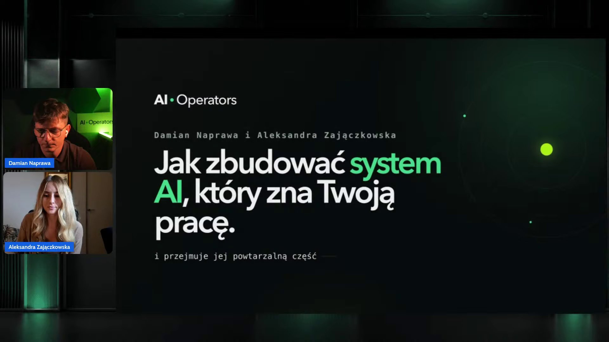

**Texto en pantalla (OCR):**

```
Al+ Operators

Jak zbudowaé system
Al, ktéry zna Twoja
prace.

i przejmuje jej powtarzalna czes¢
```

**Transcripción:** Dobry wieczór Państwu, witamy serdecznie na szkoleniu jak zbudować system AI, który zna Twoją pracę i przejmuje jej powtarzalną część. Ja nazywam się Damian Naprawa i ze mną jest Ola Zajączkowska i mam nadzieję, że razem dzisiaj spędzimy najbliższe 90 minut i że zostaniecie z nami do końca, ponieważ przygotowaliśmy dla Was specjalne bonusy, no i oczywiście Ola przygotowała kawał merytorycznej wiedzy. Zatem powoli będziemy sobie zaczynać, wiem, że część osób dołączy jeszcze w trakcie, ale w międzyczasie zrobimy sobie wprowadzenie.

### [00:01:00]

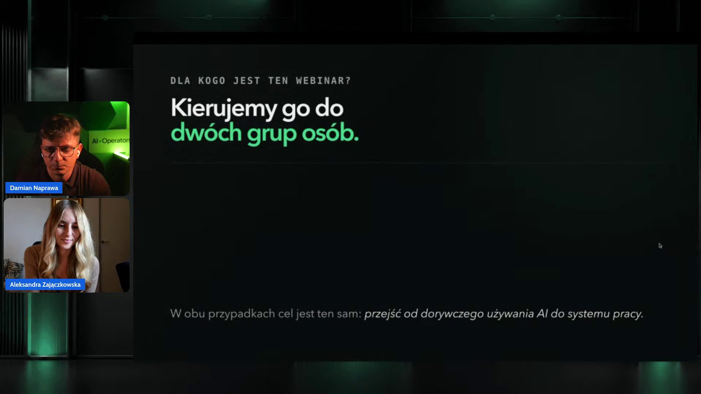

**Texto en pantalla (OCR):**

```
DLA KOGO JEST TEN WEBINAR?

Kierujemy go do
dwoch grup osob.

W obu przypadkach cel jest ten sam: przejsé od dorywczego uzywania Al do systemu pracy.
```

**Transcripción:** To szkolenie kierujemy do dwóch grup osób, tak naprawdę. Do osób, które dopiero zaczynają z AI i chcą zrozumieć fundamenty, zobaczyć gdzie AI może usprawniać, jak zbudować pracę, ale także do osób, które już używają AI i chciałyby się czegoś konkretnego nauczyć, czyli to co w tytule jak budować system AI, który rozumie Twoją pracę. I będzie konkretne demo, za chwilę tutaj oddam Oli głos, która zaprezentuje Wam ciekawe rozwiązanie, które obecnie jest na topie, można by powiedzieć. Ale zanim jeszcze to zrobimy, to chcę jeszcze porozmawiać o takim czymś, co spotykam na co dzień. Część osób używa AI jako tylko takiej szybkiej wyszukiwarki, lepszej wyszukiwarki niż Google, piszą coś do tego czata, czy do innego Gemini'a, kopiują, uzyskują jakąś odpowiedź. Natomiast możliwości dzisiaj są znacznie większe i jeśli pomyśleliście, że jest to kolejny webinar o promptach, albo że pokażą nam znowu jakieś narzędzia, które za miesiąc się zmienią, albo pokażą coś, co w ogóle nie będzie przydatne w Waszej pracy, to chcemy Was uspokoić, dzisiaj tego nie będzie. Pokażemy dzisiaj konkrety, jak można budować taki system w różnych dziedzinach. I on będzie na tyle uniwersalny, że śmiało mogę powiedzieć, iż możecie go wykorzystać w bardzo różnych branżach. Więc nie będziemy dawać Wam ani 50 magicznych promptów, ani pokazywać jak tworzyć aplikacje. Ani nie pokażemy Wam jednego tricku, ani nie opowiemy Wam o trzech magicznych sekretach, jak to na webinarach ostatnio często widzę, jakieś trzy magiczne sekrety.

### [00:02:57]

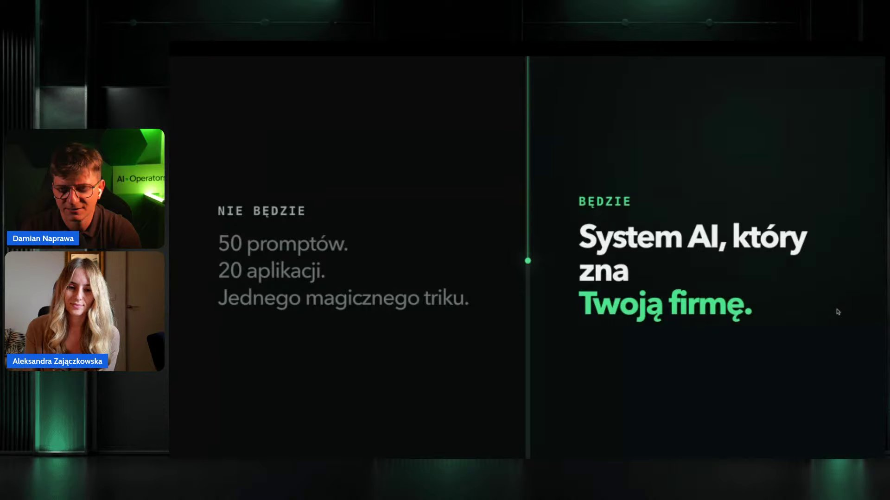

**Texto en pantalla (OCR):**

```
BEDZIE

NIE BEDZIE
50 promptow. System Al, ktory
20 aplikacji. zna

Jednego magicznego triku. Twoja firme.
```

**Transcripción:** Nie, nie, tutaj tego nie będzie, będzie konkret. Więc moi drodzy, nie będzie tego, ponieważ przewaga nie leży w jednym promptcie, tylko tak naprawdę praca z AI zaczyna się od dobrze ustawionego kontekstu, który jest zasilony wiedzą, narzędziami i odpowiednimi zasadami. I na to się składa system. To oczywiście w bardzo wielkim skrócie. Nie spytałem na początku, czy nas dobrze widać, czy nas słychać, po prostu wyleciało mi to z głowy, ale na czacie widzę, że nie ma komentarzy, nie słychać, także lecę dalej. Będziemy budować sobie tzw. LLM Second Brain, gdzie AI rozumie Wasz kontekst, firmy, dokumenty, decyzje, procesy i właśnie Ola to za chwilę zaprezentuje.

### [00:03:51]

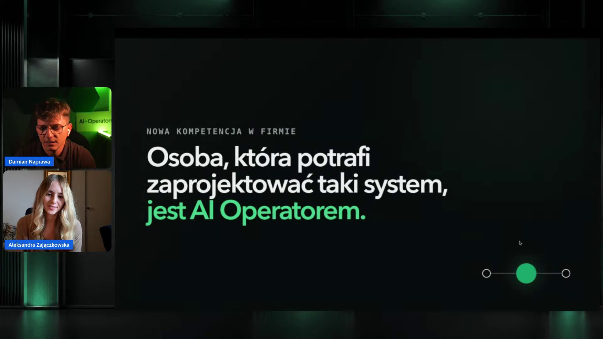

**Texto en pantalla (OCR):**

```
NOWA KOMPETENCIJA W FIRMIE

Osoba, kt6ra potrafi
zaprojektowac taki system,
jest Al Operatorem.
```

**Transcripción:** I my dzisiaj z Olą widzimy taką nową kompetencję w firmach. Którą nazwaliśmy AI Operatorem. I jest to właśnie taka osoba, która potrafi zaprojektować taki system, jaki dzisiaj pokażemy za chwilę i o którym zrobiliśmy małe wprowadzenie. Więc jeśli jesteś osobą nietechniczną, to spokojnie dzisiaj będziemy mówić w taki sposób, aby rozumieli nas także nietechniczni.

### [00:04:09]

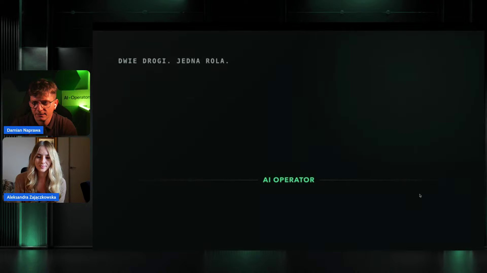

**Texto en pantalla (OCR):**

```
DWIE DROGI.

JEDNA ROLA.

Al OPERATOR
```

**Transcripción:** Czyli jeżeli pracujesz poza branżą IT. Nie masz na co dzień styczności z programowaniem, to spokojnie dzisiaj to szkolenie także jest dla Ciebie. Ale uwaga, jeśli jesteś z branży IT, wiem, że tutaj sporo takich osób mamy i pozdrawiam wszystkich naszych stałych klientów i obserwujących. To też wyniesiesz z tego całkiem sporo wiedzy, bo możesz dzięki temu rozwiązaniu, które pokaże Ola za chwilę, projektować swoje narzędzia, integracje i wdrażać takie dodatkowe narzędzia, które usprawniają pracę w firmie. Pracę Twojego zespołu lub Twoją. Więc dlaczego mielibyście nas dzisiaj słuchać?

### [00:04:57]

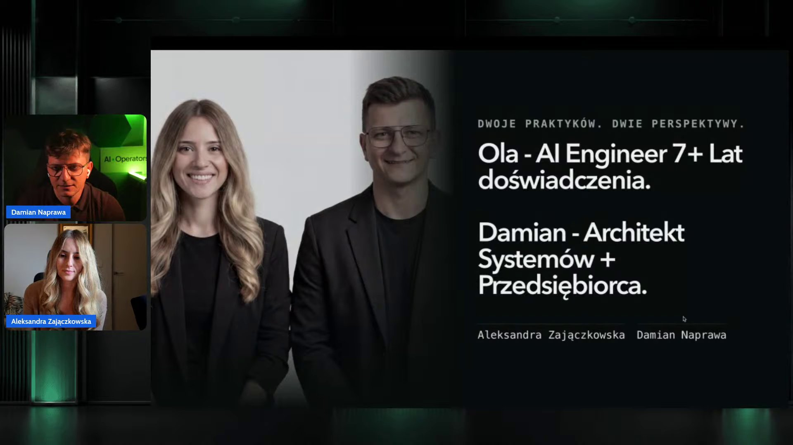

**Texto en pantalla (OCR):**

```
DWOJE PRAKTYKOW. DWIE PERSPEKTYWY.

Ola - Al Engineer 7+ Lat
doswiadczenia.

Damian - Architekt
Systemow +
Przedsiebiorca.

Aleksandra Zajaczkowska Damian Naprawa
```

**Transcripción:** To może wreszcie teraz oddam głos Oli, bo jeszcze nie dopuściłem jej do słowa. Tak, dobrze mnie słychać? Tak, tak. Super, super. Witam Was wszystkich. Cieszę się, że możemy dla Was poprowadzić ten webinar. Ja się też krótko przedstawię. Mam na imię Ola Zajączkowska i jestem inżynier z ponad 7-letnim doświadczeniem. Przeszłam całą tą drogę, żeby wejść właśnie do branży AI i teraz staram się przekazać takie smaczki z wszystkich lat doświadczenia, jak pracowałam w wdrażaniu systemów AI przy różnych branżach. Także dzisiaj opowiem Wam właśnie, jak LLM Brain może nam pomóc ustawiać kontekst, jak możemy z tym rozwiązaniem budować system, który jest taką, wiecie, aplikacją, która daje nam bardzo dużo wniosków i po prostu nie mogę się doczekać, że Wam pokażę za chwilę całą część merytoryczną. Dzięki Ola. To dwa zdania ode mnie. Jestem Damian. Zajmowałem się projektowaniem systemów IT. Od jakiegoś czasu także rozwijam swoje aplikacje i prowadzę też inne biznesy i jestem naprawdę heavy użytkownikiem AI. Myślę, że spędzam z AI po kilka godzin dziennie albo może nawet i całą moją pracę w ciągu dnia. Jeśli pracuję przy komputerze, to jest to praca z AI z różnych perspektyw. Od programowania, po tworzenie treści, materiałów marketingowych. No de facto, co tylko się da dzisiaj z AI zrobić, to dotykam tego, więc dzisiaj też większość tematów będzie omawiać Ola, ale jeśli będziecie mieli do mnie jakieś pytania, to też chętnie na nie odpowiem.

### [00:06:51]

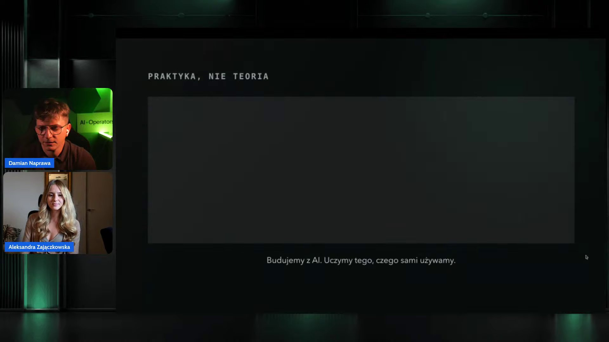

**Texto en pantalla (OCR):**

```
PRAKTYKA,

NIE TEORIA

Budujemy z Al. Uczymy tego, czego sami uzywamy.
```

**Transcripción:** Więc to są nasze jakby statsy, jeśli chodzi o to, dlaczego mielibyście z nami zostać do końca. Ja tylko dodam, że jeżeli ktoś jest pierwszy raz na tym szkoleniu i nie kojarzy nas, to w naszych szkoleniach ogólnie tutaj pod marką w kontenerach, którą reprezentuję brało udział, no myślę, że grubo ponad 20-30 tysięcy w tych darmowych i jakieś 5 tysięcy w takich szkoleniach, powiedzmy pełnopłatnych. Pełnometrażowych. Więc zostańcie z nami dzisiaj do końca, będziemy mieli też dla was specjalny prezent, który myślę, że wam się spodoba. Więc jak będziecie podchodzić do budowania takich systemów, to trzeba sobie zadać trzy pytania. Co AI musi wiedzieć o waszej firmie, o waszej pracy? Skąd wie, którym źródłom ufać i gdzie człowiek zachowuje kontrolę? Gdzie człowiek powinien zatwierdzać rzeczy? I teraz obiecany prezent, który mamy dla was, dla osób, które będą z nami na żywo, będzie to takie szkolenie, poradnik, jak zbudować stronę internetową z AI w 4 wieczory,

### [00:07:48]

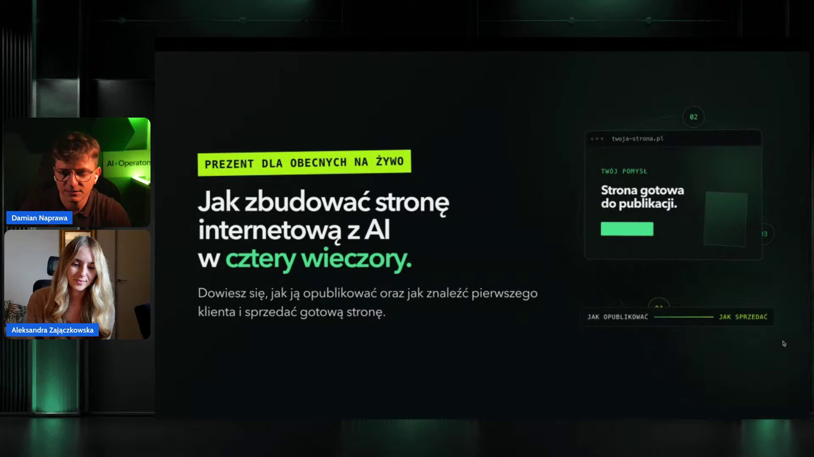

**Texto en pantalla (OCR):**

```
PREZENT DLA OBECNYCH NA ZYWO

Jak zbudowaێ strone
internetowa z Al
w cztery wieczory.

Dowiesz sie, jak ja opublikowaé oraz jak znalezé pierwszego
klienta i sprzedaé gotowa strone.

TWO POMYSt

Strona _—
do publikacji.

JAK OPUBLIKOWAC

JAK SPRZEDAC
```

**Transcripción:** czyli nie w godzinę, nie w minutę, tylko w 4 wieczory, usiąść do tego konkretnie i spokojnie i jak opublikować tę stronę w internecie. Ale jeszcze, żeby to nie było wszystko, to mam dla was też, ponieważ ja dużo sprzedaję różnych rozwiązań, aplikacji i tak dalej, to mam pewne doświadczenie jak szukać klientów, jak znaleźć pierwszego klienta i zaproponować taką stronę w takim podejściu trochę side hustle, ale bez żadnego naciągania i bez żadnego hype'u, więc ten poradnik będzie dla was, którzy zostaną z nami dzisiaj na żywo. Także warto zostać do końca.

### [00:08:42]

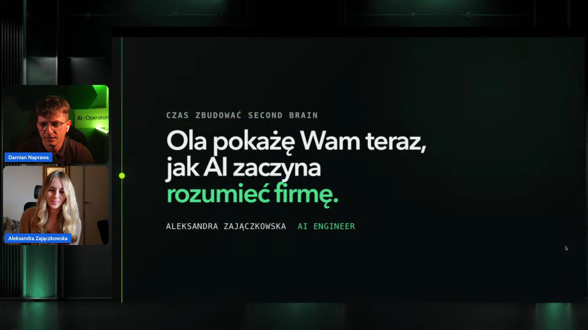

**Texto en pantalla (OCR):**

```
CZAS ZBUDOWAC SECOND BRAIN

Ola pokaze Wam teraz,

. jakAlzaczyna
rozumiec firme.

ALEKSANDRA ZAJACZKOWSKA AI ENGINEER
```

**Transcripción:** Tyle z mojej strony. Oddaję głos do Oli, która wam pokaże to wszystko, co wcześniej zapowiedzieliśmy. Tak, tak, teraz proszę cię o przekazanie ekranu i ja nie będę was widzieć na chwilę, ale myślę, że już możesz włączyć ekran i powiedzieć mi, czy dobrze widać prezentację, jak zbudować system AI.

### [00:09:00]

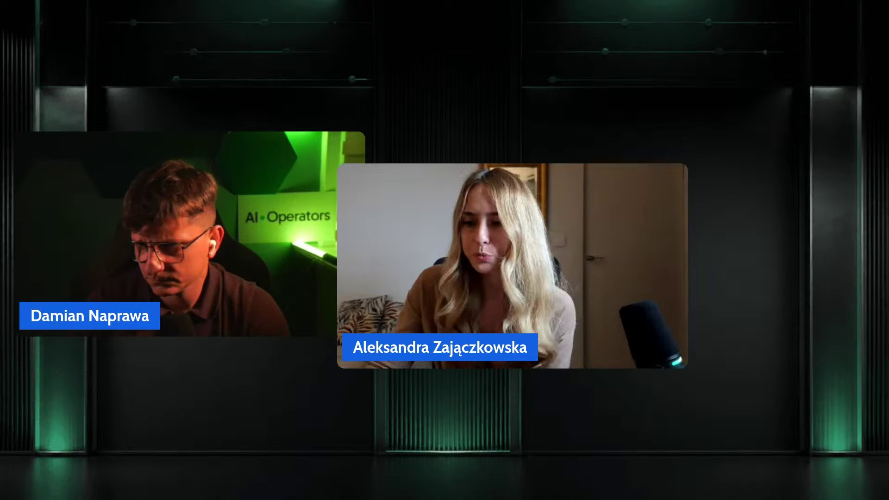

**Texto en pantalla (OCR):**

```
HU
```

### [00:09:03]

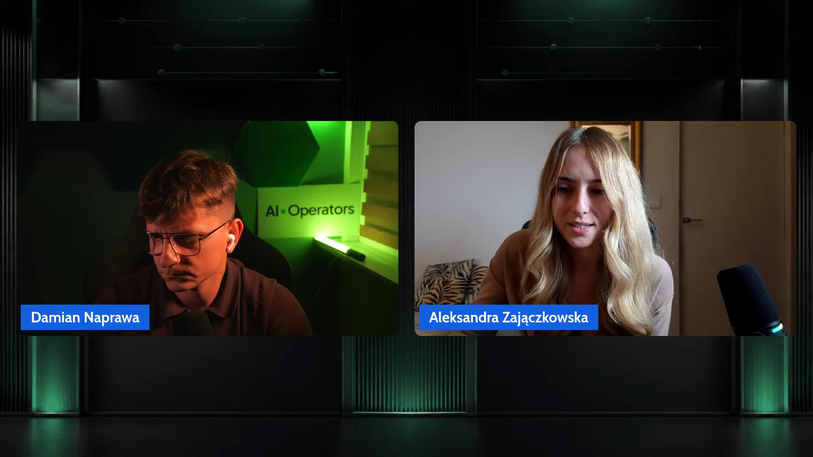

**Texto en pantalla (OCR):**

```
WU
```

### [00:09:06]

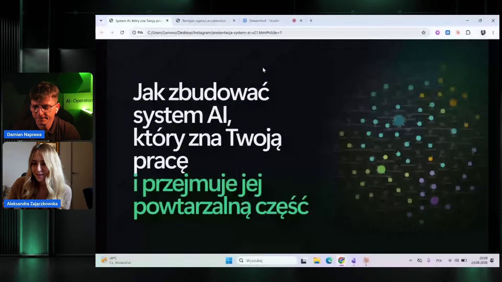

**Texto en pantalla (OCR):**

```
Jak zbudowac
system Al,

ktory zna Twoja
2g am ll

| przejmuje je}
powtarzalng czesc
```

**Transcripción:** Tak jest, już prezentacja jest widoczna. Widać? Ok, super. Dzisiaj jestem tutaj po to, razem z Damianem, żeby powiedzieć wam właśnie, jak zbudować system AI, który zna waszą pracę i jest w stanie przejąć jej powtarzalną część. I to jest też sposób, który ja widzę, że może wyróżnić bardzo wiele osób na rynku pracy.

### [00:09:24]

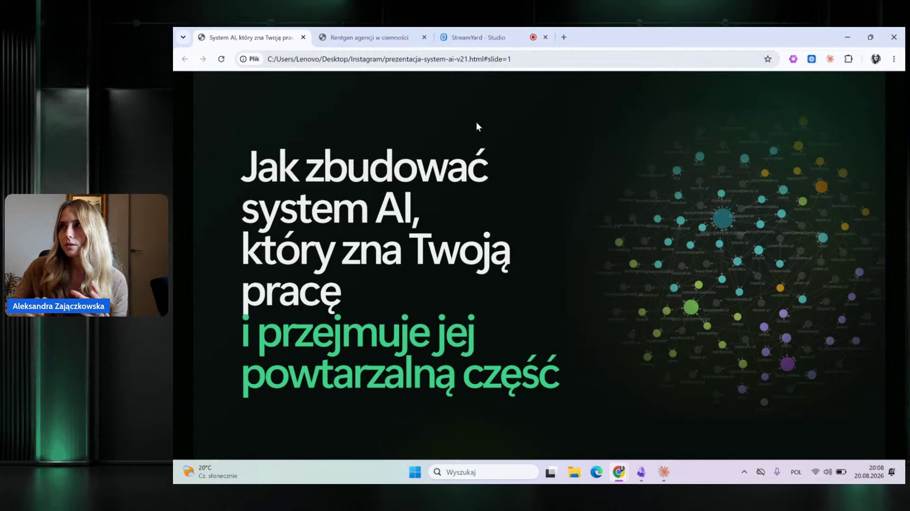

**Texto en pantalla (OCR):**

```
Jak zbudowac
system Al,

ktory zna Twoja
prace

| przejmuje jej
powtarzalng czesc
```

**Transcripción:** Ale żeby pokazać wam, jak to zrobić, muszę wspomnieć o pięciu krokach,

### [00:09:30]

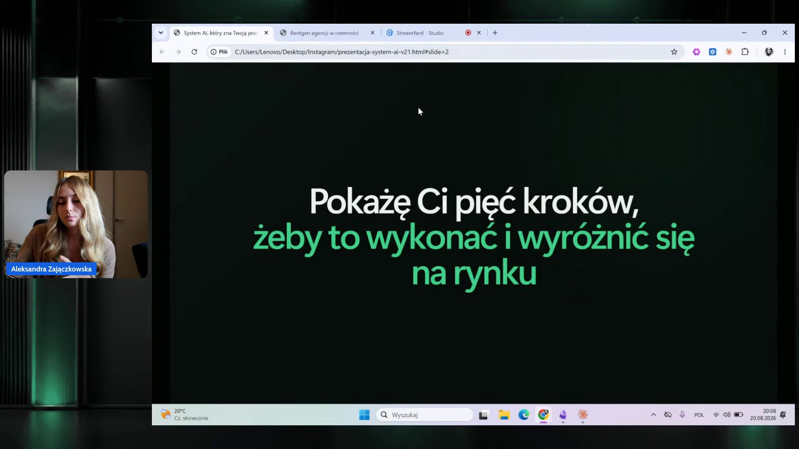

**Texto en pantalla (OCR):**

```
Pokaze Ci piec krokow,
zeby to wykonac i wyroznic sie
na rynku
```

**Transcripción:** które są kluczowe właśnie, żeby się wyróżnić na rynku i żeby wykonać ten system. I te pięć kroków możecie kojarzyć z opisu webinaru.

### [00:09:42]

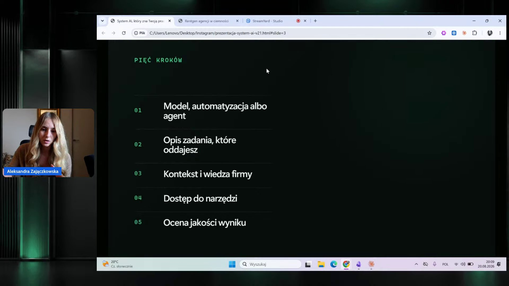

**Texto en pantalla (OCR):**

```
PIEC KROKOW

e1

02

03

ou

05

Model, automatyzacja albo
agent

Opis zadania, ktére
oddajesz

Kontekst i wiedza firmy

Dostep do narzedzi

Ocena jakosci wyniku
```

**Transcripción:** Bardzo chcę wam powiedzieć o tym, dlaczego na samym początku musicie wiedzieć, co to jest model, automatyzacja i agent, jaka jest różnica pomiędzy tym, jak mamy opisywać zadania, nasze zadania, które oddajemy AI do pracy, co to jest kontekst i jak możemy z nim pracować, jak możemy opisywać kontekst i jak operować wiedzą, którą mamy, czy to jest wiedza naszej firmy, czy projektu, dlaczego ważny jest dostęp do narzędzi i dlaczego ważna jest ocena jakości wyniku z AI. I dlaczego w ogóle te pięć kroków? Dlatego, że te pięć kroków szuka rynek.

### [00:10:24]

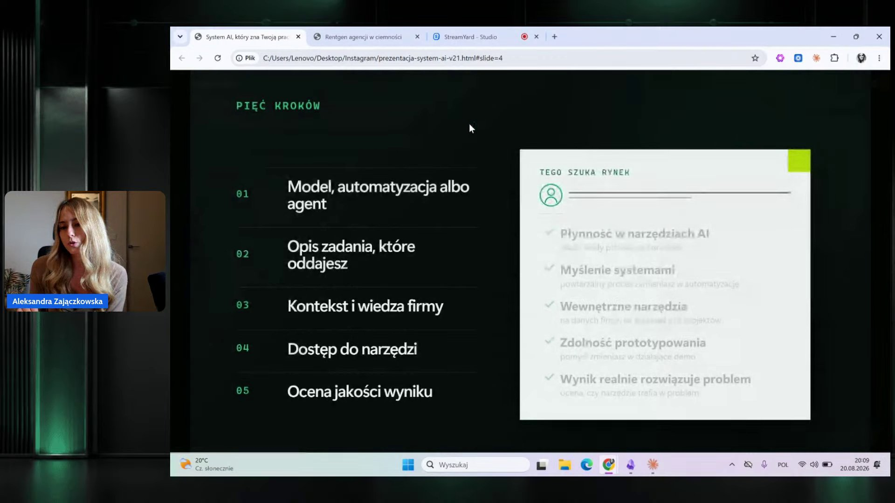

**Texto en pantalla (OCR):**

```
PIEC

04

05

KROKOW

Model, automatyzacja albo
agent

Opis zadania, ktore
oddajesz

Kontekst i wiedza firmy
Dostep do narzedzi

Ocena jakosci wyniku
```

**Transcripción:** Razem z Damianem mieliśmy bardzo dużo rozkmin i to jest coś, co ja też widzę przez ostatnie 8 miesięcy 2026 roku, przez cały rok to obserwuję, jak zmienia się rynek. Miałam masę konsultacji i widzę, jeden trend, że rynek obecnie poszukuje ludzi, którzy potrafią płynnie działać w narzędziach AI. I to się właśnie mapuje do pierwszego kroku, czyli osoba, która potrafi zobaczyć na dany problem, dane zagadnienie i zastanowić się, jak może je rozwiązać, czy modelem językowym, czy automatyzacją, czy może jakimś agentem, to jest właśnie osoba, która jest płynna w narzędziach AI. I od tego zaczniemy. Potem powiem Wam coś o myśleniu systemami, o takim systemowym myśleniu, czyli jak już jesteśmy płynni w tych narzędziach AI, to jak możemy zmienić powtarzalny proces w automatyzację. I do tego są ważne, ważna jest ta umiejętność, ten skill opisania naszego zadania, które oddajemy AI. Później, jeśli chodzi o kontekst i wiedzę firmy, to oczywiście rynek szuka ludzi, którzy potrafią spojrzeć na dane firmy, na 10 projektów, na jakich pracowaliśmy, na wewnętrzne narzędzia, wyciągnąć z nich tą masę nieustrukturyzowanych danych i wyciągnąć z nich wnioski. I to, słuchajcie, zmienia się bardzo płynnie w taką zdolność prototypowania, gdzie my mamy jakiś pomysł, że o, tutaj mamy masę projektów i danych z nich i fajnie by było wyciągnąć z tego jakieś wnioski. Ale jak wyciągnąć te wnioski? No musimy zbudować system, z którego będziemy mogli czerpać tą wiedzę i na przykład usprawnić jakiś proces albo zautomatyzować coś, albo zrobić research, wyciągnąć informacje. I po to musimy mieć zdolność prototypowania, czyli takiego zamieniania pomysłów w działające demo, żeby wyciągnąć z tego wartość biznesową. No i oczywiście w tym całym procesie potrzebna jest też ocena jakości wyniku, czyli jak ocenić ten wynik i czy on faktycznie, realnie rozwiązuje problem biznesowy i czy daje nam wartość. Bo to, co ja Wam teraz pokażę, to jest rozwiązanie, które jest techniczne. Ale po tylu latach pracy w branży to, co zawsze staram się przekazywać, to jest to, że fajnie jest mieć tą wiedzę techniczną, ale i tak finalnie my budujemy rozwiązanie, które ma dać jakąś wartość biznesową i faktycznie rozwiązać jakiś problem, więc po to się ewaluuje te wyniki, bo to jest tak naprawdę najważniejsza część tego procesu. I to, co Wam teraz wymieniłam, to jest akurat bardzo ciekawy fakt, faktyczny opis pozycji,

### [00:13:00]

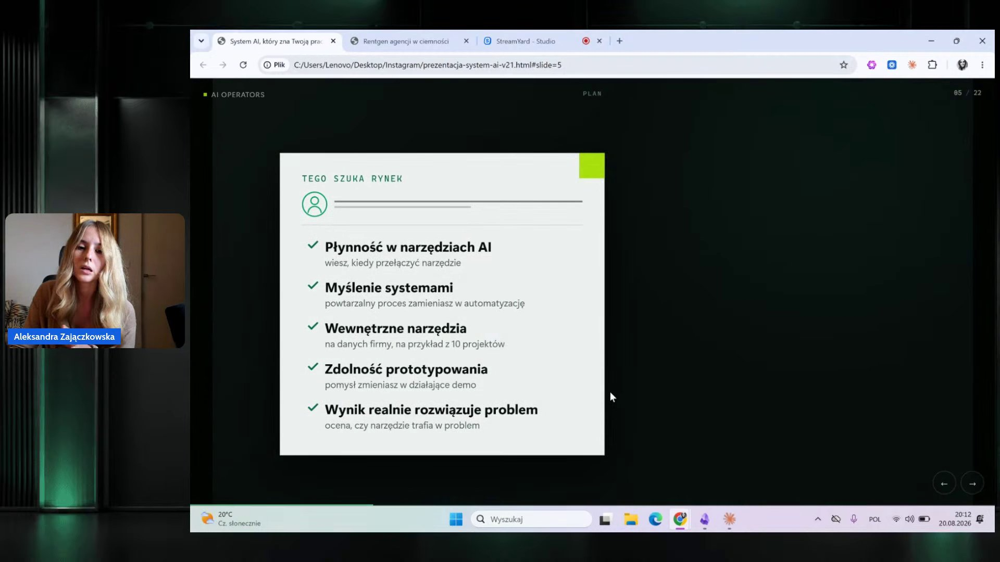

**Texto en pantalla (OCR):**

```
© Plik _C/Users/Lenovo/Desktop/Instagram/ ja-system-ai-v21.htmitslide=

Y Ptynnosé w narzedziach Al

Y MySlenie systemami

Y Zdolnosé prototypowania

ziatajace dem

Y Wynik realnie rozwiazuje problem
```

**Transcripción:** która nazywa się często AI Product Builderem, bardzo często też AI Operatorem. Tutaj nie chcę, żebyście się przywiązywali do nazwy, bo rynek zmienia się tak dynamicznie, a każda firma w zależności od potrzeb nazywa to trochę inaczej, więc dlatego to się może pojawiać też czasami pod nazwą Solution Engineer. I właśnie te wszystkie kroki dokładnie opisują to, czego firmy szukają, bo naprawdę potrzebują osób, które będą potrafiły cały ten proces przejść płynnie. I to jest coś, co chcę Wam teraz pokazać. I tutaj też chcę wspomnieć o tym, że każdy z tych kroków obecnie jesteśmy w stanie wykonać bez programowania.

### [00:13:39]

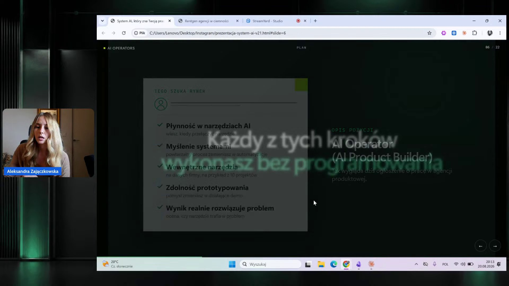

**Texto en pantalla (OCR):**

```
Kazdy Z tyc I Oneratan

Wewn

m alts Qw a & ~ & POL FD) MD socesnre
```

**Transcripción:** Bariera wejścia do AI na obecną chwilę, jak sami wiecie, jest bardzo niska. Ja to mówię z perspektywy 8 lat w tej branży, kiedyś była bardzo wysoka i naprawdę jakby bez programowania nie dało się pracować z AI. Teraz tak nie jest, więc wszystko, co Wam tutaj pokażę, da się zrobić pracując z modelami językowymi, tylko językiem naturalnym. Więc to jest też ciekawy aspekt, że zdecydowanie jakby ten proces, który Wam pokażę jest dla też osób, które potencjalnie są początkujące. I na początku chcę zacząć od podstaw, po co my w ogóle tego potrzebujemy. I dlatego przejdziemy sobie do punktu pierwszego,

### [00:14:27]

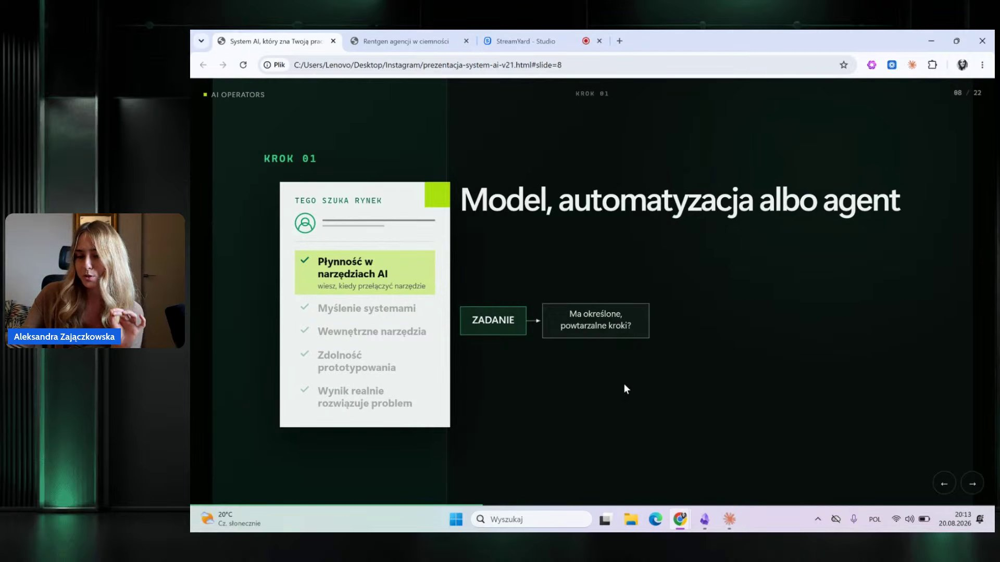

**Texto en pantalla (OCR):**

```
= AL OPERATORS

KROK 01

Model, automatyzacja albo agent

Plynnosé w
narzedziach Al

Ma okreslone,

ZADANIE powtarzalne kroki?
```

**Transcripción:** czyli do płynności w narzędziach AI. Na samym początku, jak macie jakiś proces w pracy, to musicie wiedzieć, jak możemy rozwiązać dany problem. Czego możemy użyć? Czy modelu, czy automatyzacji, czy agenta? I jak możemy w ogóle do tego podejść? Tutaj teraz dam Wam taki szybki tip, to będzie taki booster, który możecie od razu sobie wykorzystać nawet gdzieś tam w pracy, czy jak zastanawiacie się nad jakimś swoim rozwiązaniem. I to jest taki schemat myślowy, który może Was na samym początku, jak myślicie high levelowo, wysokopoziomowo o problemie, który musicie rozwiązać, doprowadzić do tego, jakiego Wy potrzebujecie rozwiązania, żeby się za to zabrać. Mamy dane zadanie w pracy i najpierw się zastanawiamy, czy ono ma określone, powtarzalne kroki. Jeśli tak, to bardzo możliwe, że rozwiązaniem tego problemu w ogóle nie będzie AI, tylko automatyzacja. I co ja mam tutaj na myśli, jeśli chodzi o określone, powtarzalne kroki? No na przykład, że macie fakturę, musicie zeskanować dane z tej faktury, przenieść je do jakiegoś Excela i coś obliczyć i za każdym razem to wygląda tak samo.

### [00:15:39]

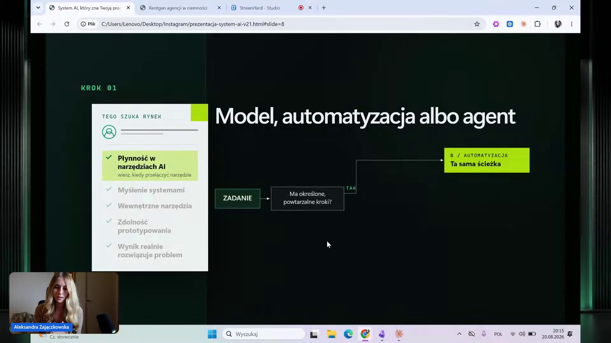

**Texto en pantalla (OCR):**

```
KROK 01

Y Plynnosé w
narzedziach Al

ZADANIE

}»

Ma okreslone,
powtarzalne kroki?

TAK

B / AUTOMATYZACJA
Ta sama Sciezka
```

**Transcripción:** I nie ma tutaj po prostu żadnej dozy krytycznego myślenia, to jest można by powiedzieć prosty algorytm, można by to krokami rozpisać zawsze identycznie. W takich sytuacjach bardzo często nie potrzebujecie w ogóle AI, tylko prawdopodobnie rozwiąże to jakaś automatyzacja. Ale z drugiej strony bardzo często, kiedy takie właśnie Wasze zadanie nie ma określonych, powtarzalnych kroków, to możliwe, że wtedy model językowy będzie dobrym rozwiązaniem. I mówię tutaj możliwe, bo oczywiście ten schemat jest pomocniczy, ale wiadomo, że jakiś przypadek, nad którym pracujecie, może mieć mnóstwo niuansów, więc czasami to nie jest takie, wiecie, zero-jedynkowe. Ale fajnie się tym schematem posługiwać, bo on bardzo dużo ułatwia na początku. Jeśli chodzi o modele językowe, to mamy dwie opcje. Mamy opcję A, czyli po prostu używamy go w okienku czasu. Możecie sobie to wyobrazić w ten sposób, że macie na przykład, wchodzicie na stronę czata GPT, na stronę Claude'a i macie tego właśnie czata jako taką wyszukiwarkę, trochę bardziej fancy, skomplikowaną i w ten sposób możecie go używać. I to jest w ogóle pierwszy poziom używania modeli językowych, żeby rozwiązać jakiś problem. Można to robić na pytania i na burzę mózgów. I większość osób się na tym poziomie zatrzymuje. A możemy pójść o wiele poziomów dalej i użyć agenta. I agent oczywiście to jest już coś takiego jak na przykład kod, kod albo kodeks. Będziemy o tym mówić za chwilę trochę więcej. I to już jest ten wyższy poziom pracy z AI, pracy z modelami językowymi, gdzie możemy wpuścić takiego agenta już nie tylko do zadawania mu pytań i odpowiedzi, do jakiegoś szybkiego pisania maili, tylko użyć go do procesu, który jest złożony, wieloetapowy i często wymaga jakiegoś krytycznego myślenia. I ja bym powiedziała, że ta płynność w narzędziach AI, bycie takim płynnym właśnie w używaniu modeli językowych, to jest właśnie ta umiejętność tego, że Ty jako taki użytkownik wspierany przez AI wiesz, kiedy użyć modelu językowego, w jakiej formie, bo też nie do wszystkiego agent jest dobry. Czasami po prostu wystarczy, że rozwiążesz problem zwykłym zapytaniem do LLM-u, zwykłym zapytaniem do kloda. Ale w ogóle AI nie potrzebujesz i musisz użyć automatyzacji. To jest krok numer jeden. I teraz pójdźmy jeszcze troszeczkę więcej, troszeczkę głębiej w podstawy, żeby wyrównać poziom, bo wiem, że bardzo możliwe, że mam tutaj dużo osób, dla których to jest totalnie temat od zera. Więc chcę troszeczkę wyrównać poziom i powiedzieć Wam jeszcze parę słów więcej o tych trzech rozwiązaniach. Właśnie jak używamy czata w wyszukiwaniu. W wyszukiwarce to to jest zazwyczaj takie zadawanie pytań i odpowiadanie jednokierunkowe, czyli mamy pytanie, odpowiedź, pytanie, odpowiedź. I tutaj przychodzimy z prostymi tematami. Jak wybieramy automatyzację z drugiej strony, to mamy określone kroki, czyli tak jak mówiłam, ta sama ścieżka za każdym razem. I tutaj użyjemy takich programów jak AnyTen i Make. Pokazuję Wam też tą mapę tych trzech różnych poziomów, żeby też zarysować Wam jakie mamy normy. Narzędzia tutaj, czyli zaznaczyłam właśnie w czacie, że to będą proste zapytania do modeli językowych. W automatyzacjach to będzie AnyTen lub Make, najbardziej popularne narzędzia do automatyzacji. A w złożonych procesach, i czym jest złożony proces? Złożony proces to będzie taki, gdzie mamy dany cel, gdzie musimy dojść do jakiegoś określonego stanu. Na przykład research, musimy zrobić badania rynku, gdzie musimy wybrać konkretne narzędzia albo połączyć ten proces, z narzędziami zewnętrznymi i później potrzebujemy krytycznej oceny. No to taki złożony proces, gdzie kroki w zasadzie układają się w trakcie i nie jesteśmy ich w stanie ułożyć na samym początku, tak jak właśnie w przypadku automatyzacji, to to jest właśnie rozwiązanie dla agenta, czyli dla kodkoda albo dla kodeksa. I ja zawsze lubię o tym opowiadać, bo to jest taka podstawa, którą często ludzie pomijają, a ta świadomość tego już na samym początku może Wam nawet rozwiązać po prostu problem, który macie w pracy i nie wiecie jak się zaniknąć. Możecie go zabrać. I pójdźmy teraz o krok dalej, ponieważ ja chcę pokazać Wam kolejny element już na przykładzie.

### [00:19:54]

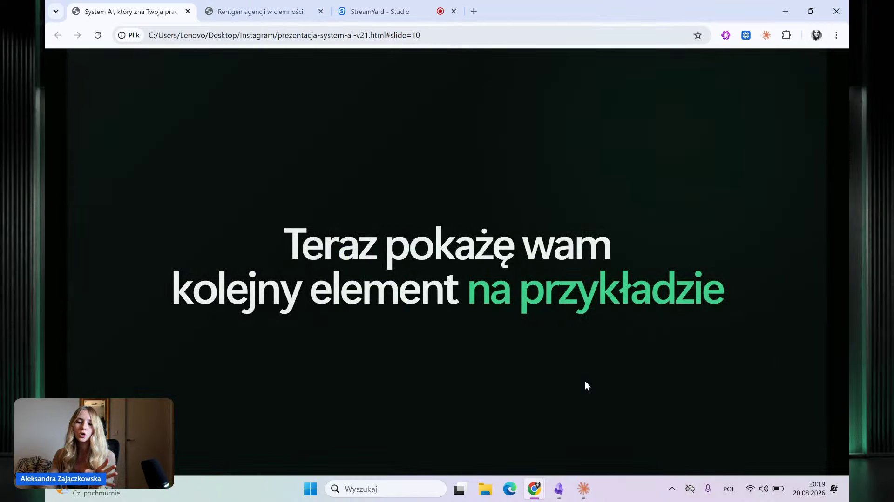

**Texto en pantalla (OCR):**

```
Teraz pokaze wam
kolejny element na przyktadzie
```

**Transcripción:** Teraz powiedziałam troszeczkę o teorii, żeby wyrównać poziom, żeby dać wprowadzenie, a dalej przejdziemy sobie głębiej już na konkretny przykład. Myślenie systemami.

### [00:20:09]

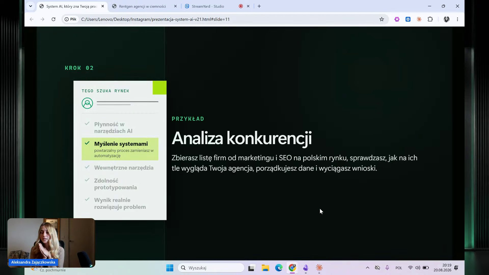

**Texto en pantalla (OCR):**

```
GG @OPlik C/Users/| system-ai-v21.html#slide=11

KROK 02

PRZYKLAD

wees Analiza konkurencji

Zbierasz liste firm od marketingu i SEO na polskim rynku, sprawdzasz, jak na ich
tle wyglada Twoja agencja, porzadkujesz dane i wyciagasz wnioski.
```

**Transcripción:** To jest taki sposób pracy z modelami językowymi, w którym chcemy zamienić powtarzalny proces w jakąś automatyzację, usprawnić sobie proces. Chcę Wam to pokazać na przykładzie analizy konkurencji. Chcę, żebyście wyobrazili sobie, że zbieramy listę firm od marketingu i od CEO na polskim rynku, agencji marketingowych. I ja faktycznie zebrałam listę 60 agencji marketingowych w Polsce i chcemy sprawdzić, jak na tle tych firm wygląda jedna z wybranych agencji, zrobić research, uporządkować dane, zebrać te dane i wyciągnąć z nich wnioski. Więc to będzie nasz przykład, który ja będę teraz pokazywać. Ale... Chcę, żebyście wiedzieli, że ten jeden sposób, który Wam teraz pokażę, jesteśmy w stanie zastosować tak naprawdę na masie innych pomysłów. Dlatego, że ten schemat, który ja użyję teraz do pokazania, jak się robi analizę konkurencji, możemy na przykład użyć do nauki nowego tematu. Czyli wszystko, czego uczymy się na przykład o AI, możemy mieć w jednym miejscu i możemy użyć tego sposobu do takiego pomysłu. Jeśli pracujecie w jakiejś firmie, możecie zrobić bazę wiedzy działów. W firmie też tym sposobem. Czy to są dokumenty, procedury, czy jakieś ustalenia, czy pracujecie w sprzedaży, w HR-ach, w finansach, czy w jakimkolwiek innym dziale, to też byłoby coś, co da się wykorzystać tym samym sposobem, który za chwilę pokażę. I jeśli na przykład chcecie to mieć jako swój prywatny użytek i mieć takiego swojego doradcę i po prostu wrzucić w ten system nawet swoje notatki, swoje przemyślenia, swoje jakieś dokumenty, na których pracujecie i zrobić z tego prywatnego doradcę, który przypomina, podpowiada albo z którym zbijacie myśli, to tak samo w ten sposób można tutaj wykorzystać. Więc przejdźmy teraz krok dalej. O co chodzi w tym myśleniu systemami? Chodzi o to, żeby opisywać zadanie, które oddajemy w taki sposób do modela językowego, żeby zmapować wszystko po drodze. I co ja mam tutaj na myśli? Pokażę wam. Pokażę wam to teraz na przykładzie. Jeśli robimy analizę konkurencji, to na samym początku musimy się zastanowić, czego my potrzebujemy. Potrzebujemy informacji ze stron internetowych, potrzebujemy cenników, potrzebujemy na przykład iluś tam konkurentów i dane o nich. Więc musimy się zastanowić w takim opisie pracy, przekazywaniu kontekstu do agenta, na jakich danych będziemy pracować. Później musimy się zastanowić, skąd te dane weźmiemy i jakich narzędzi potrzebujemy. Na przykład pracujemy w jakiejś firmie, korzystamy z Notion. I w Notion są informacje o różnych agencjach marketingowych, które już zresearchowaliśmy. Mamy jakieś dane z CRM-u z Airtable. Potrzebujemy danych z internetu, więc tu musimy się zastanowić, ok, będzie mi potrzebny FireCrawl. I tu już możecie zobaczyć, że wracając do poprzedniego punktu, to myślenie systemami już nam się układa w taki proces, że widzimy, ok, mamy tutaj wiele narzędzi. Research to będzie proces wieloetapowy. Musimy się połączyć z narzędziami wewnętrznymi, gdzie jest jakaś wiedza, pobrać coś z internetu, spisać cały ten proces. I tutaj też nam to pokazuje, które rozwiązanie będzie najlepsze najprawdopodobniej. W takim zadaniu to będzie właśnie agent, czyli krotkot. Ja tu jeszcze zapisałam skill, o którym za chwilę trochę więcej powiem. Potem musimy się zastanowić, czy ten nasz proces potrzebuje decyzji. Tutaj wiemy na przykład, że... Jeśli dane są starsze, to będą musiały być update'owane. Trzeba jakoś nad nimi iterować. Musimy też mieć tą dozę krytycznego myślenia przy takim researchu i wyciąganiu wniosków. Więc to już nas doprowadza do tego, że ok, w takim wypadku to jest proces niedeterministyczny. Kroki będą ustalane w trakcie, więc agent jest dobrym rozwiązaniem do tego konkretnego zadania. I słuchajcie, kolejnym elementem takiej pracy jest to, że ok, wiemy już, że mamy te dane i co teraz z tymi danymi możemy zrobić? Nie ma czegoś takiego praktycznie, jak się faktycznie pracuje z modelami językowymi, jak praca z modelami bez pamięci. Jeśli używacie czata GPT w przeglądarce, to dobrze wiecie, że w pewnym momencie jest tak, że to wasze okienko czatu już jest takie długie, kontekst się gubi i on na przykład zaczyna odpowiadać po jakimś czasie gorzej. W związku z tym, żeby zaprojektować taki naprawdę użyteczny i dobry system, pracy z modelami językowymi, to trzeba się zastanowić nad tym, jak my mu zaprojektujemy pamięć. I jest kilka sposobów, tutaj teraz się odnoszę do osób technicznych, że jest wiele sposobów, jak możemy to przedstawić. Ja pokażę teraz jeden z nich, który nazywam LLM Brain. Jest to baza danych dla osób technicznych, grafowa baza danych, o której zaraz powiem troszeczkę więcej, która właśnie pełni rolę takiej pamięci dla modelu. Potrzebujemy tego, ponieważ mamy bardzo dużo danych, bardzo dużo informacji. Chcemy zrobić research 60 agencji marketingowych w Polsce i jak my te dane mamy przechować. No nie wrzucimy tego wszystkiego do jednego okienka czatu, bo zrobi się z tego jeden wielki bałagan, zaraz skończy nam się okno kontekstu i będzie problem. Więc po to właśnie wykorzystuje się takie bazy danych, żeby stworzyć taki dynamiczny mózg, który właśnie będzie sam się usprawniał i widział połączenia pomiędzy przeróżnymi danymi, które mu tam damy do środka. I po co to robimy? Robimy to po to, żeby nasz model językowy miał podstawę do tego, żeby naprawdę bardzo dużo dowiedzieć się o naszym projekcie z różnych stron, żeby to bardzo dobrze opisać. To jest właśnie też część przekazywania kontekstu i na podstawie tego zrobimy sobie taki bardzo dobry fundament do tego, żeby nasz model językowy, żeby nasz agent, wyciągnął wnioski i dał nam analizę, taką analizę konkurencji,

### [00:26:15]

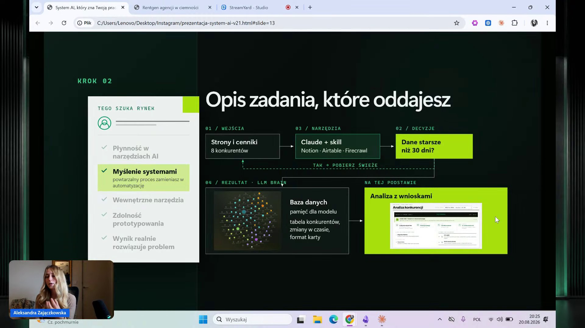

**Texto en pantalla (OCR):**

```
KROK 02

Opis zadania, ktore oddajesz

RYNEK

JEISCIA 03 / NARZEDZIA 02 / DECYZJE

Strony i cenniki Claude + skill
8 konkurentéw Notion - Airtable - Firecrawl z 30 di

ry

Y MySlenie systemami
powtarzalny proces zamieniasz w

fi eu / REZULTAT LLM BRAWN NA TEJ PODSTAWIE
automatyzacje

. Baza danych
pamieé dla modelu
tabela konkurentow, =

zmiany w czasie,
format karty
```

**Transcripción:** która jest naprawdę poparta na ogromnej ilości danych, na połączeniach i wnioskach z tych właśnie plików, które mu damy, które sami zapewne albo robilibyśmy dniami, godzinami, albo właśnie byłoby to nawet niemożliwe do zauważenia, co możemy zrobić dzięki temu, że korzystamy z modeli językowych. I teraz Wam pokażę, jak właśnie działa i powstaje taki LLM Brain

### [00:26:45]

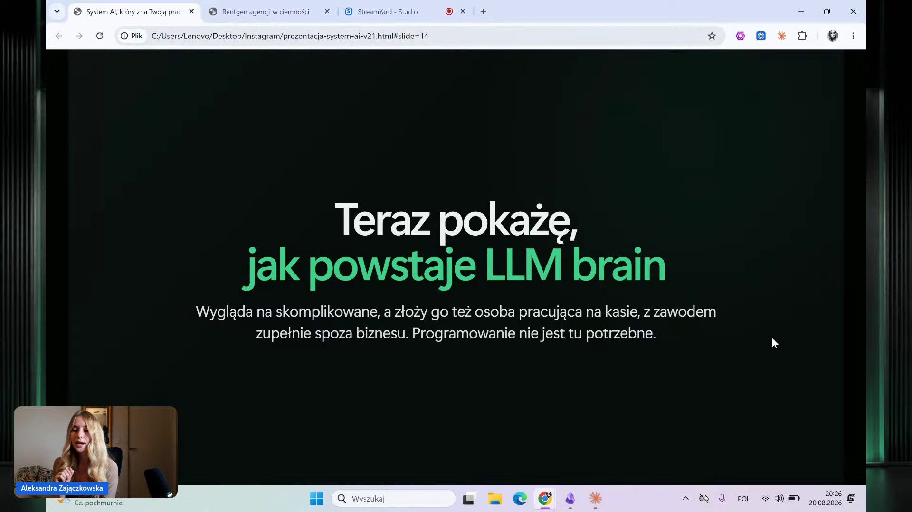

**Texto en pantalla (OCR):**

```
Teraz pokaze,
Jak powstaje LLM brain

Wyglada na skomplikowane, a ztozy go tez osoba pracujaca na kasie, z zawodem
zupetnie spoza biznesu. Programowanie nie jest tu potrzebne.
```

**Transcripción:** i to, co teraz zobaczycie, może wyglądać na jakąś czarną magię i naprawdę na skomplikowane, ale chcę Wam tutaj powiedzieć i Was zapewnić, że to, co ja Wam teraz pokazuję, jest tak naprawdę w stanie złożyć nawet osoba pracująca na kasie i tutaj daję przykład takiej osoby, bo chodzi mi po prostu o wymienienie zawodu, który jest zupełnie spoza niszy biznesowej. Naprawdę jakby jest to proces, w którym programowanie nie jest potrzebne i jedyne, co jest potrzebne, to zrozumienie działania tego i odpowiednie przekazanie kontekstu, które macie Wy jako specjaliści z wiedzą ekspercką w danej dziedzinie. I teraz Wam, tak, za chwilę Wam pokażę, jak wygląda ten LLM Brain,

### [00:27:33]

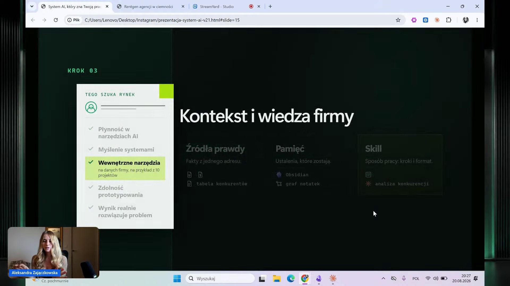

**Texto en pantalla (OCR):**

```
KROK 03

TEGO SZUKA RYNEK

¥ Wewnetrzne
```

**Transcripción:** ale czego my potrzebujemy, żeby w ogóle go stworzyć. Więc tak, tutaj teraz przechodzimy do kolejnego elementu, czego szuka rynek, czyli rynek potrzebuje ludzi, którzy potrafią pobrać tę wiedzę z wewnętrznych narzędzi, zebrać dane firmy i ułożyć taki system prawdy, który właśnie będzie dostosowany do pracy z modelem językowym. Więc jak to powstaje? Najpierw pobieramy informacje i teraz tak, mamy informacje z internetu, na przykład mamy pobrane wszystkie informacje ze stron internetowych z tych właśnie agencji marketingowych. Robimy to za pomocą połączenia właśnie klockoda z FireCrawlem. Później pobieramy, jeśli pracujemy w jakiejś firmie z CRM-ów, z Airtable, robimy to za pomocą połączenia konektorów z klockodem właśnie z tymi narzędziami i pobieramy te wszystkie informacje i to są nasze źródła prawdy. I później wybieramy sobie narzędzie i w tym wypadku ja wybrałam Obsidian, który pozwala nam stworzyć grafową bazę danych. Dlaczego graf? Zaraz Wam pokażę, jak ten graf działa, ale generalnie one są bardzo fajne do pracy z modelami językowymi, ponieważ one pozwalają na to, żeby model językowy sam stworzył bazę danych, w którym sam zobaczy połączenia pomiędzy różnymi źródłami i to jest właśnie ten klucz. I potem kolejnym elementem, po tym jak już weźmiemy te źródła prawdy, jak już wstawimy je do Obsidiana, jak już ustawimy odpowiednio, właśnie napiszemy odpowiednio sposób, w jaki klockod ma, jak ma uporządkować te dane w Obsidianie dla nas, to wtedy tworzymy z tego skill, tworzymy z tego umiejętność, czyli opisujemy mu, o czym są te dane, nasz sposób pracy, jakie informacje on ma wyciągnąć i jak ma je uporządkować, żeby on stworzył dla nas taką właśnie bazę danych. Jak ta baza danych wygląda? Ja się teraz przełączę do Obsidiana i teraz Damian pytanie,

### [00:29:32]

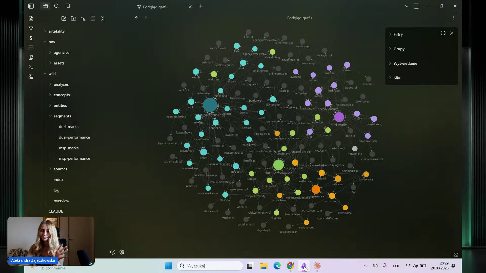

**Texto en pantalla (OCR):**

```
©

88

()

o=
o=

agencies
assets
wiki
analyses
> concepts

entities

segments
duzi-marka
duzi-performance
msp-marka
msp-performance

sources

index

log

overview

CLAUDE

% Podglad grafu

=

Podglad grafu

Filtry

Grupy

Wyéwietlanie

Silty
```

**Transcripción:** czy widać dobrze teraz Obsidiana? Widać.

### [00:29:39]

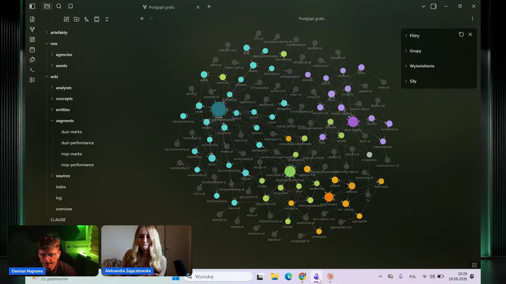

**Texto en pantalla (OCR):**

```
© Bia a  Podglad grafu Ge ¥,O - x

(63) G rel & € Podglad grafu
e
Heat 4 Filtry oD x
Ef] ol
raw
8 - Grupy
agencies
lo
: assets Wyéwietlanie
= wiki
8 Sily
analyses
> concepts
entities
/ segments
] duzi-marka

duzi-performance
msp-marka
msp-performance
> sources
index
log

overview

| CLAUDE
```

**Transcripción:** Widać. Czy dobrze? To ciężko stwierdzić. Mogłabyś troszkę powiększyć, myślę, jakby się da. Może Shift, Ctrl+, o lepiej, no. Tak. Także jak widzicie, faktycznie, teraz może trochę pomniejszę i powiększę, żeby dać wam perspektywę. Faktycznie wygląda to jak mózg. Możecie tutaj zobaczyć przeróżne klastry, ja je za chwilę powiększę, to jest żeby pokazać wam perspektywę, w których widzicie,

### [00:30:12]

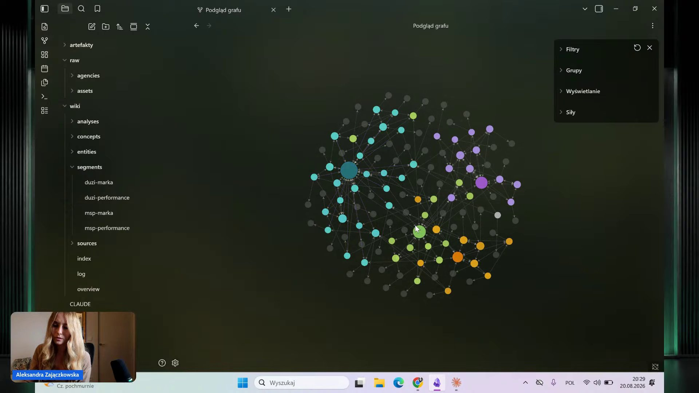

**Texto en pantalla (OCR):**

```
me) Q 8 & Podglad grafu x +

es] @onrG x € Podglad grafu
rte
ee Filtry OD x
oe
oO
raw
. Grupy
agencies
1 oe
5 > assets Wyswietlanie
wiki
Sily
analyses
concepts
entities
segments

duzi-marka
duzi-performance
msp-marka
msp-performance

sources

index

log

overview

CLAUDE

pochmurnie
```

**Transcripción:** mamy takie centra i one coś oznaczają. I teraz wam opiszę, o co tutaj chodzi. Słuchajcie, to jest tak, że dajemy do modelu językowego, właśnie w takiej grafowej bazie wiedzy, gołe pliki. I te pliki mamy tutaj w tym folderze, gdzie mamy dosłownie, faktycznie prawdziwe agencje marketingowe z Polski. Mamy 60 agencji marketingowych. Tylko, że ja zrobiłam anonimizację ich nazw, żeby nikogo tu nie reklamować, więc możecie tam zobaczyć poprzekręcane nazwy, ale dane są faktycznie prawdziwe. I strukturyzujemy taki sposób właśnie pracy w tej bazie danych i to, co model językowy robi dla nas, czyli co Cloud Code robi dla nas w takiej bazie danych, to on sam wyciąga segmenty i grupuje nam te firmy, więc tworzy taką bazę danych, w której na przykład możemy zobaczyć, że mamy tutaj zebrany klaster. Mamy zebrany klaster firm, które są skupione na tym, że to są małe, średnie przedsiębiorstwa i one działają w taki sposób, że zapewniają innym firmom performance. Tutaj na przykład mamy takie, które zapewniają, są to duże firmy, które zapewniają visibility marki. Tutaj mamy analogicznie małe, średnie przedsiębiorstwa, które zapewniają visibility marki, widoczność marki i tak samo analogicznie mamy duże firmy, które właśnie dają wynik sprzedażowy firmom. I jak widzicie model językowy sam sobie tworzy te klastry i sam to grupuje, to nie jest coś, co my musimy zrobić. I oprócz tego to, co jest tutaj też interesujące, to to, że w takiej bazie wiedzy mamy te wszystkie połączenia, mamy też koncepty, czyli model językowy sam wyciąga koncepty, one mi się tutaj zapisały po angielsku, ale oczywiście może to być też po polsku, to jest po prostu przez sposób, w jaki pracowałam. Więc mamy tutaj na przykład metodologię, które firmy marketingowe używają jakiego CEO, jakie mają CEO na landing page'ach, jak oni kwalifikują osoby, które mogą zostać ich właśnie klientami, czy mają branding, który jest oparty na założycielu, jaką mają edukację. Jest bardzo, bardzo dużo konceptów, które właśnie sam nam model językowy stąd wyciągnął. I to, co widzicie teraz, może wydawać wam się bardzo skomplikowane, ponieważ możecie sobie zapewne, zgaduję, że może być tak teraz, że widzicie tą bazę grafową i macie takie, kurczę, ale jak ja będę z tego korzystać? Przecież to wygląda na tak skomplikowane. Tych danych tutaj jest masa. Ja nie wiem, jak się po tym poruszać. Może to jest długi czas, żeby to ogarnąć, żeby się tego nauczyć. I teraz chcę wam powiedzieć, że to wygląda w ten sposób, ale to nie jest dla nas. To nie jest dla nas jako dla człowieka, w sensie dla mnie jako dla Oli, bo ta baza danych wygląda w ten sposób, ponieważ ona jest dostosowana do naszego agenta. To jest zrobione specjalnie w taki sposób, żeby na przykład kod, kod albo kodeks, nieważne, co sobie wybierzecie do pracy, był w stanie właśnie przechodzić przez te informacje, szybko znajdować sobie tutaj połączenia pomiędzy tymi informacjami i na podstawie tego wyciągać wnioski. Więc to, co widzicie tutaj, jest dla agenta, a to, co pokażę wam zaraz, to jest coś, co robicie i widzicie wy po zbudowaniu takiego systemu. I tutaj jeszcze zanim przejdę, powiem wam, że no, to jest to taki bardzo złożony system notatek, tak działa ta baza danych, że na przykład możemy sobie wejść w jakąś konkretną agencję i tutaj tagami będzie oznaczona, będą informacje, będzie jej pozycjonowanie, jak oni, co oni o siebie mówią i będą przeróżne, przeróżne właśnie informacje, więc można teoretycznie wejść i zobaczyć, co się tutaj znajduje, czyli tak jak wam mówiłam, analogicznie, gdybyście mieli taki system na przykład do nauki, no to moglibyście zobaczyć, że tutaj jest jakieś zagadnienie, uczycie się na przykład AI i na przykład teraz uczycie się grafowych baz danych i macie notatkę o grafowych bazach danych i wszystko w takim systemie jest zawarte. Tak samo możecie mieć konkretne koncepty i właśnie konkretne analizy. Więc tak jak mówiłam, to jest coś, co widzi model językowy, a teraz wam pokażę, co konkretnie widzicie wy.

### [00:35:00]

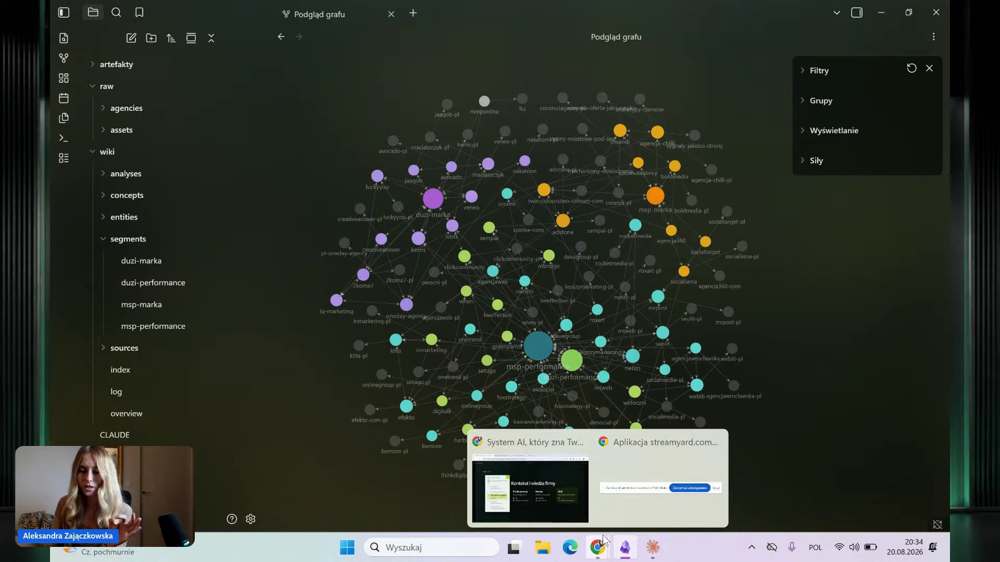

**Texto en pantalla (OCR):**

```
oO &

88

)

a0
nn

i

$ |

Qa  Podglad grafu x ob vO
G Pel & € Podglad grafu

irtefe
es Filtry

raw

5 Grupy

agencies

assets Wyswietlanie

wiki

sity

analyses

concepts

entities

segments
duzi-marka
duzi-performance
msp-marka
msp-performance

sources

index

log

overview

CLAUDE

amyard.com.
```

**Transcripción:** I to, co ja przygotowałam teraz dla was,

### [00:35:02]

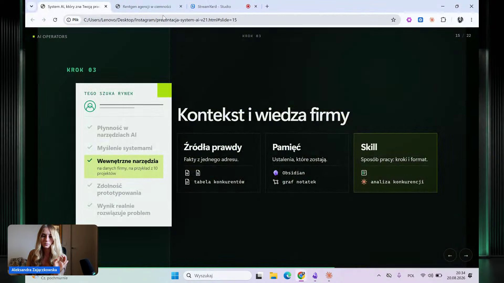

**Texto en pantalla (OCR):**

```
Al OPERATORS KROK 15 / 22

KROK 03

TEGO SZUKA RYNEK

Kontekst i wiedza firmy

Zrédta prawdy Pamieé Skill

’ Wewnetrzne narzedzia Fakty z jednego adresu. Ustalenia, ktore zostaja. Sposdb pracy: kroki i format.

BA B @ obsidian B

E) tabela konkurentow %2 graf notatek 3 analiza konkurencji

na danych firmy, na

20.08.20
```

### [00:35:03]

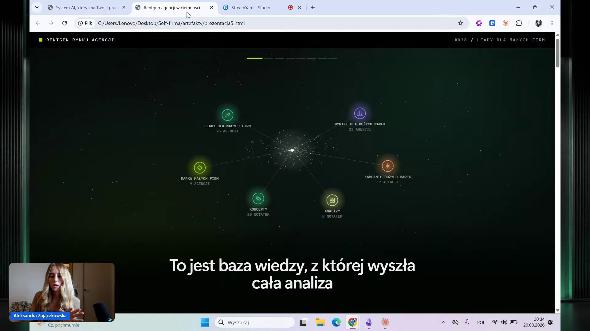

**Texto en pantalla (OCR):**

```
RENTGEN RYNKU AGENCII DLA MALYCH FIRM

#038 / LEADY

i) ©

LEADY DLA MALYCH FIRM WYNIKI DLA DUZYCH MAREK

© = ®

MARKA MALYCH FIRM KANPANZE OUZYCH MAREK

KONCEPTY Aue

To jest baza wiedzy, z ktorej wyszta
cata analiza
```

**Transcripción:** to są takie wnioski, które dostarczył mi mój agent, ponieważ to był jego mózg, to jest jego baza, na której on pracuje i to, co on dostarcza mi, to jest właśnie analiza, to są wyniki, to są wnioski, które on wyciągnął z tych klastrów. I teraz wam pokażę, co widzę ja, jako właśnie taki specjalista wspierany przez AI, który zarządza takim agentem, który ma dostęp do takich informacji. To, co chcę wam tutaj przekazać, to jest to, że kiedy zaczynamy pracować z takim agentem jak KlotKot i zaczynamy przekazywać mu ten kontekst i naszą wiedzę, to nasza praca się zmienia z tej wykonawczej pracy na bardziej nadzorującą i to, co teraz wam pokażę, to jest właśnie proces tego nadzoru. Czyli KlotKot wykonał dla mnie coś, co ja bym robiła ze 2 miesiące, bo żeby zmapować, zrobić taki research i zmapować takie połączenia i zobaczyć, jak to wszystko ze sobą współgra, no to ja bym siedziała nad tym, nad taką manualną robotą bardzo, bardzo długo i on mi dostarcza wynik tego i jakby to teraz w moim krytycznym myśleniu jest jakby w moim, że tak powiem, moim obowiązkiem jest teraz to sprawdzić, nadzorować, zobaczyć, co on mi tutaj przyniósł i poiterować go, czy idziemy w dobrym kierunku, czy dalej ma nad tym pracować. Więc teraz sprawdźmy sobie, jakie on mi przygotował tutaj klastry. Na analizie konkurencji tu możecie zobaczyć, że to jest wizualne przedstawienie tego, co on mi dał. On mi dał 6 różnych klastrów i 4 z nich dotyczą firm, a 2 z nich dotyczą samych wniosków i analiz. Na samym początku Klot zobaczył, że przeanalizował, że 25 agencji to są agencje, które robią leady dla małych firm i opisuje mi tutaj, co one mówią wprost, że one mówią wprost do właściciela małej firmy, to są firmy, które robią telefony, zapytania, zamówienia, mają jawne ceny i gwarancje na rynku i zgrupował mi taki jeden klaster. Kolejna grupa z analizy konkurencji to są firmy, które właśnie robią wyniki dla dużych marek i ja pokazywałam Wam te klastry na samym grafie, tylko teraz pokazuję Wam już same wnioski z nich, bo nie chodzi o to, żebyśmy my przeglądali teraz każde z tych notatek i sami łapali wnioski, tylko my to dostajemy jako gotowy wynik. Kolejny klaster to jest na przykład agencji, które zajmują się wynikami dla dużych marek i to są właśnie agencje, które mają opisane procesy, mają własne narzędzia, rozliczają się z ROAS-u, czyli z wyniku tego, ile przyniosą reklamy i bardzo, bardzo liczy się dla nich koszt pozyskanego klienta. Kolejny klaster, jaki Claude zauważył, to są marki małych firm, czyli tutaj mamy małe firmy, które chcą wyglądać i brzmieć, jak większa marka i co one dostają od tych agencji, dostają estetykę i portfolio, czyli na przykład zarządzanie contentem. Kolejny klaster, jaki zauważył, to jest 12 agencji marketingowych, które głównie robią kampanie dla dużych marek, czyli na przykład przychodzi do nich dyrektor marketingu, kupuje kreację, kupuje wizerunek i mamy tutaj, często takie agencje nie podają ceny, ale za to mają dużą listę klientów, którzy są zazwyczaj znani i duzi. I oprócz tego, że Claude wziął mi te gołe dane i tak je pogrupował i zrobił naprawdę bardzo głęboką analizę konkurencji, to zwrócił mi coś jeszcze, zwrócił mi właśnie te koncepty i tutaj on mi zwraca wzorce, które powtarzają się pomiędzy firmami. Mamy tutaj archetypy tego, jak działają te firmy, mamy mechanizmy tego, jak one dowożą wartość, czy cena jest jawna, czy dają gwarancję, mamy nazwane ich metody, jak one działają, jeśli chodzi o edukację, jaki mają sposób pozyskiwania klientów i to zostało wyodrębnione jako koncepty. I mamy też kolejną rzecz, czyli analizy, czyli już wnioski, które Claude wyniósł na podstawie tego, jak zobaczył te wszystkie połączenia pomiędzy tymi właśnie danymi. I tutaj możemy mieć gotowe odpowiedzi, notatki, możemy mieć porównanie, czasami nawet tworzy macierze usług, cenników, warunków i tu na podstawie tego można zrobić taką mapę pozycjonowania oraz zobaczyć, jakie w ogóle mamy luki na rynku i szanse. I teraz tutaj też odniosę się do tego, że gdybyśmy używali tego systemu dla czegoś innego niż analiza konkurencji, no to tak samo mielibyśmy na przykład pogrupowane nasze dane w różne klastry, na temat czego zbieramy informacje, tak samo mielibyśmy wyodrębnione koncepty, nad którymi pracujemy i tak samo mielibyśmy analizy. I teraz sobie pomyślicie pewnie, kurczę, ale jak zarządzać tą bazą danych i co, jeśli ja dorzucę kolejne informacje? No właśnie, jeśli pracujemy skutecznie z modelami językowymi, to jesteśmy w stanie ustawić ten system w taki sposób właśnie, że dodając nową analizę, dodając nawet nowy koncept, to Claude przejdzie przez całą bazę danych i zobaczy, czy ten nowy koncept, czy ta nowa analiza, czy może nowa dorzucona firma łączy się ze wszystkimi innymi danymi, które tu mamy i sam zupdate'uje wszystkie połączenia w bazie danych. Zaraz wrócę sobie do Obsidiana. Gdybym dorzuciła tutaj,

### [00:40:59]

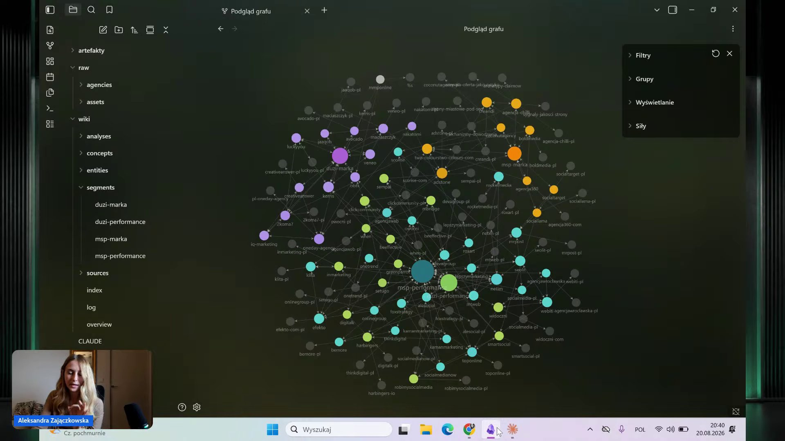

**Texto en pantalla (OCR):**

```
© fo 8 % Podglad grafu x + »-Q- a x

& G el ¥ SS Podglad grafu
cf
rtef
aoe Filtry oD x
ge
00
raw
8 - Grupy
agencies
ts)
5 assets Wyéwietlanie
wiki
8: sily
analyses
concepts
entities t
segments
duzi-marka

duzi-performance
msp-marka
msp-performance

sources

index

log

overview

CLAUDE
```

**Transcripción:** tutaj nową firmę, to agent zacząłby od tego, że nie zostawiłby jej sobie jako takie osobne kółeczko, które sobie tutaj wisi, tylko przeszedłby przez wszystkie te pliki i zobaczył, czy ona się z czymkolwiek nie łączy i zrobił nowe połączenia, które by tutaj na tym grafie zaczęły widnieć jako po prostu nowe strzałki.

### [00:41:24]

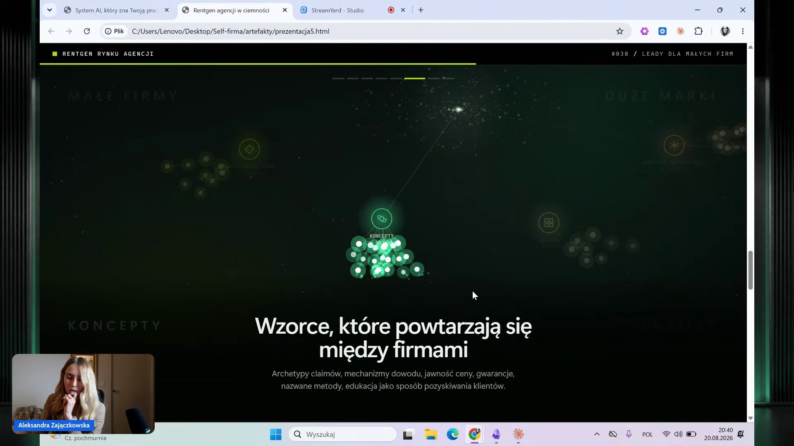

**Texto en pantalla (OCR):**

```
iemnosci XO

GC OPlik

C:/Users/Lenovo/Desktop/Self-firma/artefakty/prezentacja5.html

#038 / LEADY DLA MALYCH FIRM

WM RENTGEN RYNKU AGENCJT

h

Wzorce, ktore powtarzaja sie
miedzy firmami

Archetypy claimow, mechanizmy dowodu, jawnosé ceny, gwarancje,
nazwane metody, edukacja jako sposdéb pozyskiwania klientow.
```

**Transcripción:** I teraz odniosę się jeszcze raz, jeśli mamy tutaj osoby techniczne, że oczywiście jest to jeden tylko sposób, w jaki możemy tworzyć bazę danych, dla modeli językowych. On jest bardzo skuteczny. Są też inne sposoby, także to nie jest tak, że to jest jeden możliwy i jeden jedyny, za którym trzeba obecnie iść, ale jest to na pewno taki uniwersalny sposób, który w wielu przypadkach bardzo dużo Wam pomoże uzyskać i który też na pewno jest czymś fajnym do pokazania i nadaje się do bardzo, bardzo wielu firm. I jak mamy już te wnioski, widzimy właśnie te wzorce, analizę, to właśnie z tego może nam powstać taka prawdziwa analiza konkurencji.

### [00:42:15]

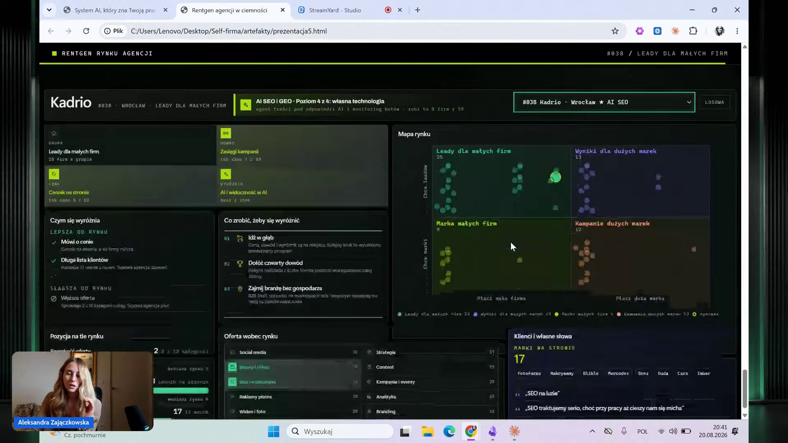

**Texto en pantalla (OCR):**

```
M RENTGEN RYNKU AGENCJI

Kadrio ..;:

wROCKAW

Leady dla matych firm

Cennik na stronia

Czym sie wyréznia
LEPSZA OD RYNKU
/ Méwiocenie

 Dhuga lista klientow

Q Weise wfert

Pozycja na tle rynku

i

Cz, pochmurnie

ntgen agencji w

LEADY DLA MALYCH FIRM

8
vernbanzk

Ali widoeznosé w Al

Co zrobié, zeby sie wyréinié

novo/Desktop/Self-firma/artefakty/prezentacja5.html

x amYard

AISEQ/i GEO - Poziom 4 z 4: wlasna technologia

tudic © x x = a

#038 / LEADY DLA MALYCH FIRM

a  Idéwglab

o> Q Dolézcewarty dowod

87 @ Zajmij branze bez gospodarza

Oferta wobec rynku
Social media

en

Reklamy platne

Wideo foto

#038 Kadrio - Wroctaw * AI SEO v | Losowa
Mapa rynku
Leady dla matych firm Wyndki dla duzych marek
25 pe
z 2 C) &
3 >
Marka matych firm Kampanie dugych marek
; r a
@ Landy dts matych Kine TE eynits wie uryeh maret 53 @ Mats mat ae rere Oe
Klienci i wlasne stowa
MARK WA STRONTE
Strategie 7
> Content
Fotoforms Wakrymamy Like fereodes Genz Cuda Cars Taker
Kemparie ieventy 25
cine ; 6s -SEO naluzie’

Setting, a << ,SEO traktujemy serio, choc przy pracy az cieszy nam sig micha”
```

**Transcripción:** Bo możemy też wziąć te nagie dane, pobrane ze stron internetowych i po prostu wrzucić je do Claude'a. I jak zapewne wiecie, pracując z modelami językowymi, jak czasem wrzucicie mu 5, 10 plików, nie wiadomo co, no to on zrobi to bardzo pobieżnie, zwróci Wam coś generycznego, nie zauważy szczegółów, będziecie musieli rozbijać zadanie na małe etapy, no i tak się pracuje iteracyjnie i różnie to wychodzi. A jeśli pracujemy na takiej bazie danych, no to już mamy z góry bardziej opisany kontekst, mamy sposoby pracy, bo tam możemy naprawdę wszystko wrzucić. Możemy mu też wrzucić informacje, w jaki sposób on ma w ogóle korzystać z tej bazy danych. Jeśli byśmy robili na przykład bazę jakiegoś procesu firmowego, to też możemy to tak ustawić, żeby on w taki sposób działał. I wtedy na przykład, ja teraz Wam pokazuję wnioski dla jednej przykładowej agencji marketingowej, wtedy takie wnioski są o wiele bardziej skuteczne. One mogą pozwolić nam zauważyć coś, czego normalnie byśmy nie zauważyli bez tak dogłębnej analizy, która po prostu łączy, bo to są takie kropki. I wiem, że bardzo wiele osób spotyka się też z takim problemem właśnie, że pracuje na modelach językowych i ma takie kurczę, ale przecież on nie wie, na przykład jak ja piszę teraz ten raport, to on nie wie, że ja potrzebuję jakichś wniosków z raportu sprzed trzech miesięcy. No to właśnie w takiej sytuacji można stworzyć sobie później taką analizę, taki dashboard, który będzie widział te połączenia, bo ten graf po prostu to zapewni i zadba o to. No i zobaczmy, jak to wygląda dla agencji marketingowej, która właśnie, oczywiście nazwę sobie gdzieś tam wymyśliłam i w sensie zanimizowałam ją, ale dane są prawdziwe i możemy tutaj zobaczyć, że ta na przykład agencja mega się wyróżnia na tle innych na rynku, ponieważ właśnie robi AACO i widać, że robi to tylko 8 firm z 59. Możemy właśnie zobaczyć, co jest jej wyróżnikiem i mamy od razu podane wnioski, czym ona jest lepsza od rynku, że na przykład mówi o cenie, a to nie jest takie oczywiste, bo wiele firm nie mówi o cenie, to wynika tutaj z tych danych, że ma wiele klientów, czym jest słabsza i od razu mamy podane, co możemy w ogóle zrobić,

### [00:44:42]

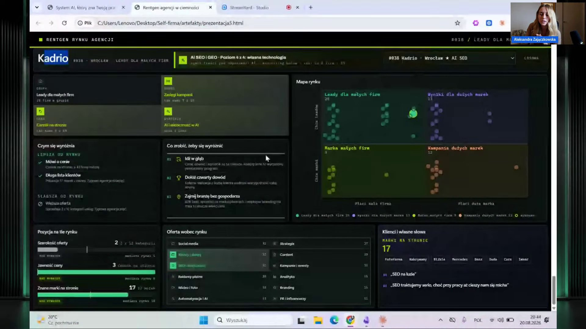

**Texto en pantalla (OCR):**

```
Czym sig wyrdinia

wv Méwiocenie

Diuga lista klientow

eszacterta

Pozycja na tle rynku

Srerokoit oferty

At eekteczrmc w At

Co zrobié, zeby sig wyréznié

2 Idéwalab

Q Dobié cewarty dowéd

f-firma/artefakty/prezentacja5.htm|

Harke

© Zajmij brante bez gospodarza
e
Oferta wobec rynku
Serial media Strategie

Raklamy ptr
Wide foro

Autamatyeacja ‘A

Kamparve | wventy

Arsalt yen

eranding

2 influenearzy

dy dla matych firm

matych firm

#038 Kadrio - Wroctaw * AI SEO

liynthi dla dudych

Kampanie dutych marek

Klienci | wtasne stowa

MARME WA STRONTE
17

Fotoforma akrymamy Lika Mercedes © Banz  Ouda Cary

+ SEO na luzie”

44 ~SEO traktujemy serio, cho¢ przy pracy a? cieszy nam sig micha”

Thar
```

**Transcripción:** żeby się wyróżnić, co ta agencja może zrobić, żeby się wyróżnić. No i taki sposób może też być potencjalnie po to,

### [00:44:48]

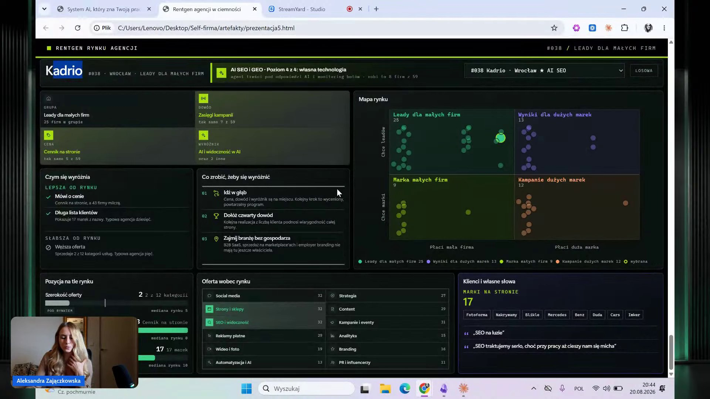

**Texto en pantalla (OCR):**

```
1 Al, k

Leady dla matych firm

25 firm w grupie

Cennikena stronie

tak samo 5 2 59

Czym sie wyréinia
LEPSZA OD RVNKU
v Méwiocenie

/ Dhuga lista klientow

Pokazuje 17 marek zn

SEABSZA OD RYNKU

@ Weisza oferta

Sprzedaje 2 212 kategorii uslug

Pozycja na tle rynku

Szerokoéé oferty
i=]

© Plik

a 43 fiemy mila,

LEADY DLA MALYCH FIRN

wa agencja deiesieg

mediana rynku 5

3

js!

mediana rynku 0

17 17 marek
=

median ryniu 10

entgen agencji w ciemnosci

x

C/Users/Lenovo/Desktop/Self-firma/artefakty/prezentacja5. html

ANSE!

ows,
Zasiegi kampanii

tak sano 7 2 $9

{EO - Poziom 4z 4: wtasna technologia

Leadéw

Chee

Co zrobié, zeby sie wyréznié
e1 @ Idzwglab

powtarzainy program.

02 Q Dotézczwarty dowéd

gina realizacja zliceb klienta podnosl

scu.Kolejny krok to w

branie ber gospodarza

£828 SaaS, spreecda? ne metketplace’ach jem

marks

matych Firm 25 @ Wyniki dla dudych marek

Oferta wobec rynku
© Social media
EB sony stepy
BB 2 iidccznose
% Rekiamy platne
X Wideo i foto

% Automatyzacja i AL

Kampanie ieventy

#038 Kadrio - Wroctaw * AI SEO

Leady dla matych firm Wyniki dla duzych marek

28 13
C) e e

>. & *

Marka matych firm Kampanie duzych marek
9 12
@
® 6S,
Placi mata firma PRaci duga

Klienci i wtasne stowa
MARKI NA STRONIE

17

Fotoforma Nakrywany BLikle Mercedes

29

«SEO na luzie”

«¢ SEO traktujemy serio, choé przy pracy ai cieszy nam sig micha”

#038 / LEADY DLA

@ Marka matych Firm 9 @ Kampanie duzych marek 12 © mybrana
```

**Transcripción:** żeby na przykład pozyskiwać klientów albo można uderzyć do danej firmy i powiedzieć hej, zauważyłem takie luki u was, możecie to usprawnić. To też taki mały tip dla osób, które szukają pracy, że możecie zrobić takie research o firmie, do której uderzacie i zaproponować im coś, jak wbijacie na jakąś daną pozycję. Można też zobaczyć z takiej analizy właśnie, jak ta firma konkretnie się pozycjonuje właśnie wobec rynku, jeśli chodzi o jej ofertę i możemy sprawdzić też właśnie, jaka jest jej pozycja, taka bardziej związana z samymi danymi i też są jakieś, mam tutaj informacje na temat klientów, na temat tego, co można znaleźć na ich stronie i jak oni siebie pozycjonują. I ja z własnego doświadczenia pracy na danych, co mam bardzo wiele lat, robiłam to w przeróżnych branżach, wiem, że czasami ten proces wyciągania wniosków jest taki bardzo mozolny, a tutaj jakby w modele językowe to nam ułatwiają, że jesteśmy w stanie wyciągać wnioski, które faktycznie dają wartość. I to, co chcę tutaj też przekazać, to jest to, że generalnie wiadomo, że ten proces jest bardzo iteracyjny, więc jakby to też nie chodzi o to, że raz ustawimy taki system i właśnie on nam da od razu dobry wynik, tylko że będziemy nad tym iterować. I teraz przejdę sobie dalej i to był właśnie ten element tego kontekstu

### [00:46:24]

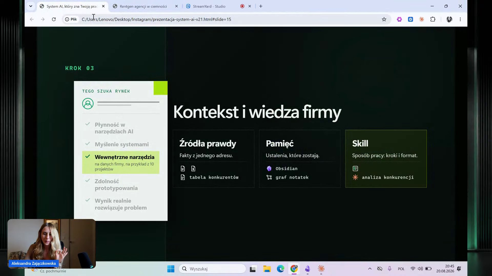

**Texto en pantalla (OCR):**

```
m Al, ktéry

GG OPlik cuss enovo/Desktop/Instagram/prezentac} em-ai-v21.html#slide=15

KROK 03

Kontekst i wiedza firmy

Zrédta prawdy Pamieé Skill

Y Wewnetrzne narzedzia Fakty z jednego adresu. Ustalenia, ktore zostaja. Sposob pracy: kroki i format.

Vac y,na

BB @ Obsidian 8

B tabela konkurentéw %8 graf notatek 3 analiza konkurencji
```

**Transcripción:** i wiedzy firmy, że jesteśmy w stanie stworzyć taką bazę danych, ustawić tą bazę danych do właśnie agentowi, jak on ma z niej korzystać i później to nam wszystko się mapuje właśnie do tej zdolności prototypowania. Dlatego, że ten system, który Wam teraz pokazałam, to jest tak naprawdę prototyp systemu albo wewnętrznie dla danej firmy, albo dla Was do Waszej konkretnej pracy. No i to jest właśnie ten taki proces, w którym Wy możecie pokazać, że hej, ja przecież jestem w stanie pracować z modelami językowymi, mam tą właśnie wiedzę, bo wiem, jakie wybrać rozwiązanie, potrafię zaprojektować taki system, potrafię pobrać te dane, potrafię zaprojektować te dane dla modelu językowego, a potem potrafię jeszcze zaproponować rozwiązanie, z którego możemy naprawdę wyciągnąć wnioski, które są wartościowe dla biznesu, na przykład robiąc właśnie taki artefakt, jaki Wam pokazałam, który Wam te wnioski uporządkuje. Dlatego tutaj właśnie tak mówię w tej zdolności prototypowania o tym, że bardzo ważne jest ogarnięcie dostępu do narzędzi i żeby cloud sięgał generalnie tylko tam, gdzie naprawdę jakby musimy pobrać te informacje. No i w jaki sposób to robimy? Teraz podsumowując już tak, wybieramy do tego clouda, łączymy go tylko z tymi narzędziami przez konektory, które są konieczne, wybieramy mu jeden konkretny folder i jeszcze w tej zdolności właśnie prototypowania i robienia tego całego procesu muszę zaznaczyć, że najważniejszy jesteśmy my, najważniejsza jest ta nasza tutaj wiedza ekspercka i to nasze działanie krytyczne, gdzie my będziemy tą osobą, która będzie sprawdzać jego wynik, będzie zatwierdzać jego wynik i będzie ewentualnie iterować nad tym wynikiem i kierować go w dobrą stronę i to jest to prawdziwe przekazywanie kontekstu. Teraz się mówi o tym, że kontekst jest trochę tak jak ropa. Kiedyś się mówiło, że dane są jak ropa, teraz mówi się o tym, że kontekst jest jak ropa, czyli że ta wiedza ekspercka, którą my jesteśmy w stanie po prostu przełożyć na proces pracy i na proces taki, który będzie czytelny dla modela językowego, żeby on właśnie odciążył nas z jakiegoś konkretnego zadania i to jest właśnie to. Jest jeszcze ostatni element, o którym chcę tutaj wspomnieć i to jest właśnie ewaluacja,

### [00:49:09]

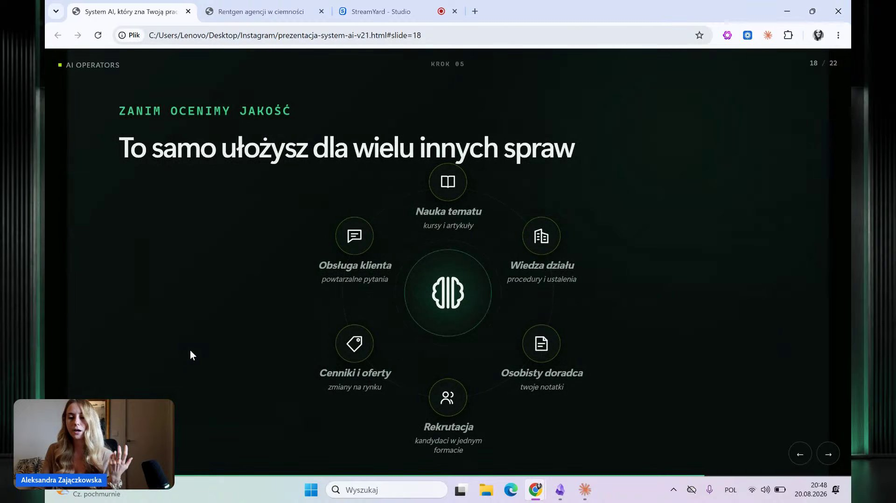

**Texto en pantalla (OCR):**

```
/Lenovo/Desktop/Instagram/prezentacja-system-ai-v21.html#slide=18

= Al OPERATORS KROK 05 18 f-22

ZANIM OCENIMY JAKOSCE

To samo utozysz dla wielu innych spraw
ima)

Nauka tematu
kursy iartykuly

Ea]

Obstuga klienta Wiedza dziatu

powtarzalne pytania q | D procedury i ustalenia

0 Ea)

Ls
Cennikii oferty Osobisty doradca
zmiany na rynku twoje notatki
Q>
m™
Rekrutacja

kandydaci w jednym
formacie
```

**Transcripción:** a przepraszam, jeszcze tutaj właśnie chciałam jeszcze raz wspomnieć, że zanim przejdę do ewaluacji, to chciałam jeszcze tak troszeczkę podsumować, że podałam Wam przykład analizy konkurencji, no a jeszcze raz przypominając, że generalnie taki proces, jaki Wam teraz pokazałam, możemy wykorzystać do nauki danego tematu, możemy tu wrzucić materiały z YouTube, kursy, artykuły i możemy sobie mieć taką bazę wiedzy, która będzie po prostu nam pomagać w nauce, możemy tu przekazać wiedzę z danego działu, możemy zrobić z tego osobistego doradcę, jeśli pracujecie w HR-ach, to to może być taki materiał, gdzie mamy po prostu całą rekrutację, możemy mieć tu cenniki, cenniki oferty, jeśli na przykład pracujecie w dziale sprzedażowym i patrzycie, jak się zmienia rynek, to może być też użyte do customer service, do obsługi klienta, gdzie mamy powtarzalne pytania i taki agent będzie sobie wyciągał z tej bazy wiedzy i odpowiadał właśnie klientom na podstawie już innych case'ów rozwiązanych, innych pytań i całej masy po prostu danych zebranych tutaj. Więc tutaj też chcę podkreślić, że jesteśmy w stanie ułożyć ten sam system dla wielu innych spraw. I teraz wrócę właśnie do tego ostatniego elementu, czyli do oceny jakości wyniku,

### [00:50:27]

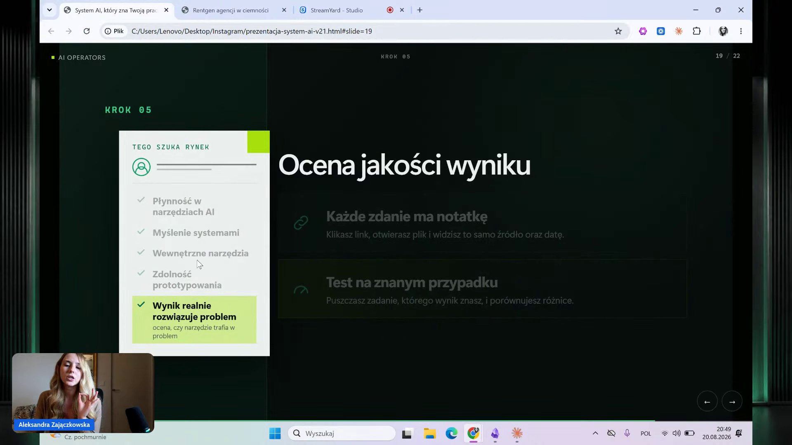

**Texto en pantalla (OCR):**

```
@Plik C/U:

= Al OPERATORS R 8 497,22

KROK 05

TEGO SZUKA RYNEK

Ocena jakosci wyniku

Y Wynik realnie
rozwiazuje problem

»blem
```

**Transcripción:** dlatego że tutaj chciałam Wam powiedzieć, że ta ocena jakości wyniku, ona nie tylko odnosi się i do tego systemu, który Wam pokazałam, nie tylko do konkretnego case'a, ale też tak naprawdę do wszystkiego, do czego bylibyście w stanie użyć ten system. To jest taki krytyczny punkt pracy z modelami językowymi, że zawsze musimy oceniać, jak ten model językowy właśnie zwraca nam te odpowiedzi. No i tutaj taka grafika, grafowa baza danych działa w taki sposób, że widzimy źródło, widzimy kiedy powstała dana notatka, jesteśmy w stanie wejść, zawsze jakoś zweryfikować, jakie informacje mu wrzuciliśmy, jak one zostały połączone i taki system będzie wymagał czegoś takiego, jak testowe przypadki, czyli zawsze powinniśmy mieć jakiś taki przypadek, na przykład jakiegoś połączenia, jakiegoś konceptu, który on powinien wyłapać, który taki system powinien wyłapać i powinniśmy mieć konkretne zapytanie, w którym zawsze możemy zapytać i zobaczyć, czy on na przykład wyłapie dalej te połączenia, czy jak na przykład dodamy mu 15 innych plików, czy on nie zacznie się gubić i nie zacznie nagle na przykład odpowiadać gorzej, więc powinniśmy mieć zawsze takie testowe przypadki i prowadzić taką ewaluację, żeby być w stanie oceniać jakość tej naszej bazy danych i czy ona nie degraduje z czasem, czy ona faktycznie się ulepsza i czy ten kontekst pozostaje zachowany. Więc tutaj też mamy właśnie taki aspekt, który chciałam Wam poruszyć na sam koniec. I jak widzicie, przeszliśmy sobie te wszystkie elementy, więc ja tutaj chcę jeszcze raz podsumować,

### [00:52:12]

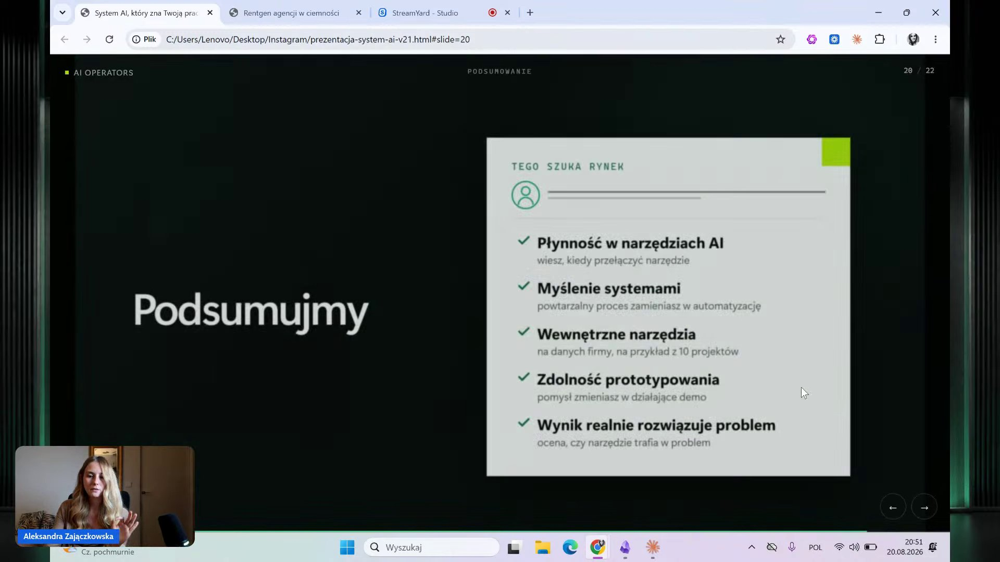

**Texto en pantalla (OCR):**

```
vo/Desktop/Instagram/prezentacja

= Al OPERATORS

TEGO SZUKA RYNEK

Ptynnos¢ w narzedziach Al
MySlenie systemami

Wewnetrzne narzedzia

Zdolnosé prototypowania

Wynik realnie rozwiazuje problem
```

**Transcripción:** że żeby stworzyć system pracy z AI, który pracuje razem z Wami i odciąża Was w części zadań, musimy przejść przez 5 elementów. Na samym początku musicie być naprawdę płynni w narzędziach AI i wiedzieć, kiedy ten model językowy się nadaje, a kiedy się nie nadaje do pracy, kiedy możemy użyć agenta, a kiedy agent to będzie za dużo, to będzie tak zwany overkill, no bo jeśli chcemy po prostu zrobić prosty brainstorm, no to może nie musimy angażować do tego żadnego kodkoda albo kodeksa. Potem musimy, żeby potrafić dobrze opisać sposób naszej pracy, czyli nauczyć się myśleć systemem i to jest właśnie to przekazywanie kontekstu, czy my bardzo dobrze zmapujemy tą naszą wiedzę ekspercką i czy my jesteśmy w stanie to ustrukturyzować, czy jesteśmy z tego w stanie wyizolować poszczególne etapy, powiedzieć z jakich danych korzystamy, jak korzystamy z tych danych, w jakiej kolejności, ile my tego potrzebujemy, czy my potrzebujemy to update'ować i zaprojektować właśnie, rozpisać sobie taki system, potem zastanowić się, czy my jesteśmy w stanie właśnie dostać się do tych danych, jak mamy je uporządkować, ile projektów musimy w to zaangażować i te trzy elementy są kluczowe, bo modele językowe też pracują na danych, nie mogą polegać tylko na swojej własnej wiedzy. No i później kolejny element to jest, jak stworzyć już rozwiązanie, czyli jak tak naprawdę dobrze pokierować tego kodkoda, żeby on nam zrobił po prostu, zmienił nasze pomysły w jakiś namacalny artefakt, w prototyp, który będzie dla nas narzędziem do wyciągania wniosków i jak mamy taki system, no to wtedy właśnie przestajemy wykonywać dane zadanie i możemy je oddelegować do agenta, stajemy się takim specjalistą wspieranym przez AI i to co my robimy, to jest właśnie ocena tego, krytyczne myślenie i takie bardziej strategiczne działanie, w którą stronę dalej mamy iść, jakie wnioski z tego wyciągnąć, skoro już oddaliśmy te powtarzalne, nudne czy też trudne i żmudne zadania do agenta, to jak my możemy teraz naprawdę na tych danych zrobić coś, co ma sens i przyniesie wartość i to się właśnie na samym końcu mapuje do tego, że musimy potrafić oceniać wyniki takiego systemu i widzieć, czy on realnie rozwiązuje problem, bo tutaj chcę wspomnieć o tym, że jest bardzo duży hype teraz na AI i myślimy, że ono jest w stanie rozwiązać wszystko, ale to jest tylko technologia i finalnie i tak jak projektujemy jakieś rozwiązanie, to ono jest po to, żeby rozwiązać jakiś dany problem, więc czy faktycznie rozwiązuje ten problem, czy może nie daje nam jakiejś konkretnej wartości. Tak i jeśli chodzi o wiedzę merytoryczną, to jest tak naprawdę wszystko, ale na sam koniec chcę wam jeszcze powiedzieć coś zupełnie szczerze

### [00:55:12]

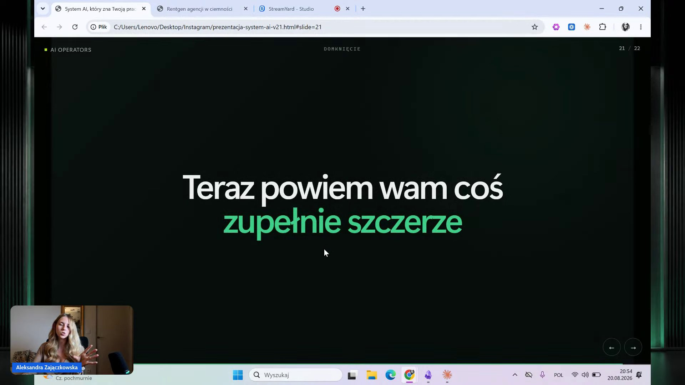

**Texto en pantalla (OCR):**

```
Y — @ system Al, ktd rac «X= @ Rentgen agencji

Cc @Plik C/ /Lenovo/Desktop/Instagram/prezentacja-system-ai-v21.html#slid

= Al OPERATORS DOMKN IE 2 / 22

Teraz powiem wam cos
zupeinie szczerze

h
```

**Transcripción:** i tutaj to, co chcę wam przekazać, to jest to, że teraz zobaczyliście naprawdę dobrze działający, system, w którym wiecie, macie piękną bazę danych, ona wygląda naprawdę jak mózg, są połączenia, dane są pobrane, ona się update'uje sama, sama się usprawnia, mamy też podane konkretne wnioski, mamy ten zbudowany artefakt i możecie sobie teraz pomyśleć, że to będzie jak magiczna różdżka i taki system będziemy mieć i ja zawsze bardzo lubię obalać hype i chcę wam powiedzieć tylko o tym, że ja lubię przekazywać to, że praca z modelem językowym to jest zawsze praca iteracyjna, zawsze będzie tak, że trzeba będzie go tam popromptować, pokierować i poiterować, jeśli chodzi o pracę z nim i po takich wiecie, falach iteracji w końcu będziemy mieli naprawdę dobrze działający system, tak było zawsze, taka jest natura modeli językowych,

### [00:56:12]

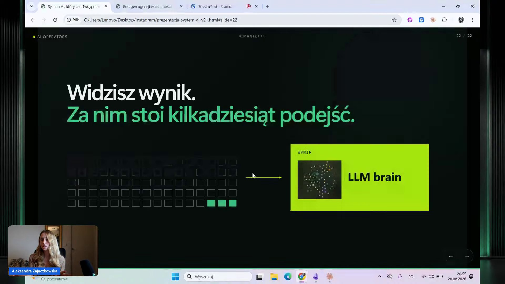

**Texto en pantalla (OCR):**

```
-ai-v21.html#slide=22

= Al OPERATORS ECTE 22/7 22

Widzisz wynik.
| Za nim stoi kilkadziesiat podejsc.

WYNTK

LLM brain
```

**Transcripción:** to prawda, że jest coraz łatwiej z nimi pracować, ale chcę zakończyć właśnie tą prezentację takim zabiciem tego hype'u, bo strasznie mnie on denerwuje, że ludzie myślą właśnie, że to jest nie wiadomo co i że tylko taką magiczną różdżką będziemy mieli niesamowity wynik i zapominają o naturze tego, jak działają modele językowe i że one właśnie wymagają iteracji. No tak, więc to będzie wszystko z mojej strony i teraz myślę, że oddam właśnie ekran i głos Damianowi.

### [00:56:46]


**Texto en pantalla (OCR):**

```
_ Aleksandra Zajaczkowska—

oy

.
```

**Transcripción:** Dzięki Ola, ja sam się bardzo dużo nauczyłem dzisiaj,

### [00:56:47]

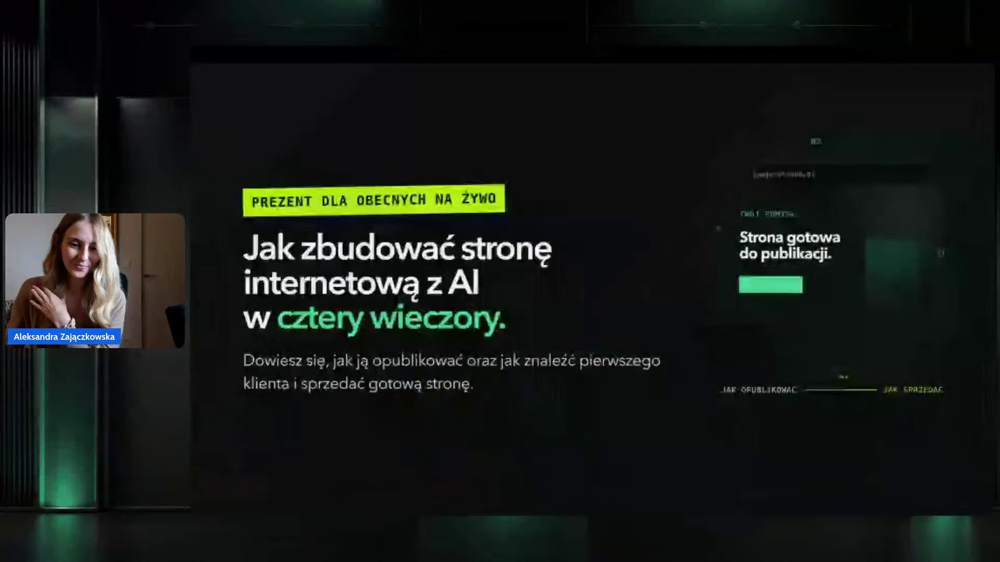

**Texto en pantalla (OCR):**

```
PREZENT DLA OBECNYCH NA ZYWO

Jak zbudowaé strone do publikach
internetowa z Al a
w cztery wieczory.

Dowiesz sie, jak ja opublikowaed oraz jak znalezc pierwszego

klienta i sprzedacé gotowa strone. Lak ORUBLIKOWAC
```

### [00:56:48]

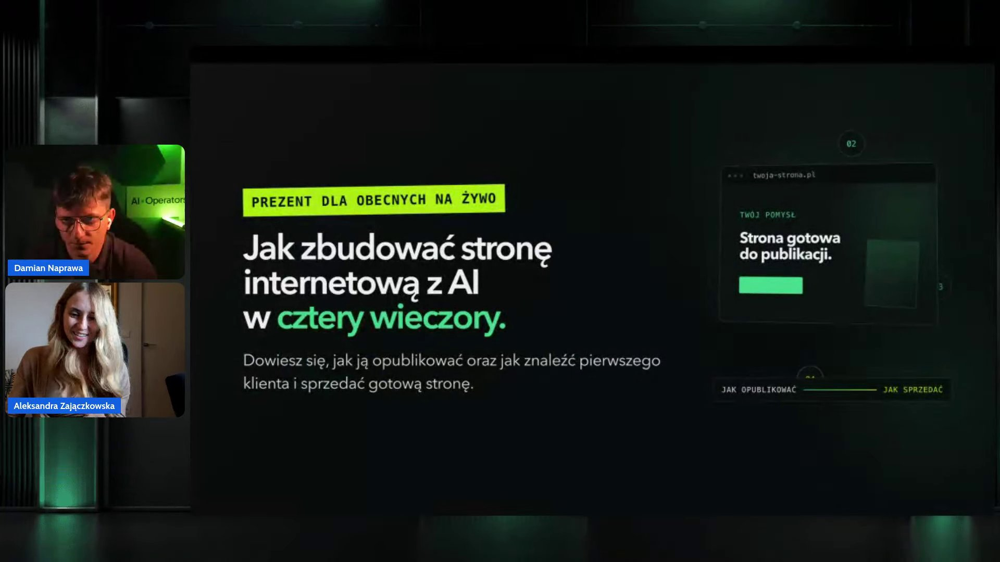

**Texto en pantalla (OCR):**

```
Jak zbudowaé strone sroagetowe

| internetowa z Al EER
ih w cztery wieczory.

Dowiesz sie, jak ja opublikowac oraz jak znalez¢ pierwszego
klienta i sprzedaé gotowa strone.

JAK OPUBLIKOWAC ——————————_ JAK_ SPRZEDAC
```

**Transcripción:** więc sądząc po komentarzach nasi widzowie także, więc ja przypominam, że już za chwilę będziemy rozdawać prezent, o który wam obiecaliśmy, czyli jak zbudować stronę internetową za 4 wieczory, ale jeszcze ja mam parę słów do dodania od siebie, więc pozwólcie, że wrócę do swojej części prezentacji

### [00:57:12]

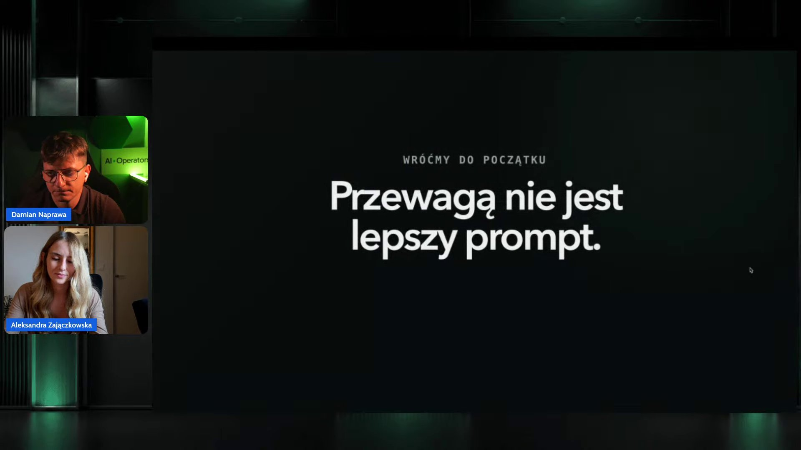

**Texto en pantalla (OCR):**

```
aeernean nie jest
lepszy prompt.
```

**Transcripción:** i to co na początku dziś zapowiadaliśmy, to dzisiaj promptowanie już nie ma sensu na pewno, w sensie inaczej, sam prompt nie rozwiązuje takich problemów, o których uczono nas chociażby rok temu, gdzie mówiono nam, że prompty i prompt engineering jest najważniejszy. Dzisiaj już ta zasada jest troszkę passé. Przewagą jest zbudowanie systemu i przykład takiego systemu widzieliście przed chwilą na prezentacji Oli.

### [00:57:48]

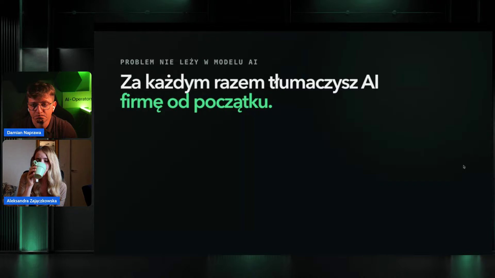

**Texto en pantalla (OCR):**

```
PROBLEM NIE LEZY W MODELU AI

Za kazdym razem tlumaczysz Al
firme od poczatku.
```

**Transcripción:** Więc problem nie jest też w jakimś wyborze modeli AI, bo dzisiaj zobaczcie, że też wiele osób pyta się, a jakiego to modelu AI użyłeś? Do mnie czasami tak się ludzie pytają. Ja odpowiadam często, że to nie ma większego znaczenia, którego modelu używasz, dopóki naprawdę nie wydajesz setek tysięcy albo tysięcy na te tokeny, to prawdopodobnie nie ma znaczenia, jakiego modelu użyjesz. Tylko problem jest w tym, że za każdym razem większość ludzi tłumaczy wszystko do tego AI od początku, a to, że ludzie są leniwi, ja też jestem leniwy i nie chce mi się za każdym razem tłumaczyć wszystkiego, to powoduje, że mam gorsze wyniki, jeśli bym nie miał takiego systemu, gdzie nie mam zabranej wiedzy w jednym miejscu, nie mam tego kontekstu dobrze ustawionego i tak dalej. Więc to są najczęstsze problemy, że AI nie zna tego, co my mamy w głosie. Więc to są najczęstsze problemy, że AI nie zna tego, co my mamy w głosie. My byśmy chcieli, że my napiszemy jedno zdanie i od razu wszystko będzie pięknie, ale jak my tego dobrze nie opiszemy wcześniej, no to wyniki też są kiepskie, bo są brane ze statystyki. Przypominam, że AI to jest to technologia oparta trochę o statystyce. Prawdopodobieństwo, to jest lepsze słowo. I tu się właśnie pojawia luka, kto przygotuje firmę do realnej pracy z AI.

### [00:59:12]

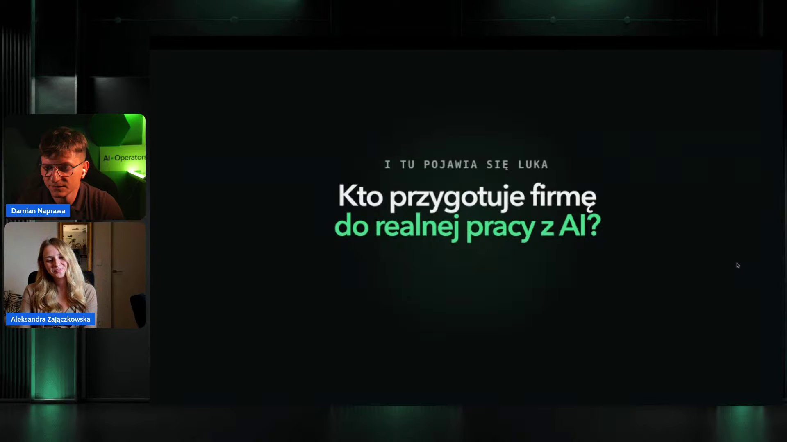

**Texto en pantalla (OCR):**

```
I TU POJAWIA SIE LUKA

Kto przygotuje firme
do realnej pracy z Al?
```

**Transcripción:** Wiemy już, że nie muszą być to programiści. Ja też potrafię programować, ale dzisiaj już nie programuję. I dzisiaj największy mój skill to jest to, że potrafię łączyć kropki i ustawiać dobrze kontekst, tak bym powiedział. Plus jeszcze parę innych rzeczy. Więc dzisiaj to humaniści, czy też ludzie nietechniczni często będą mieli przewagę nad programistami. Gdybym powiedział to 5 lat temu, albo 3 lata temu, to by mnie wszyscy wyśmiali, zlinczowali. Co? Programiści? Dzisiaj to się dzieje, moi drodzy. I mam nadzieję, że część z Was już to dostrzega. Że specjaliści, którzy mają wiedzę domenową, często potrafią lepiej opisać dany problem i wrzucić go do AI niż osoby techniczne. Więc dzisiaj tak naprawdę drzwi stoją otworem przed osobami, które chcą się uczyć i chcą w ten świat AI wejść. Bo dzisiaj potrzebujemy ludzi, którzy będą potrafili uporządkować jakąś wiedzę. I zamienić ją w procesy. I przede wszystkim przygotować kontekst do tego AI. Więc taki szybki czek, sprawdzenie, czy ostatnie 50 minut, czy zgodzicie się, że to był dobrze spędzony dla Was czas. Dajcie znać na czacie. To też nam pomoże przygotowywać kolejne prezentacje. Wasz feedback bardzo szanujemy, stąd też o niego prosimy. Dobrze.

### [01:01:06]

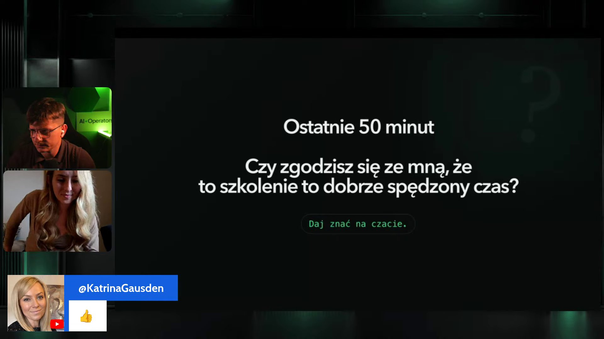

**Texto en pantalla (OCR):**

```
Ostatnie 50 minut

Czy zgodzisz sie ze mna, ze
to szkolenie to dobrze spedzony czas?

Daj znaé na czacie.
```

**Transcripción:** Cieszymy się bardzo. Bardzo się cieszymy. Bardzo się cieszymy. Dziękuję bardzo.

### [01:01:15]

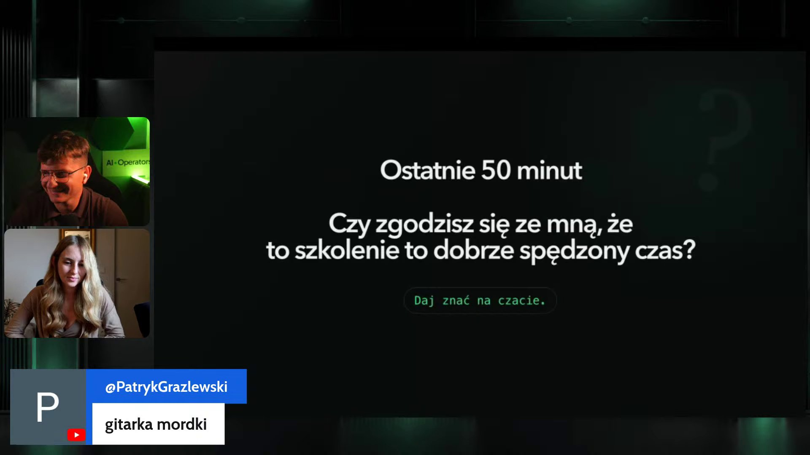

**Texto en pantalla (OCR):**

```
|

|
-_¥ a Ostatnie 50 minut
x!

Czy zgodzisz sie ze mna, ze
to szkolenie to dobrze spedzony czas?

Daj zna¢ na czacie.

gitarka mordki
```

### [01:01:21]

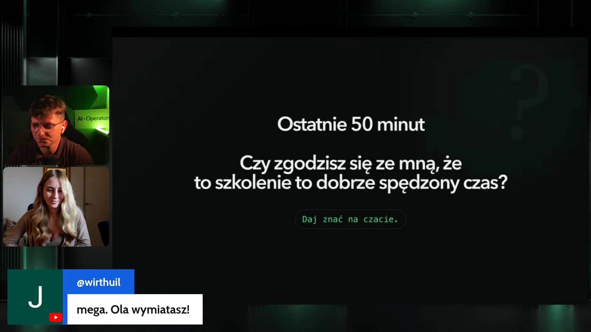

**Texto en pantalla (OCR):**

```
Ostatnie 50 minut

Czy zgodzisz sie ze mna, ze
to szkolenie to dobrze spedzony czas?

J mega. Ola wymiatasz!
=

Daj znac¢ na czacie.
```

**Transcripción:** Dobra, dzięki wszystkim.

### [01:01:27]


**Texto en pantalla (OCR):**

```
Ostatnie 50 minut

Czy zgodzisz sie ze mna, ze
to szkolenie to dobrze spedzony czas?

Daj zna¢ na czacie.

1ewnie, dobrze spedzony czas!
```

### [01:01:33]


**Texto en pantalla (OCR):**

```
Ostatnie 50 minut

Czy zgodzisz sie ze mna, ze
to szkolenie to dobrze spedzony czas?

Daj zna¢ na czacie.
```

**Transcripción:** Jakby coś, to możecie też dać znać, co Wam gdzieś szczególnie utrwiło w pamięci na czacie. Ja będę miał dla Was krótką propozycję. I mam tutaj pytanie, czy chcecie ją usłyszeć. Ale w sumie odpowiem sobie sam i pójdę dalej.

### [01:01:51]


**Transcripción:** Więc chcę Wam puścić taki krótki, krótki filmik.

### [01:01:54]


**Texto en pantalla (OCR):**

```
MAM JESZCZE JEDNA RZECZ

Czy chcecie ustysze¢ krotka propozycje
dla osob, ktore chca nauczy¢ sie

budowaé takie systemy?
```

**Transcripción:** I ta propozycja zajmie dosłownie 15 minut maksymalnie. I po tym wszystkim będę miał dla Was ten prezent, który Wam obiecałem. Więc na początek króciutki filmik, który Wam zrobi takie wprowadzenie do tematu, o czym chcę odpowiedzieć. AI potrafi zrobić bardzo dużo, tylko jest jeden problem.

### [01:02:11]


**Texto en pantalla (OCR):**

```
B =] ® GLOS WEACZONY ©
```

### [01:02:14]


**Texto en pantalla (OCR):**

```
” .
```

**Transcripción:** Nie zna Twojej firmy. Nie wie, jak pracują zespoły, gdzie jest wiedza, a niektórym źródłom można ufać.

### [01:02:16]


**Texto en pantalla (OCR):**

```
a |

e GLOS Wt

Nie wie, jak pracuja zespoty.
```

### [01:02:18]


**Texto en pantalla (OCR):**

```
rons \
a5 :

. tah - @ GLOS WEACZONY
e —
on a,

~ se ba 7
7 °  —, °
a J
|

Gdzie jest Wiedza i i kt6orym zr rodtom ufac.
```

**Transcripción:** AI operator rozmawia z zespołami, porządkuje wiedzę firmy, przygotowuje kontekst i pokazuje, które zadania naprawdę warto przekazać AI.

### [01:02:20]


**Texto en pantalla (OCR):**

```
GLOS WEACZONY

Al Operator rozmawia z zespotami.
```

### [01:02:21]


**Texto en pantalla (OCR):**

```
GLOS WEACZONY ©

=

Al Operator rozmawia z zespotami.

4
```

### [01:02:24]


**Texto en pantalla (OCR):**

```
GLOS WEACZONY
```

**Transcripción:** Nie musisz być programistą, żeby wejść w tę rolę.

### [01:02:30]


**Texto en pantalla (OCR):**

```
a

s !
Nie musisz byé programista, Zeby wejse v w te role.

{°%o
```

**Transcripción:** Bo dziś humaniści i osoby z wiedzą domenową mogą być bardziej przydatni niż programiści, bo będą potrafić opisać dobrze AI kontekst firmy.

### [01:02:39]


**Texto en pantalla (OCR):**

```
|
GLOS WEACZONY ™

kontekst re, _~ /

“llf 4
= 4
```

**Transcripción:** A jeśli pracujesz w IT, możesz pójść dalej.

### [01:02:41]


**Texto en pantalla (OCR):**

```
e GEOS WEACZONY M
```

**Transcripción:** Możesz tworzyć własne MCP i łączyć AI z systemami firmy.

### [01:02:45]


**Texto en pantalla (OCR):**

```
e GLOS WLACZONY
```

**Transcripción:** AI operator potrafi wziąć problem od zespołu i z pomocą AI samodzielnie dowieźć konkretny rezultat.

### [01:02:48]


**Transcripción:** Analizę, raport, stronę, prototyp albo usprawnienie prototypu.

### [01:02:55]


**Texto en pantalla (OCR):**

```
—— GLOS WEACZONY #
```

### [01:02:57]


**Transcripción:** Wie jak przygotować kontekst, dobrać narzędzia i doprowadzić temat do czegoś, co zespół może wykorzystać.

### [01:03:00]


### [01:03:03]


**Texto en pantalla (OCR):**

```
= |

GLOS WEACZONY " |
```

**Transcripción:** Na szkoleniu AI operators przez 5 tygodni nie tylko nauczysz się skutecznie korzystać z AI,

### [01:03:10]


**Texto en pantalla (OCR):**

```
| = GLOS WEACZONY

2 <

&}
rs Gh,
```

**Transcripción:** ale zbudujesz projekt do portfolio, a co tydzień spotykamy się na żywo, żeby omówić Twoje pytania i postępy.

### [01:03:12]


**Texto en pantalla (OCR):**

```
|
GLOS WEACZONY ©
```

### [01:03:14]


**Texto en pantalla (OCR):**

```
e GEOS WEACZONY ™

=a
```

**Transcripción:** Zapraszamy Cię serdecznie na pokład. Ok, więc przedstawiamy Wam dzisiaj program AI operators.

### [01:03:24]


**Texto en pantalla (OCR):**

```
DZIS OTWIERAMY PRZEDSPRZEDAZ

Al-Operators

5-tygodniowy program, ktdory uczy delegowaé Al realne procesy.
```

### [01:03:27]


**Texto en pantalla (OCR):**

```
DZIS OTWIERAMY PRZEDSPRZEDAZ

Al-Operators

5-tygodniowy program, ktdéry uczy delegowaé Al realne procesy.

HIERN
```

**Transcripción:** Jest to 5 tygodniowy program edukacyjny, który poprowadzimy wspólnie z Olą.

### [01:03:30]


**Texto en pantalla (OCR):**

```
DZIS OTWIERAMY PRZEDSPRZEDAZ

Al-Operators

5-tygodniowy program, ktory uczy delegowaé Al realne procesy.
```

**Transcripción:** I dzisiaj otwieramy do niego przedsprzedaż. Będzie to program, który będzie uczyć jak projektować kontekst firmowy. Niezależnie od tego czy jesteście osobami technicznymi czy nietechnicznymi. Czy pracujecie w logistyce, marketingu, sprzedaży czy innych działach. To jest program dla osób, które są po prostu ciekawe tego świata AI. I chcą do tego świata wejść. Więc przed tym programem ja sobie wyobrażam, że osoba, która dzisiaj korzysta dorywczo z czata GPT,

### [01:04:03]


**Texto en pantalla (OCR):**

```
TWOJA TRANSFORMACJA

PO 5 TYGODNIACH
Uzywasz Al Projektujesz system Al,
dorywczo. (np. ChataGPT) ktory zna Twoja prace.

DZIS
```

**Transcripción:** prosi go o jakieś pytanie, to to wystarczy, żeby wejść w to szkolenie. Nie potrzebujemy wcześniej jakiejś skomplikowanej wiedzy, aby przejść przez ten program. Ale skończymy go z umiejętnościami projektowania systemów AI, które będą znały Waszą pracę. Czy to Waszą osobiście, czy pracę jaką robicie na co dzień w firmie. I ten program kierujemy do dwóch grup osób.

### [01:04:33]


**Texto en pantalla (OCR):**

```
TEN PROBLEM MA DWIE ODStONY

DLA NIETECHNICZNYCH

W firmie sa wiedza i procesy,
ale brakuje osoby, ktora
przygotuje je pod Al.
```

**Transcripción:** Do osób nietechnicznych, czyli osób, które chciałyby ułożyć procesy w firmie. I na przykład wejść do branży AI lub wyróżnić się wśród obecnego pracodawcy. I mamy też specjalną ścieżkę dla technicznych. Dla osób, które chciałyby budować jakieś własne integracje z istniejącymi systemami.

### [01:05:00]


**Texto en pantalla (OCR):**

```
"| TEN PROBLEM MA DWIE ODStONY

a DLA NIETECHNICZNYCH

W firmie sa wiedza i procesy,
ale brakuje osoby, ktora
przygotuje je pod Al.

DLA TECHNICZNYCH

Masz systemy i API, ale agent
potrzebuje bezpiecznych .
narzedzi, zeby z nich
korzystaé.
```

**Transcripción:** Bo na przykład zależy Wam na bezpieczeństwie danych. Więc to będą dwie ścieżki. Jest nas dwóch prowadzących i dwie osoby będą odpowiadać za różne rzeczy.

### [01:05:12]


**Texto en pantalla (OCR):**

```
="

Modesszostaé o20bs od A
ktora przygotowuje firme do pracy z Al.
```

**Transcripción:** Więc jeśli chodzi o ścieżkę nietechniczną, tutaj za nią będzie odpowiadać Ola bardziej. Ja będę tylko gdzieś tam z boku. Tutaj zadbamy o to, aby to było w porządku. Tutaj zadbamy o to, aby to było w porządku. Żebyście wynieśli taką wiedzę jak porządkować firmowy kontekst i procesy. Usprawniać pracę swoją, ale także innych ludzi. Jak inicjować jakieś swoje projekty wewnątrz firmowe, żeby budować jakieś prototypy na potrzeby firmowe. A także jak zbudować sobie portfolio, jeśli chcecie wejść dopiero do branży AI. W ścieżce nietechnicznej nauczymy Was jak łączyć agentów z systemami firmy. Więc przede wszystkim zbudujemy własny serwer MCP, do którego podepniecie agenta i ten serwer MCP będzie zintegrowany z jakimiś Waszymi systemami firmowymi. To wszystko oczywiście z wykorzystaniem takich otwartych protokołów i standardów, jakie są obecnie na rynku. I to rozwiązanie będziecie w stanie wdrożyć w swojej pracy. I to jest jakby cel, za który ja odpowiadam w ścieżce dla technicznych osób. Będziemy budować coś, co realnie będziecie mogli wykorzystać w pracy. Więc szkolenie jest właśnie podzielone na takie dwie ścieżki, zarówno dla osób nietechnicznych i technicznych. Ale mamy też jeden wspólny fundament, czyli ustawianie kontekstu.

### [01:06:42]


**Texto en pantalla (OCR):**

```
JEDEN PROGRAM

Wspolny fundament.
Dwie rownorzedne sciezki.

, DLA NIETECHNICZNYCH
TYGODNIE 1-4 3
L DLA TECHNICZNYCH

Masz dostep do obu. Wybierasz projekt dopiero w 5. tygodniu.
```

**Transcripción:** I tutaj nad tym się będziemy najbardziej skupiać. Przejdę sobie troszkę szybciej przez ten slajd.

### [01:06:54]


**Texto en pantalla (OCR):**

```
TYDZIEN 1

Wybierasz proces,
ktory naprawde warto
oddaé Al.

Rozmowa, workflow czy agent? Podejmujesz decyzje na podstawie
wartosci, ryzyka i kosztu.

REZULTAT Mapa wiasnego procesu
```

**Transcripción:** I teraz opowiemy Wam. Co będzie Was czekać w konkretnym tygodniu. Bo będzie 5 tygodni. I teraz oddam głos Oli, żeby opowiedziała Wam co będzie w poszczególnych tygodniach. Na samym początku będziemy mieli tą właśnie wspólną bazę skierowaną i do osób technicznych i do nietechnicznych. I od pierwszych tygodni ja będę też mentorem. I ja tam postaram się Wam przekazać takie też zasady po prostu pracy z modelami językowymi. Ponieważ to jest moja specjalizacja. I od pierwszego tygodnia zaczniemy od wybrania procesów, które właśnie warto oddać. O tym, żebyście wiedzieli kiedy naprawdę... Teraz mieliście tego taki malutki przesmak. Kiedy wybrać proces deterministyczny, niedeterministyczny. Kiedy nadaje się właśnie rozwiązanie oparte o plot-code'a. Kiedy trzeba zrobić prototyp. Kiedy automatyzacja. Bo jak... Ja to... W zasadzie zaprojektowaliśmy to z taką myślą, że po prostu widzę co się dzieje w firmach. Nie zawsze będzie tak, że wszystko da się rozwiązać modelami językowymi. I po prostu trzeba być płynnym w tym. Więc pierwszy tydzień będzie skupiony na tym, żeby faktycznie dobrać dobre rozwiązanie do konkretnego przypadku. I kiedy zastosować te modele językowe i w jaki sposób. I na tym skupimy się w tygodniu pierwszym. Ok. To ja opowiem teraz może dla odmiany o tygodniu drugim.

### [01:08:30]


**Texto en pantalla (OCR):**

```
TYDZIEN 2

Budujesz agenta,
ktory przejmuje
powtarzalne zadanie.

Dajesz mu role, narzedzia, granice dziatania i sposéb oceny wyniku.

REZULTAT Dziatajacy, przetestowany agent
```

**Transcripción:** Więc w tygodniu drugim będziemy budować agentów. Czyli już będziemy oddawać jakieś powtarzalne zadania. Będą tu takie tematy jak MCP, jak skille. Czyli wszystkie te fundamenty, które dzisiaj każdy AI operator musi mieć. Będziemy uczyć się jak tworzyć skille od zera. Jak wykorzystywać istniejące serwery MCP. Tu jeszcze nie będziemy budować serwerów MCP, bo jest to troszkę bardziej skomplikowane. I to bym zostawił dla ścieżki technicznej. Ale to też taka ciekawostka, że osoby nietechniczne mają też dostęp do ścieżki technicznej. Bo nie rozdzielamy tego. Dostajecie dostęp do wszystkiego. Sami decydujecie w którą ścieżkę idziecie. Więc jak ktoś będzie ambitny z osób nietechnicznych to też będzie mógł skorzystać z tworzenia serwerów MCP.

### [01:09:24]


**Texto en pantalla (OCR):**

```
Tw6j sposob pracy
staje sie kontekstem
dia Al.

Zapisujesz Zrédta prawdy, instrukcje, przyktady i procedury, aby agent
nie zgadywat.

REZULTAT Wersjonowany kontekst i wlasny skill
```

**Transcripción:** Tak, teraz tydzień trzeci. Czyli przekazywanie kontekstu. I tutaj będziemy faktycznie pracować nad tym, żeby dobrze ustawić ten tak zwany kontekst engineering. To jest umiejętność właśnie opisywania tych procesów dla modelu językowego. Będziemy mieli różne przykłady. I będziemy pokazywać jak właśnie też wersjonować ten kontekst. I tworzyć skille, które wspierają nam te procesy ustawiania kontekstu dla agenta. To jeszcze może Cię poproszę o czwarty tydzień. Tak, i czwarty tydzień to są bazy danych. Teraz też Wam pokazałam tego przedsmak. Ponieważ pokazałam Wam grafową bazę wiedzy. Ale tak naprawdę to zależy mi na szerszym pokazaniu tego. Ponieważ tworzenie bazy wiedzy dla agenta to nie tylko są grafy. I nie tylko są takie fajne kolorowe właśnie LLM brainy, mózgi. Ale też są systemy ragowe. Też są bardzo proste systemy ragowe, które da się robić bez tworzenia ich samemu. I po prostu chcę pokazać cały taki przekrój tego. Jak wygląda cały przekrój. Jaka może być baza wiedzy dla naszego agenta. Jaką może z niej korzystać. I które rozwiązanie mamy wybrać. No bo znowu taka jest potrzeba. To nie jest tak, że taki LLM brain jest rozwiązaniem na wszystko. Tylko jest konkretny przykład w firmie. Czy u Was prywatnie, czy w firmie dla której pracujecie. I nie zawsze LLM brain się nada. Czasami to będzie inne rozwiązanie. Więc po prostu żeby mieć taki przekrój i wiedzieć co zastosować. No i teraz przechodzimy już do konkretów dla poszczególnych ścieżek. Więc ja najpierw teraz opowiem o ścieżce dla technicznych.

### [01:11:18]


**Texto en pantalla (OCR):**

```
PRTORAAD BLA ALETECHNIEZATCH

Co sklada si
na ten projekt?
```

**Transcripción:** I za chwilę się cofniemy dla nietechnicznych. Więc w ścieżce dla osób technicznych. Zbudujemy bezpieczną warstwę. Zbudujemy bezpieczną warstwę między agentem AI a wewnętrznym API. Czy logami, czy dokumentacją firmową. Następnie wykorzystamy ją do sprawdzenia statusu systemów chociażby. Będzie to jakaś dobra wiedza dla devopsów. I nie tylko. Więc tu jaki problem rozwiążemy. Często gotowe integracje się kończą wtedy gdy zaczynają się jakieś wewnętrzne systemy firmowe. Mamy jakiś wewnętrzny system firmowy, który sami zbudowaliśmy. No i ciężko żeby mieć do tego jakiś gotowy konektor MCP. Dlatego też trzeba będzie się troszkę pogłowić i zbudować sobie na przykład taki serwer MCP. Aby połączyć agenta w sposób bezpieczny z istniejącym systemem. I tym się również zajmiemy właśnie w ścieżce dla technicznych w tygodniu piątym. A teraz przykład dla nietechnicznych. Oddaję Ci głos. Jeśli chodzi o przykład dla osób nietechnicznych. To tutaj zależy nam na tym żeby zrobić właśnie taki system. Który usprawni wewnętrzny proces w firmie. Na przykład właśnie taką analizę konkurencji. Tylko, że ten proces może być o wiele bardziej złożony. I chodzi tutaj też o to żeby mieć taki projekt dla osób, które chcą wejść do branży AI. I żeby mogły pokazać go w swoim portfolio. Ponieważ ja wiem, że jest bardzo wiele specjalistów. Którzy właśnie mają tą wiedzę ekspercką. I wiedzą, że jak dołożą do tego ten skill AI. To mogą wtedy na przykład ze swojej pozycji. Project managera, product managera, sprzedawcy. Czy może właśnie jakichś takich zawodów biznesowych. Wejść na rolę, która jest takim operatorem AI. Solution właśnie inżynierem. Czy product builderem. Jest bardzo wiele ludzi, które ma pokrewne umiejętności. I tu chodzi o to żebyście wy byli w stanie zrobić coś. Co będzie tym właśnie takim waszym projektem do portfolio. Że hej wziąłem moją wiedzę ekspercką. Zrobiłem rozwiązanie AI. I zobacz co mam w swoim CV teraz. I jakby ja naprawdę potrafię używać tego AI plus mojej wiedzy eksperckiej. Więc jakby tutaj celem będzie zrobić taki system. Ja tutaj tylko dodam, że ta analiza konkurencji jest tylko wybranym przykładem. Ponieważ w tym tygodniu skupimy się także na takich rzeczach. Jak prototyp aplikacji. Czyli osoba, product manager będzie w stanie zrobić szybki prototyp aplikacji. Która mogłaby usprawnić jakieś procesy wewnątrz firmowe. Nie będziemy tu oczywiście mówić o sprzedawaniu aplikacji, budowaniu pod sprzedaż. Bo jest to uważam na dzień dzisiejszy zarezerwany temat dla inżynierów, dla programistów. Więc nie mydlimy wam tu oczu, że nauczycie się budować aplikacje i potem je sprzedawać. Absolutnie nie. Chociaż wiem, że są w internecie ludzie, którzy w ten sposób mydlą oczy ludziom. I bardzo ich nie szanuję. To my wam tutaj pokażemy bardziej jak robić coś. Co możecie wykorzystać na potrzeby firmowe. Bo zbudowanie czegoś na potrzeby wewnętrzne, a udostępnienie tego do internetu. To są w ogóle dwie różne światy i dwie różne ścieżki. Więc nie będziemy tego robić. Ja też pokażę wam jak tworzyć strony internetowe. Za chwilę zobaczycie stronę AI Operators chociażby. Która gdzieś ostatnio była tworzona przez nas. I to też było tworzone z AI. Na podstawie dobrego kontekstu. Uwierzcie mi bardzo dobrego, rozwijanego już od ponad roku. No i też podzielę się tym doświadczeniem z wami. Jak tworzyć strony, które nie wyglądają jak AI generated. Tylko wyglądają jakby wyszły od designera. Więc to tyle pokrótce jeśli chodzi o program. Wszystkie szczegóły będą na stronie. Więc za chwilę wam je udostępnimy. I teraz jeśli ktoś ma jakieś pytania. W sensie takim, że nie wiem. Jest laikiem, boi się, że sobie nie poradzi. To mamy taki warunek. Mianowicie macie 7 dni na przetestowanie kursu. Przetestowanie naszego programu. Wbicie na spotkania z nami na żywo. Sprawdzenie czy to jest fajne czy nie. W razie czego możecie zwrócić 100% kasy, odzyskać. Więc jakby nie ma tu żadnego ryzyka, że kupicie. A potem się okaże, że sobie nie dacie rady. Natomiast przypominam, że też kierujemy ten program. Do nietechnicznych. Więc będzie to przedstawione w sposób taki. Aby osoba nietechniczna to zrozumiała. Jeśli boicie się, że nie macie wiedzy eksperckiej. Bo tutaj na przykład wymienialiśmy często. Że ktoś ma wiedzę domenową, ekspercką. I może zostać właśnie takim solution inżynierem. Czy coś w tym stylu. To też się nie bójcie. Jeśli na przykład wasza w tej chwili praca jest powtarzalna. To my wam zaproponujemy jakiś projekt. Tutaj w szkoleniu. Gdzie tą wiedzę będziecie mogli sobie przetestować. I tutaj też nie ma o to obaw. Jeśli wybieracie ścieżkę techniczną. To też nie ma dużych wymagań wstępnych.

### [01:16:33]


**Texto en pantalla (OCR):**

```
wCZY TO MI SIE PRZYDA W PRACY?”

Jesli w Twojej pracy sa
informacje, decyzje i powtarzalne zadania,
masz co spabiaiclt

“MARKETING SPRZEDAZ OPERACJE HR IT ANALIZA

&
```

**Transcripción:** Proste rzeczy typu Bash, Git, API itd. Ale to podkreślam tylko dla ścieżki technicznej. Czy to wam się przyda z pracy? Możecie sobie pomyśleć. Więc jeśli z waszej pracy są jakieś informacje. A każda firma chyba ma informacje. Jakieś powtarzalne zadania. To na pewno macie co usprawniać. I będziecie mogli się wykazać.

### [01:16:57]


**Texto en pantalla (OCR):**

```
NIE MASZ POMYSLU NA PROJEKT?

Nie musisz
przychodzi¢
z gotowym. ‘

Pomozemy Ci znalez¢ proces w Twojej pracy i pokazemy
kompletny przyktad.
```

**Transcripción:** Jak nie macie pomysłu na swój projekt. To my wam podsuniemy taki pomysł. Który będziecie mogli zrobić. A jak będziecie mieli pomysł na swój. To jesteśmy happy żeby wam dać feedback. Jak to ogarnąć.

### [01:17:12]


**Texto en pantalla (OCR):**

```
PROGRAM ZAPROJEKTOWANY DLA OSOB NA ETACIE
```

**Transcripción:** Więc program wygląda w ten sposób. Że uczycie się wtedy kiedy macie czas. Jest to program dostosowany do osób pracujących na etacie. Którzy rano najczęściej są w pracy. I mają czas tylko popołudniami. Mamy też spotkania na żywo. Też w godzinach popołudniowych one będą. Ale dla osób które nie mogą być w danym dniu. To będzie nagrywane wszystko. I udostępnione. I przechodzicie to wszystko razem z grupą. Więc macie motywację. Nie odłożycie tego na półkę na pewno. Tylko będziecie pracować. Będziecie pracować z grupą. I wszystko razem z naszym wsparciem.

### [01:17:45]


**Texto en pantalla (OCR):**

```
NIE ZOSTAJESZ SAM Z MATERIALAMI

Budujesz z nami.
Dostajesz feedback.
```

**Transcripción:** Macie dostęp do forum. Do spotkań na żywo. Więc możecie liczyć na naszą pomoc. Poprzednie nasze programy. Z zadowoleniem.

### [01:17:57]


**Texto en pantalla (OCR):**

```
Katarzyna Kot
(%) Audytor Jakosci Produkcji Zywnosci

UCZESTNICZKA NASZYCH SZKOLEN

»Wiedze wczesniej zarezerwowana dla
programistow przetozyliscie na jezyk :
zrozumiaty dla cztowieka spoza branzy IT."
```

**Transcripción:** Kończyły osoby nietechniczne. Tu widzicie przykład Kasi. Która ukończyła jedno z naszych szkoleń. I było to szkolenie. Które pokrywało taką wiedzę. Też z AI. I Kasia tu mówi. Że wiedzę wcześniej zarezerwowaną dla programistów. Przełożyliście na język zrozumiały. Dla człowieka spoza branży IT. I to jest bardzo ważne. I to jest bardzo ważne. Więcej opinii znajdziecie na stronie. Ja tylko już podsumuję. I przechodzę do konkretów. Czyli do ceny.

### [01:18:30]


**Texto en pantalla (OCR):**

```
PIERWSZA EDYCJA

Cena?
```

**Transcripción:** Natomiast zanim jeszcze. To przypomnę 7 dni gwarancji.

### [01:18:33]


**Texto en pantalla (OCR):**

```
NAJPIERW ZDEJMIJMY RYZYKO

Masz 7 dni od startu,
zeby spokojnie sprawdzi¢
czy to dla Ciebie.

Jesli nie, prosisz o zwrot.
```

**Transcripción:** Niezależnie od tego czy. Cokolwiek wam się nie spodoba. Czy na przykład będziecie potrzebować. Odzyskać pieniądze. To aż do 2 listopada możecie to zrobić. Program startuje nie teraz. Nie dzisiaj. Startuje w październiku. A dzisiaj mamy otwarcie projektu. Na najlepszą możliwą cenę. Najniższą jaką się tylko dało. I nigdy nie będzie taniej. Ale jeszcze dodatkowo możecie tą cenę rozłożyć. Nawet na 10 rat 0%. Mamy w koszyku pay uraty. Wszystko tam sobie wyklikujecie samodzielnie.

### [01:19:06]


**Texto en pantalla (OCR):**

```
PRZEDSPRZEDAZ

Ta cena nie wroci
juz nigdy.

DZIS 2 WRZESNIA

Kolejne ceny beda wyzsze.
```

**Transcripción:** Ja tylko podkreślę, że dzisiaj jest najlepszy moment. I ta cena nie wróci już nigdy. Bo zawsze będzie później drożej. Tak to działa. Przed sprzedaż jak kupujecie bilet na koncert. Wcześniej to macie taniej. Tak samo działa to u nas. Tyle. Nie będę się nad tym rozwodził.

### [01:19:24]


**Texto en pantalla (OCR):**

```
WAZNE - zanim podamy cene...

Potrzebujemy minimum
100 osob w przedsprzedazy.
```

**Transcripción:** Mam jeden ważny temat. Potrzebujemy. Albo raczej określiliśmy sobie takie minimum. Że musi do nas dołączyć minimum 100 osób. Przed sprzedaży. Jeśli nie uzbieramy tych 100 osób. To anulujemy projekt całkowicie. Wszystkim którzy dołączyli. Oddajemy kasę. I się rozchodzimy. Ale wierzę, że ten limit przekroczymy. I to grubo. Ale gdyby nie. To tak jak mówiłem. Oddajemy 100% kasy. I nie ma żadnego problemu. Dodatkowo dla wszystkich osób.

### [01:20:00]


**Texto en pantalla (OCR):**

```
DODATKOWY KURS ONLINE
BEZ PROGRAMOWANIA * DLA NIETECHNICZNYCH

Zbuduj glosowego

ser ical Al, ktory

odbiera telefony.

Potrafi odebra¢ potaczenie, takze gdy nie odbierasz wlasnego

telefonu, i prowadzié rozmowe gtosem brzmiacym jak
cztowiek.

FIRMY PLACA ZA TAKIE ROZWIAZANIA
500-1200 zt / mies.

W ABONAMENCIE
```

**Transcripción:** Które zdecydują się. Dzisiaj do północy. Na dołączenie. Będzie dodatkowy kurs online. Który udostępnimy wam we wrześniu. Będzie to kurs. Zbuduj głosowego asystenta AI. Który odbiera telefony. Potrafi odbierać połączenia. I możecie to nawet ustawić tak. Jest tam instrukcja. Jak na przykład przekierować. Takiego asystenta z iPhone'a. Czyli ktoś dzwoni na waszego iPhone'a. I odbiera wasz taki asystent AI. Takie rozwiązania. Dzisiaj są na rynku. Jakby. Już powoli standardem. I coraz więcej firm. Decyduje się na wdrożenie. I to nie jest taka sekretarka. Wciśnij jeden. To połącze cię z działem tym. Jakby to człowiek odbierał telefon. Podobnie. Bardzo podobnie. Oczywiście nie jest to człowiek. Ale brzmi to bardzo podobnie. Firmy dzisiaj za takie rozwiązania płacą. Między 500 złotych a 1200 złotych miesięcznie. Dzisiaj mi się wyświetliła reklama. Dwóch takich firm. Które oferują takie usługi. Nie będę tutaj reklamował. Ale możecie sobie poszukać. Jak wpiszecie w Google. To na pewno zobaczycie takie firmy. Za miesiąc. Oczywiście zależy od wolumenu połączeń. Jeszcze tutaj chciałam jedną rzecz powiedzieć. Że zawsze jak ktoś się mnie pytał.

### [01:21:24]


**Texto en pantalla (OCR):**

```
WARUNEK OTRZYMANIA BONUSU

Tylko osoby, ktore kupia
dzisiaj do 23:59,
otrzymaja dodatkowy kurs online.

BEZ PROGRAMOWANIA + DLA NIETECHNICZNYCH
```

**Transcripción:** Jaki jest największy właśnie zwrot. Z inwestycji. Jak na przykład wybieracie sobie jakiś projekt. Do portfolio na przykład. Co firmy chętne są wdrażać. No to zawsze mówiłam. Że to jest asystent głosowy. Bo to właśnie łatwo. Bardzo dużo firm to chce na przykład restauracje. Salony beauty. Więc zawsze mówiłam. Że jeśli chcesz być publiczny. To taki asystent głosowy. To jest świetny wybór. Więc tak. Ten bonus dzisiejszy. To jeszcze raz przypomnę dla osób. Które dołączą do północy. Ten dodatkowy kurs online.

### [01:22:06]


**Texto en pantalla (OCR):**

```
WARUNEK OTRZYMANIA BONUSU

Tylko osoby, ktdre kupia
dzisiaj do 23:59,
otrzymaja dodatkowy kurs online.

BEZ PROGRAMOWANIA ~- DLA NIETECHNICZNYCH

q: czy bonus dotyczy tez androida czy tylko iphone
```

**Transcripción:** I teraz tutaj jest pytanie od razu na czacie. Czy to dotyczy również Androida czy iPhone. Generalnie ja mam sprawdzone. Ja wiem że w iPhone się da przekierować połączenie. I można to zrobić z poziomu telefonu. Nie jestem pewien czy się da to zrobić. Z poziomu Androida. To mówię bo to przetestowałem. Na nie wiem. Strzelam że na 80% też się da. No bo dzisiaj Android to praktycznie ma wszystko. To co iPhone. Ale 100% pewności nie mam. W każdym bądź razie. Jesteś w stanie wykupić sobie dodatkowy numer specjalny. I po prostu jak ktoś zadzwoni pod ten numer telefonu. Bo o tym iPhone to ja mówię na tej zasadzie. Że masz swój numer telefonu.

### [01:22:42]


**Texto en pantalla (OCR):**

```
Tylko osoby, ktore kupia
dzisiaj do 23:59,
otrzymaja dodatkowy kurs online.

BEZ PROGRAMOWANIA + DLA NIETECHNICZNYCH
```

**Transcripción:** Który masz od lat zarejestrowany. I na ten numer kierujesz tego asystenta. I jak ktoś do ciebie dzwoni. To on odbiera. Natomiast jak chciałbyś to założyć. Na osobny numer telefonu. To niezależnie od tego czy masz Androida czy cokolwiek innego. To to zadziała. Jak weźmiesz nowy numer telefonu. I chcesz na przykład skonfigurować to dla jakiejś nowej firmy. Czy cokolwiek. Więc ten bonus dzisiaj do 23.

### [01:23:15]


**Texto en pantalla (OCR):**

```
Al + Operators

Zostan
se, Al Operatorem. Deleguj
: powtarzalne zadania do Al. Gud» ec
KUP DO :§

Bez programowania: zbuduj
gtosowego asystenta Al, ktory
+ 12 miesiecy dostepu odbiera telefony i brzmi jak
cztowiek. Firmy ptaca za takie
rozwiazania 500-1200 zt
miesiecznie.

« 5 tygodni nauki i dostep do obu sciezek

+ Spotkania na zywo oraz feedback

« Certyfikat i 7 dni gwarancji

« Start 26 pazdziernika - ale teraz w przedsprzedazy
najtaniej

aioperators.pl/teraz (>)
```

**Transcripción:** Cena wygląda następująco. W przedsprzedaży najniższa możliwa cena. 995 zł netto. Plus podatek VAT. 23%. Wystawiamy faktury. 23% VAT. I wszystko. Przychodzi wam od razu po zakupie na maila. Przypominam. Zero ryzyka. Macie 7 dni gwarancji od startu. Czyli jak sprawdzicie materiały. Zobaczycie o co chodzi. Uznacie że to jest nie dla was. Albo że was wkurzamy. Albo wam nie pasujemy. To piszecie jednego maila. I w ciągu 3 dni roboczych odzyskujecie 100% kasy. Bo przelew wychodzi jeden dzień roboczy. Odczytamy maila. I najczęściej robimy to tego samego dnia. Ale dajemy sobie taki bufor. 3 dni robocze. Więc zapraszamy serdecznie. I teraz przechodzimy do sekcji pytań. I przechodzimy do obiecanego bonusu. Który też obiecaliśmy. Wrzucam tylko link na czat. I tutaj też zaznaczę od razu. Że tą przedsprzedaż nie ukrywam. Kierujemy do stałych klientów. Jak zawsze. Powiem szczerze że. W reklamę wrzuciliśmy dosłownie parę groszy. Jak na nasze standardy. Specjalnie po to żeby dołączyli. Nasi stali klienci. Stąd też nie przewidujemy tutaj żadnych rabatów. To jest najniższa możliwa cena. I ona nigdy się nie powtórzy. Zawsze będzie drożej. Jeszcze ważna uwaga. Jak ktoś już się zdecydował na dołączenie. To ten dostęp do tego kursu. O tym asystencie. Jaj będzie we wrześniu przydzielany. Postaramy się. Jak najszybciej to przydzielić. Ale to też zaznaczam. Że dzisiaj tego jeszcze nie będzie. Ale ten bonus jest tylko dzisiaj. Więc jutro jak ktoś będzie chciał dołączyć. To już go nie dostanie. Dobra to my przechodzimy do pytań. I zróbmy sobie dwa pytania. I rozdamy ten bonus. O który obiecaliśmy. Ja mam tutaj polajkowane. Zaznaczone pytania. Pytania. Do części merytorycznej. Więc Ola. Pytanie do Ciebie.

### [01:25:42]


**Texto en pantalla (OCR):**

```
Al» Operators

|  Zostan
| Al Operatorem. Deleguj
“ —_ powtarzalne zadania do Al.

» 5 tygodni nauki i dostep do obu Sciezek
« Spotkania na zywo oraz feedback
+ 12 miesiecy dostepu

« Certyfikat i 7 dni gwarancji

« Start 26 pazdziernika - ale teraz w przedsprzedazy

najtaniej

Q: dlaczego obsidian i czy moze byێ cos innego?

(EGELY DLA NIETECHNICZNYCH
kup 00 2Os9

Bez programowania: zbuduj

glosowego asystenta Al, ktory
odbiera telefony i brzmi jak
cztowiek. Firmy ptaca za takie
rozwiazania 500-1200 zt
miesiecznie.
```

**Transcripción:** Tutaj było w trakcie prezentacji. Dlaczego Obsidian? I czy może być coś innego? Może być coś innego. Zdecydowanie jest dużo rozwiązań grafowych. To nie jest jedyna. Jest w ogóle cała masa. Tak samo jak wektorowych baz danych. Wybrałam Obsidian dlatego. Że chciałam Wam zobrazować koncept. I on jest bardzo dobrze dostępny. Na szkoleniu też. Obsidiana na pewno. Też dlatego, że to rozwiązanie jest darmowe. I żeby nie generować. Niepotrzebnych kosztów. Więc. Wybór był głównie po to. Żeby pokazać Wam. Zobrazować Wam koncept. I dobrze go wytłumaczyć. A to narzędzie pozwala na to też wizualnie. Więc też taka moja preferencja była. Ale nie ma tutaj jakiejś takiej. Przewagi wielkiej. Bo ja też mam takie podejście do tych narzędzi. Że bardzo często jest tak, że. Jak na przykład pracujecie w firmie. To nie będziecie mogli za bardzo. Wybrać sobie czegoś co lubicie bardziej. Albo nie bardziej. Tylko czasami są pewne ograniczenia. Czasami jedno rozwiązanie jest lepsze do danego use case.

### [01:26:48]


**Texto en pantalla (OCR):**

```
Al> Operators

Zostan
Al Operatorem. Deleguj
powtarzalne zadania do Al.

« 5 tygodni nauki i dostep do obu sciezek
« Spotkania na zywo oraz feedback

« 12 miesiecy dostepu

« Certyfikat i 7 dni gwarancji

« Start 26 pazdziernika - ale teraz w przedsprzedazy
najtaniej

aL DLA NIETECHNICZNYCH
kup po LOS

Bez programowania: zbuduj
gtosowego asystenta Al, ktéry
odbiera telefony i brzmi jak
eztowiek. Firmy placa za takie
rozwiazania 500-1200 zt
miesiecznie.

aioperators.pl/teraz )
```

**Transcripción:** Więc ja nigdy staram się tak nie podchodzić. Do tego na zasadzie, że coś jest lepsze, gorsze. Dlatego, że. To bardzo mocno zależy od tego jaki macie przypadek. I do czego musicie to użyć. I bardzo wiele rozwiązań. Daje nam to samo. Bo wiadomo nawet jest wiecie. Jak używamy kod koda a kodeksa. Niektóre firmy nie mają w ogóle dostęp do kod koda. I muszą używać copilota. I tu nie o to chodzi tak naprawdę. Nie chodzi o model. Tak jak to mówił Damian na początku. Tylko chodzi o sposób pracy. Więc narzędzie jest drugorzędne. To tu jest jeszcze pytanie. Też w trakcie prezentacji padło. Czy ten graf się robi sam? Czy trzeba mu go. Czy LLM robi sam ten graf? Czy trzeba mu jakoś dostarczyć? LLM robi. Ale trzeba dostarczyć LLM-owi dobrze opisany sposób i kontekst. Ale LLM go dla ciebie zrobi. Nie robi się go samemu. Czyli po prostu dosłownie daje się LLM-owi pliki. Które są w folderze. Daje się dostęp do folderu. I musisz po prostu w dobry sposób to. Przedstawić ten kontekst. I wtedy LLM robi go dla ciebie. Rozumiem, że w szkoleniu AI Operators. Będzie to wytłumaczone. Krok po kroku. Dokładnie. Długo by było żeby to wyjaśnić. Ale tak będzie to dokładnie opisane. Dobra. Tak jak obiecałem. Dwa pytania poszły. Wrzucam teraz. Ten poradnik o który Kamil prosi.

### [01:28:24]


**Texto en pantalla (OCR):**

```
Al+ Operators

i = Zostan

Al Operatorem. Deleguj

e
powtarzalne zadania do Al. FeXTR |
kup v0 2OsDP
Bez programowania: zbuduj
gltosowego asystenta Al, ktory
odbiera telefony i brzmi jak
cztowiek. Firmy ptaca za takie
rozwigzania 500-1200 zt
miesiecznie.

« 5 tygodni nauki i dostep do obu Sciezek

« Spotkania na zywo oraz feedback

+ 12 miesiecy dostepu

« Certyfikat i 7 dni gwarangcji

« Start 26 pazdziernika - ale teraz w przedsprzedazy
najtaniej

q: jak odebrac¢ bonusy bo nie moge znalez¢ na stronie z teraz, chodzi mi o "Strona Internetowa w
Cztery Wieczory + Publikacja w Internecie + Jak znalez¢ klientow"
```

**Transcripción:** Ten bonus. Więc już teraz wam to wrzucam na czat.

### [01:28:27]


**Texto en pantalla (OCR):**

```
Al+ Operators

Zostan
Al Operatorem. Deleguj
powtarzalne zadania do Al.

« 5 tygodni nauki i dostep do obu sciezek
« Spotkania na zywo oraz feedback

+ 12 miesiecy dostepu

« Certyfikat i 7 dni gwarancji

« Start 26 pazdziernika - ale teraz w przedsprzedazy
najtaniej

SaLLW DLA NIETECHNICZNYCH
kup v0 2O2D9

Bez programowania: zbuduj
gtosowego asystenta Al, ktory
odbiera telefony i brzmi jak
cztowiek. Firmy ptaca za takie
rozwiazania 500-1200 2t
miesiecznie.

aioperators.pl/teraz
```

**Transcripción:** I jest on do odebrania dla was. Już kopię link. Więc link macie na czacie. I jest to. To co obiecywałem od początku. A my lecimy z kolejnymi pytaniami. Jeśli macie jeszcze jakieś pytania. O sam program. To też zachęcamy. My tutaj mamy zebraną. Sporą ilość pytań. Jeszcze w trakcie prezentacji. Tu jest pytanie takie. Czy da się jakoś pobierać te dane. By mogły się aktualizować codziennie. By być na bieżąco ze zmienami. To podejrzewam, że chodzi o. O takie update'owanie. Dane tych agencji chyba. Tak, tak, tak. Oczywiście da się to. Da się ustawić to żeby się w ogóle. Automatycznie wszystko pobierały te dane. Jeśli masz jakieś miejsca. Z których chcesz je pobierać. Czy to są dostępy do wewnętrznych narzędzi firmowych. Czy pobieranie z internetu. To jak najbardziej. Da się w ogóle całkowicie zautomatyzować ten proces. Żeby one się właśnie automatycznie pobierały. I ta baza usprawniła się sama. To pytanie od Agnieszki. Więc odpowiemy od razu. Czy można kurs zrobić wcześniej niż w październiku. To jest taki. Program edukacyjny. W którym uczymy się. Też na spotkaniach na żywo. Więc to jest tak, że to startuje. W październiku. I w trakcie tego. Tego intensywnego sprintu. Są dodatkowe spotkania. Jest dodatkowe nasze wsparcie. Też jest taka motywacja. Dzięki temu żeby to ukończyć. Mamy już z powodzeniem przeprowadzony program. Poprzedni dla programistów. Z wykorzystaniem AI. I to się bardzo dobrze sprawdziło. Ponieważ. Mamy wysoki poziom ukończeń tych szkoleń. Czyli ludzie po prostu. Nie odkładają tych szkoleń na półkę. Tylko je przerabiają. A na tym nam zależy żebyście. Tu i teraz. Jakąś wiedzę wynieśli. Bo jak się kupuje kolejne kursy. To ja wiem sam z praktyki. Jak to jest od razu dostępne. Wejdę a tam jest 150 filmików. I 150 wideo. To jest za dużo. Za dużo dla mnie. I najczęściej to ląduje na półce wstydu. A tutaj mam nadzieję. Że tak nie będzie.

### [01:31:09]


**Texto en pantalla (OCR):**

```
Al> Operators

Zostan
Al Operatorem. Deleguj

powtarzalne zadania do Al. LLY DLA NIETECHNICZNYCH
kup 00 2O2D

« 5 tygodni nauki i dostep do obu sciezek
Bez programowania: zbuduj

+ Spotkania na zywo oraz feedback

gtosowego asystenta Al, ktory
+ 12 miesiecy dostepu odbiera telefony i brzmi jak
« Certyfikat i 7 dni gwarancji cztowiek. Firmy placa za takie
rozwigzania 500-1200 zt
« Start 26 pazdziernika - ale teraz w przedsprzedazy miesiecznie.

najtaniej

aioperators.pl/teraz
```

**Transcripción:** Bo będzie to wszystko prowadzone w taki sposób. Żebyście. Mieli też motywację do tego. Żeby to ukończyć. Razem z całą grupą. I też grupa nakręca się. Bo jak idzie cała grupa. To też. Nie tylko jesteśmy my jako mentorzy. Ale są też inni ludzie. Którzy dzielą się swoim feedbackiem. Co tam udało się skończyć. I mamy to po prostu już przetestowane. Sprawdzane na innym programie. Tylko ten program był kierowany do programistów. I mamy to przetestowane. I w ten sam sposób to będzie realizowane. Tutaj Ola do ciebie pytanko. Możesz traktować. Cloud Master Class jako podstawę. A to będzie bardzo rozszerzone. Więc nie będzie to powtórzenie. Tego samego. A już na pewno nie Cloud Content. Bo takie materiały. Tam w ogóle nie będzie. Jeśli chodzi o Cloud Business. To możesz traktować. Jako taką bardzo dużą podstawę. Cały kurs będzie prowadzony. Na platformie Circle. Która jest bardzo wygodna. Ma super aplikację mobilną. Wszyscy ogólnie chwalą tą platformę. Jeśli ktoś ma nasze inne szkolenia. I nie była to ewolucja dewelopera. Bo ewolucja też była na Circle. To to właśnie jest zmiana. Będzie to właśnie na platformie Circle. Jest tam chat. Są live. Wszystko tam macie w jednym miejscu. Ogłoszenia, dyskusje. Fajny podział. Jakby tej wiedzy. Na różne materiały. Czy to tekstowe, graficzne. Video, quizy. Także jest to nowoczesna platforma. Dostosowana do 2.26. I tam to się będzie wszystko. Wszystko odbywać. Przypominam, że będą te spotkania na żywo. Że to też wyróżnia. Kurs online kolejny jak na Udemy. Czy gdziekolwiek indziej. Tylko na tych spotkaniach my będziemy. Nie nasze klony AI tylko my. I będziemy wam pomagać. Czy serwer MCP. Tutaj domyślam się Marcin. Że pytasz o ścieżkę dla technicznych. To też podkreślę, że. Jeśli o to pytasz. Jak nie to sprostuj mnie proszę. Odniosę się do ścieżki dla technicznych. Więc ja wykryłem sobie taki problem. I to też wyszło z moich use case. Podczas rozwoju swoich. Aplikacji SAS. Że napotkałem problem. Z połączeniem. Z połączeniem AI. Z moimi wewnętrznymi systemami. Gdzie np. nie było gotowego MCP. Serwera. Trzeba było coś szyć. I tak samo jest w firmach. Które mają wewnętrzne systemy różne. Napisane albo nie udostępnione. Na zewnątrz. No i po prostu trzeba coś dorobić. Jakiś plugin do tego wszystkiego. I bezpiecznie tam wpuścić agenta. Albo nie narobił kuku. Czyli zadbać o to żeby agent np. Miał dostęp tylko read-only itd. Więc będziemy się takimi tematami. W ścieżce dla technicznych zajmować. I nie będzie tutaj tworzenia aplikacji programowania. Tylko tak jak np. jest w evolucji. Tylko tutaj będziemy bardziej robić takie rzeczy. Dla admina. Dla devopsa. Programista też oczywiście skorzysta. Ale to są takie rzeczy bardziej. Do usprawniania pracy zespołu IT. Niż budowania aplikacji.

### [01:34:48]


**Texto en pantalla (OCR):**

```
Al+ Operators

Al Operatorem. Deleguj

powtarzalne zadania do Al. an. DLA NIETECHNICZNYCH
kup po 2OsDP

Bez programowania: zbuduj

« 5 tygodni nauki i dostep do obu Sciezek

+ Spotkania na zywo oraz feedback gtosowego asystenta Al, ktory
5
+ 12 miesiecy dostepu odbiera telefony i brzmi jak
« Certyfikat i 7 dni gwarancji cxlowiek. Finny Est an
rozwiazania 500-1200 zt
« Start 26 pazdziernika - ale teraz w przedsprzedazy miesiecznie.
najtaniej

aioperators.pl/teraz ]
```

**Transcripción:** Jeszcze raz poproszę o nazwę. Platformy. Może mój angielski nie jest rewelacyjny. Więc napiszę na czacie. Circle. Tak to jest kółko. Circle. No to taka platforma kursowa. Ja też robiłam w zeszłym roku na niej. Jedno szkolenie kohortowe. I to się sprawdza bardzo dobrze. Także zgadzam się z tym. Że to jest najlepsza platforma dostępna na rynku. Do tego typu formatu. Tu się domyślam. Że chodzi o programowanie stricte. Kojarzę tą metodykę. Więc generalnie. My się nie będziemy skupiać na tworzeniu aplikacji. Za bardzo w tym szkoleniu. Prototypy tylko dla osób nietechnicznych. Więc w ścieżce dla nietechnicznych. Będziemy uczyć.

### [01:35:39]


**Texto en pantalla (OCR):**

```
r Al- Operators PRZEDSPRZEDAZ DO
’ ay]
SS Zostan
Al Operatorem. Deleguj
powtarzalne zadania do Al. BEY DLA NIETECHNICZNYCH
kup 00 2O3DO
« 5 tygodni nauki i dostep do obu sciezek 5 ‘ai aa
- “a + Spotkania na zywo oraz feedback Piababerbaetitane |

gtosowego asystenta Al, ktory
odbiera telefony i brzmi jak
cztowiek. Firmy ptaca za takie
rozwiqzania 500-1200 zt
miesiecznie.

« 12 miesiecy dostepu

« Certyfikat i 7 dni gwarangcji

« Start 26 pazdziernika - ale teraz w przedsprzedazy
najtanie}

Czy polecanie inne metodyki niz BMAD ? Jakies sposoby na oszczedzanie tokenow ? Taki graf
pwenie zje caty kontekst i przepali tokeny (?)
```

**Transcripción:** Jak tworzyć prototypy. I gdzieś tam szybko je może wdrożyć. Testowo. Ale nie będziemy się skupiać. Na takim pełnym. AI Assisted Engineering. To jest przekazywane w ewolucji dewelopera. Tak.

### [01:35:57]


**Texto en pantalla (OCR):**

```
Al+ Operators

Zostan
Al Operatorem. Deleguj
powtarzalne zadania do Al.

« 5 tygodni nauki i dostep do obu Sciezek
« Spotkania na zywo oraz feedback

+ 12 miesiecy dostepu

« Certyfikat i 7 dni gwarangcji

« Start 26 pazdziernika - ale teraz w przedsprzedazy
najtaniej

i2g0.0 DLA NIETECHNICZNYCH

kup p0 2O2D9

Bez programowania: zbuduj
gtosowego asystenta Al, ktory
odbiera telefony i brzmi jak
cztowiek. Firmy ptaca za takie
rozwiazania 500-1200 2t
miesiecznie.

aioperators.pl/teraz
```

**Transcripción:** Przewidzieliśmy rabaty dla zespołów. Prosimy o kontakt mailowy. Zamieszczę na czacie. Czy na kursie będą omawiane kwestie.

### [01:36:24]


**Texto en pantalla (OCR):**

```
Al+ Operators

vig SS Zostan
Al Operatorem. Deleguj

powtarzalne zadania do Al. EEacLN OLA NIETECHNICZNYCH
kup 00 ZOO

Bez programowania: zbuduj
gtosowego asystenta Al, ktory
+ 12 miesiecy dostepu odbiera telefony i brzmi jak

« 5 tygodni nauki i dostep do obu Sciezek

« Spotkania na zywo oraz feedback

+ Certyfikat i 7 dni gwarancji calowlak. Firmy pista aaa
rozwiazania 500-1200 zt
« Start 26 pazdziernika - ale teraz w przedsprzedazy miesiecznie.

najtaniej
```

**Transcripción:** Bezpieczeństwa pracy na danych firmach. Oczywiście, że tak. Nie może tego zabraknąć. To jest fundament dzisiaj. Patrząc na kolejne wycieki. Nie wiem czy słyszeliście ostatnio. Jak wyciekły dane z jakiegoś systemu. Gdzie poleciały Pesele chyba 19 milionów osób. To to. Dzisiaj. Dzisiaj jest praktycznie. Na samej górze listy priorytetów. W pracy z AI. I ogólnej pracy przy komputerze. Ja bym tak powiedział. Bo ten incydent pokazuje. Że dzisiaj dane. Dane to są po prostu. Narażone na wyciek. W każdej chwili. A taki wyciek prowadzi do różnych konsekwencji. Tutaj jest podobne pytanie.

### [01:37:12]


**Texto en pantalla (OCR):**

```
Al> Operators

Zostan
Al Operatorem. Deleguj
powtarzalne zadania do Al.

« 5 tygodni nauki i dostep do obu Sciezek
« Spotkania na zywo oraz feedback

« 12 miesiecy dostepu

+ Certyfikat i 7 dni gwarancji

« Start 26 pazdziernika - ale teraz w przedsprzedazy
najtaniej

SaLLW DLA NIETECHNICZNYCH
kup 00 2O3D9

Bez programowania: zbuduj
gtosowego asystenta Al, ktory
odbiera telefony i brzmi jak
cztowiek. Firmy placa za takie
rozwiazania 500-1200 zt
miesiecznie.

aioperators.pl/teraz
```

**Transcripción:** Więc już nie będziemy. Drugi raz chyba odpowiadać.

### [01:37:21]


**Texto en pantalla (OCR):**

```
Al> Operators

Al Operatorem. Deleguj
powtarzalne zadania do Al.

EGE OLA NIETECHNICZNYCH
kup v0 2SsDO

Bez programowania: zbuduj
gtosowego asystenta Al, ktory
odbiera telefony i brzmi jak
cztowiek. Firmy ptaca za takie
rozwiqzania 500-1200 zt
miesiecznie.

« 5 tygodni nauki i dostep do obu Sciezek

« Spotkania na zywo oraz feedback

+ 12 miesiecy dostepu

« Certyfikat i 7 dni gwarangcji

+ Start 26 pazdziernika - ale teraz w przedsprzedazy
najtanie)

pozwole sobie jeszcze raz zapytac- jak zapewni¢c bezpieczenstwo danych, na ktorych kazda
firma sie opiera? Czy to tez bedzie poruszane w kursie?
```

### [01:37:30]


**Texto en pantalla (OCR):**

```
Al+ Operators

Zostan
Al Operatorem. Deleguj
powtarzalne zadania do Al.

« 5 tygodni nauki i dostep do obu sciezek
« Spotkania na zywo oraz feedback

« 12 miesiecy dostepu

« Certyfikat i 7 dni gwarancji

« Start 26 pazdziernika - ale teraz w przedsprzedazy
najtaniej

GLY DLA NIETECHNICZNYCH
kup 00 229

Bez programowania: zbuduj
gtosowego asystenta Al, ktory
odbiera telefony i brzmi jak
cztowiek. Firmy ptaca za takie
rozwiqazania 500-1200 zt
miesiecznie.

aioperators.pl/teraz
```

**Transcripción:** Idę sobie do kolejnych pytań. Tu jest znowuże pytanie. O bezpieczeństwo. Wiesz co. Zależy na jakich danych pracujesz. I tutaj generalnie. Pytanie jest. Czy twoja. Czy firma dla której pracujesz. Czy ona np. Ma cloda wewnętrznie. Ja zakładam że w bardzo wielu korporacjach. Jest tak że albo. Trzeba skorzystać jednak z tej. Subskrypcji którą macie. Wykupioną no bo wtedy. Oni pewnie korzystają z. Konkretnych serwerów w Europie. Jeśli to jest Microsoft. Ale tutaj chcemy też zaznaczyć. Że klockot nie będzie. Jedynym rozwiązaniem. O którym będziemy opowiadać. Bo my chcemy przekazać. Sposób pracy. Który jest niezależny od tego. Czy ty masz w firmie. Kodeksa koda. Co pilota. Więc to będzie głównym celem. Tak dokładnie tak. I tutaj jest jeszcze. Też fajne pytanie. Ja jeszcze dopowiem. Zanim przełączymy się na kolejne. Nie traktujcie tego szkolenia. Jako przywiązanie się do cloda. Czy do czata. Bo szkolenie będzie agnostyczne. Jeżeli w waszej firmie. Macie copailota. To będziecie mogli sobie korzystać. W trakcie szkolenia z copailota. W ogóle nie wiem. Kupować specjalnie cloda. Bo to nie jest kurs cloda. To jest szkolenie o tym. Jak budować systemy. Jak ustawiać kontekst. I po prostu być tym AI operatorem. A taki AI operator. Jest w stanie pracować. Niezależnie od narzędzia. I też wam pokażemy. Te różnice między narzędziami. Jakie są niuanse. Między np. kodeksem a clodem. Czy copilotem. Tak. Można zadawać. I jeszcze ciekawostka. Mamy taki proces. Jak ktoś nie może być na spotkaniu. To pisze na czacie. Przed spotkaniem. I odpowiadamy w trakcie spotkania. Potem sobie odsłuchuje nagranie. Bo szkolenia są nagrywane. Czy szkolenie będzie praktyczne. Dla przedsiębiorców. Którzy chcą zautomatyzować. Powtarzalne procesy. Dla swojej firmy. I ten kontekst. Który buduje sobie już od roku. To dzisiaj pozwala mi. Powiem to zupełnie szczerze. Pracować nad trzema różnymi projektami. Jednocześnie. I tak najczęściej wygląda mój dzień pracy. Więc jak najbardziej tak. Ja tutaj mogę się podzielić. Będę się dzielił. Bo to też będzie w czwartym tygodniu. Budowa landing page. Budowa prototypu w aplikacji. Jakby łączenie się. Chyba w drugim Ola będzie MCP. Więc tam pokażemy jak na przykład. Łączyć się przez MCP. Z jakimiś różnymi systemami. Co pozwoli Ci na przykład. Wykonać jakieś powtarzalne zadania za Ciebie. Czyli po prostu agent będzie klikał Ci. Po jakiejś stronie. Ty będziesz to mogła obserwować. Jak on klika. Albo po prostu odejść od komputera. I jak wyklika to wrócić. Więc to też będzie. No ja też z tego korzystam na co dzień. Z przedsiębiorcami. Którzy są AI native. Bo ja też tylko pracuję. Z cold codem. Więc wiemy z jakimi problemami się borykacie. Będą też takie case. Które będą dla Was użyteczne. Tylko po prostu. Ja tu też mam taki background. Że pracowałam jako AI inżynier. Przy różnych projektach. Więc osoby które pracują na etacie. Mogę się z nimi też utożsamić. Więc mam jedną i drugą stronę. Przedsiębiorczynią. Od dwóch lat.

### [01:42:00]


**Texto en pantalla (OCR):**

```
Al+ Operators

(r% SJ Zostan
Al Operatorem. Deleguj
powtarzalne zadania do Al.

SEY DLA NIETECHNICZNYCH
kup po ODP

Bez programowania: zbuduj
gtosowego asystenta Al, ktory
odbiera telefony i brzmi jak
cztowiek. Firmy ptaca za takie
rozwigzania 500-1200 zt
miesiecznie.

« 5 tygodni nauki i dostep do obu Ssciezek
a « Spotkania na zywo oraz feedback
+ 12 miesiecy dostepu

« Certyfikat i 7 dni gwarancji

« Start 26 pazdziernika - ale teraz w przedsprzedazy
najtaniej

Czy dla technicznych i nietechnicznych cena taka sama? Rozumiem ze techniczni to rozwiniety
kurs dla nietechnicznych ?
```

**Transcripción:** Czy dla technicznych i nietechnicznych. Cena jest taka sama. W przedsprzedaży dajemy dostęp do wszystkiego. W tej samej cenie. Zobaczymy jak będzie później. Przedsprzedaż to jest duże zaufanie też. Więc my oddzięczamy się tym. Dajemy dostęp do wszystkiego. Do obu ścieżek. A to jest też dobre. Nie tylko dla osób technicznych. Ale uważam, że dla nietechnicznych jest spoko. Możemy wbić w te materiały. Dla technicznych. I zobaczyć na ile je rozumiemy. A może jak nóż będziemy rozumieć wszystko. I nauczymy się jeszcze więcej. Niż się spodziewaliśmy. Dostęp do materiałów. Macie na 12 miesięcy. Jak przejdziecie sobie przez swoją ścieżkę nietechniczną. Bo zakładam, że. Znaczy nie zakładam nic. Jeszcze raz przeczytam komentarz. Więc możecie przejść przez jedną i drugą. Techniczny to nie jest rozwinięty. Nie. Techniczny to nie jest rozwinięty kurs dla nietechnicznych. Tam są po prostu inne tematy poruszone. Inne case. Bo dla nietechnicznych na przykład będziemy bardziej robić coś w stylu. Nie wiem. Analiza konkurencji. Przestzelam. A dla technicznych będziemy robić na przykład własny serwer MCP. Żeby połączyć go z istniejącymi narzędziami firmowymi. Czy procesami.

### [01:43:24]


**Texto en pantalla (OCR):**

```
Al Operators

Zostan
Al Operatorem. Deleguj
powtarzalne zadania do Al.

+ 5 tygodni nauki i dostep do obu Sciezek
« Spotkania na zywo oraz feedback

+ 12 miesiecy dostepu

« Certyfikat i 7 dni gwarangcji

« Start 26 pazdziernika - ale teraz w przedsprzedazy
najtaniej

SGLLW DLA NIETECHNICZNYCH
kup v0 2O2D9

Bez programowania: zbuduj
gtosowego asystenta Al, ktory
odbiera telefony i brzmi jak
cztowiek. Firmy ptaca za takie
rozwiazania 500-1200 zt
miesiecznie.

aioperators.pl/teraz
```

**Transcripción:** Jak zapłacisz kartą to raczej tak. Bo jest płatność kartą. Mamy w systemie płatność kartą przez Stripe. Więc w koszyku. Wybierz proszę płatność za pośrednictwem Stripe. I tam jest płatność kartą. I można jak najbardziej zapłacić kartą. Co tydzień będą spotkania. Patrzę sobie jeszcze na pytania z poprzedniej części. Tu jest jeszcze pytanie chyba do części tej.

### [01:44:27]


**Texto en pantalla (OCR):**

```
Al+ Operators RZEDSPRZEDAZ 02.09

we SS Zostan
Al Operatorem. Deleguj
powtarzalne zadania do Al.

kup 00 Os

Bez programowania: zbuduj
gltosowego asystenta Al, ktory
odbiera telefony i brzmi jak
cztowiek. Firmy ptaca za takie
rozwiqazania 500-1200 zt
miesiecznie.

« 5 tygodni nauki i dostep do obu Ssciezek

"am « Spotkania na zywo oraz feedback

« 12 miesiecy dostepu

« Certyfikat i 7 dni gwarancji

« Start 26 pazdziernika - ale teraz w przedsprzedazy

najtaniej

a czy czasem nie ma na rynku narzedzi agentowych, ktore robia takie analizy za pomoca

promptu? Przynajmniej do takiego etapu na jakim Pani objasnia. Bo nie wiem co bedzie dalej.
Byc moze sie myle
```

**Transcripción:** Merytorycznej.

### [01:44:30]


**Texto en pantalla (OCR):**

```
Al + Operators PRZEDSPRZEDAZ DO 02.09

Zostan
| Al Operatorem. Deleguj
7 “SS _ powtarzalne zadania do Al.

(S509 DLA NIETECHNICZNYCH
kup 00 229

Bez programowania: zbuduj
glosowego asystenta Al, ktory
odbiera telefony i brzmi jak
cztowiek. Firmy ptaca za takie
rozwiazania 500-1200 zt
miesiecznie.

fooeacz teraz ay |
a czy czasem nie ma na rynku narzedzi agentowych, ktore robia takie analizy za pomoca
promptu? Przynajmniej do takiego etapu na jakim Pani objasnia. Bo nie wiem co bedzie dalej.

« 5 tygodni nauki i dostep do obu sciezek

« Spotkania na zywo oraz feedback

« 12 miesiecy dostepu

« Certyfikat i 7 dni gwarancji

« Start 26 pazdziernika - ale teraz w przedsprzedazy

Byc moze sie myle
```

**Transcripción:** Na obecną chwilę powstają sasy na wszystko. Więc. Może już ktoś zrobił. Może już ktoś zrobił. Jak najbardziej. Ale słuchajcie. To jest tak, że macie jakiś proces w firmie. I jest 99% szans. Że albo już jest firma, która jest całkiem rozwinięta. Albo ktoś próbuje to zrobić. Jakby z obecnym. Takim wiecie. Niskim progiem wejścia. Po prostu ludzie naprawdę. Niskim progiem wejścia do AI. Obniżył się próg budowania właśnie software'u. Po ich sił. Więc powstają aplikacje absolutnie na wszystko. Więc możliwe, że już ktoś to zrobił. Tylko pytanie na ile ta aplikacja jest użyteczna. Tylko pytanie na ile ta aplikacja jest użyteczna. A tutaj nie chodzi w zasadzie o to, A tutaj nie chodzi w zasadzie o to, że jakiś case jest już zrobiony przez. Jest już zaadresowany przez jakiś software. No bo tak jak mówię. Wszystko jest już zaadresowane przez jakiś software. Tylko chodzi o to, żebyście wy się nauczyli. Tylko chodzi o to, żebyście wy się nauczyli. Zmieniać pomysły w. Zmieniać pomysły w. Namacalnego co można przetestować. To chodzi o ten skill. Że wy nie musicie czekać na zespół techniczny. Żeby coś wykonać. Tylko możecie zrobić to sami. I to jest też w ogóle taka umiejętność. Że jak nawet sami będziecie mieli jakikolwiek pomysł na coś. Jeśli na przykład pracujecie na etacie. A będziecie chcieli w przyszłości robić biznes. A będziecie chcieli w przyszłości robić biznes. To żeby sobie po prostu przetestować coś. I zobaczyć czy to daje wartość biznesową. To jakby o to chodzi żeby to przekazać. Tutaj z mojej strony tak. Tutaj z mojej strony tak. W sensie zależy. W sensie zależy. No bo na przykład. Też mogłabyś mieć taką usługę. W której ustawiasz komuś kontekst w firmie. Więc. No ja o tym samym pomyślałem. Że po prostu. To co nauczysz się w kursie. Czyli jakby ustawiać kontekst. Na przykład idziesz do firmy która zajmuje się logistyką. I tam oni nie mają żadnej osoby od AI. I ty jesteś osobą która. Im to konfiguruje. Po prostu wchodzi w temat. Wgryza się jakie mają procesy. I przekłada to na kontekst. Dokładnie. No dokładnie. No też o tym pomyślałam.

### [01:47:09]


**Texto en pantalla (OCR):**

```
Al + Operators

Zostan
Al Operatorem. Deleguj

¢ * _ powtarzalne zadania do Al. DLA NIETECHNICZNYCH
kup 0) ZOO

Bez programowania: zbuduj
gtosowego asystenta Al, ktory
+ 12 miesiecy dostepu odbiera telefony i brzmi jak
cztowiek. Firmy ptaca za takie
rozwigzania 500-1200 zt
miesiecznie.

+ 5 tygodni nauki i dostep do obu sciezek

« Spotkania na zywo oraz feedback

« Certyfikat i 7 dni gwarancji

« Start 26 pazdziernika - ale teraz w przedsprzedazy
najtaniej

aioperators.pl/teraz 7]

Pay
```

**Transcripción:** SAS ma jeszcze sens.

### [01:47:15]


**Texto en pantalla (OCR):**

```
Al + Operators

|  Zostan
Al Operatorem. Deleguj

powtarzalne zadania do Al. SETY via wrerecuwzcznycn
KUP DO 23:59

« 5 tygodni nauki i dostep do obu Sciezek
Bez programowania: zbuduj

« Spotkania na zywo oraz feedback

gtosowego asystenta Al, ktory
+ 12 miesiecy dostepu odbiera telefony i brzmi jak
5 cztowiek. Firmy ptaca za takie

« Certyfikat i 7 dni gwarancji
rozwiazania 500-1200 zt
+ Start 26 pazdziernika - ale teraz w przedsprzedazy miesiecznie.

najtaniej

SaaS ma jescze sens?
```

**Transcripción:** Ja robię. Ja robię jak coś kolejny. Więc chyba ma. Myślę że tak. Mamy tego przykłady. Możemy być dumnymi Polakami. Bardzo dużo SASów. Naszych rodaków rośnie w siłę. Więc chyba mają sens. Mogłabym rzucić z kaptura. Przynajmniej 5 firm. Które naprawdę dobrze sobie radzi za granicą. Ja odpalam nowy. Który jeszcze nie jest publicznie dostępny. Ale już ma klienta. Więc też niebawem będę dawał znać. Ale zapowiada się też obiecująco. Właśnie mi tutaj na boku. Na drugim monitorze. Kodeks koduje. Jakieś dodatkowe rzeczy. A raczej poprawki już takie finalizujące. No więc. Chyba ma. Będziecie też tak. W przyszłości. Mieć sobie agenta który działa. Całą dobę. Tak. No dzisiaj u mnie to jest codzienność. Że zostawiam coś na nockę. Albo gdzieś biorę komputer do domu. I kładę go gdzieś tam w jakimś miejscu. I coś tam się robi. No i takie jest założenie tego programu. Żebyście mieli na tyle kontekst ustawiony. Że on może działać autonomicznie bez was. Nie ma złotych gór oczywiście. Że on tam nie wiadomo co wam zrobi. Ale. Dobrze ustawiony kontekst. Pozwala na to. I odpowiednie podejście. Pozwala na to żeby coś się robiło. Przez ileś tam godzin. Bez waszego udziału. Ja tak działam na co dzień.

### [01:49:00]


**Texto en pantalla (OCR):**

```
Al + Operators

Zostan
Al Operatorem. Deleguj

powtarzalne zadania do Al. DLA NIETECHNECZNYCH
kup p0 2Os59

Bez programowania: zbuduj

glosowego asystenta Al, ktory

« 12 miesiecy dostepu odbiera telefony i brzmi jak

« Certyfikat i 7 dni gwarancji c2towiek. Firmy piace zataaae
rozwigzania 500-1200 zt

miesiecznie.

« 5 tygodni nauki i dostep do obu sciezek

« Spotkania na zywo oraz feedback

« Start 26 pazdziernika - ale teraz w przedsprzedazy
najtaniej

aioperators.pl/teraz 2
```

**Transcripción:** To mogę szczerze powiedzieć.

### [01:49:09]


**Texto en pantalla (OCR):**

```
Al + Operators

|  Zostan
| Al Operatorem. Deleguj
7 "S _ powtarzalne zadania do Al. GEEEEN 01a wrerecnnrczwyc

kup p0 2O2DP
« 5 tygodni nauki i dostep do obu Ssciezek

Ee Bez programowania: zbuduj
« Spotkania na zywo oraz feedback

gtosowego asystenta Al, ktory
« 12 miesiecy dostepu odbiera telefony i brzmi jak
cztowiek. Firmy ptaca za takie
rozwigzania 500-1200 zt
miesiecznie.

« Certyfikat i 7 dni gwarancji

« Start 26 pazdziernika - ale teraz w przedsprzedazy
najtaniej

Szkoda zostawiac komputer bez zleconej pracy na noc ;)
```

**Transcripción:** Takie mamy czasy teraz.

### [01:49:15]


**Texto en pantalla (OCR):**

```
To exit full screen, press
OD CHAOSU DO PROCESU

Al pomaga Ci dorywczo.

Szkoda zostawia¢ komputer bez zleconej pracy na noc ;)

o
```

**Transcripción:** O właśnie jeszcze zapomniałem tego pokazać.

### [01:49:18]


**Texto en pantalla (OCR):**

```
Kolejne zadanie znéw zaczynasz od —
poczatku.
```

**Transcripción:** Więc może cofnijmy się. Z tym slajdem. To jest szkolenie AI operators.

### [01:49:24]


**Texto en pantalla (OCR):**

```
Al + Operators

Zostan
‘i, Al Operatorem. Deleguj

*  powtarzalne zadania do Al. DLA NIETECHNICZNYCH
kup 00 2O2D9

Bez programowania: zbuduj

gtosowego asystenta Al, ktory

+ 12 miesiecy dostepu ® odbiera telefony i brzmi jak

« Certyfikat i 7 dni gwarancji c2towiek. Firmy placa za Saute
rozwigzania 500-1200 zt

miesiecznie.

« 5 tygodni nauki i dostep do obu sciezek

« Spotkania na zywo oraz feedback

« Start 26 pazdziernika - ale teraz w przedsprzedazy

najtaniej

aioperators.pl/teraz (+)

s :
```

**Transcripción:** Od kiedy zaczynacie.

### [01:49:25]


**Texto en pantalla (OCR):**

```
HM
```

**Transcripción:** Czyli dorywczo AI wam pomaga. Zaczynacie od początku. A będąc tym operatorem łączycie kontekst. Wyznaczacie granice. I zatwierdzacie rzeczy. I to wszystko zaczyna się układać. W jakiś taki spójny system. A nie chaos. Na którym mieliście na początku. Porozrzucane różne rzeczy gdzieś. I to wszystko za każdym razem. Wrzucane do kolejnego okienka w czacie. I tak dalej. Więc.

### [01:49:57]


**Texto en pantalla (OCR):**

```
WYBIERZ ZDANIE, KTORE OPISUJE CIEBIE

eee

Chce wejsé gtebiej w
Al, ale nie wiem, od
czego zaczac. 8
```

**Transcripción:** Może zrobię mały przerwnik od pytań. I podkreślę raz jeszcze. Że ten program edukacyjny. Kierujemy do osób. Które chcą wejść głębiej w AI. Nie wiedzą od czego zacząć. Także do osób które używają AI. Ale zaczynają za każdym razem. Od zera. Nowy czad i tak dalej. I do osób też na ścieżce technicznej. Które pracują w IT. I chcą budować bezpieczne narzędzia dla agentów. Więc zapraszamy Was serdecznie.

### [01:50:27]


**Texto en pantalla (OCR):**

```
Al+ Operators

Zostah osoba od Al
w swojej firmie.

aioperators.pl
```

**Transcripción:** I naszym celem jest to. Byście mogli. Gdzieś w rozmówkach. W biurze przy kawce. Też błysnąć. Jakimś takim fajnym. Nie newsem. Ale nie wiem. Takim skillem. Że rozumiecie jak z tym AI gadać. I pracować mimo że jesteście osobami nietechnicznymi. I to też jest nasz cel. Żebyście po tym szkoleniu. Takie umiejętności też nabyli.

### [01:50:57]


**Texto en pantalla (OCR):**

```
| Al- Operators

Zostan
Al Operatorem. Deleguj

powtarzalne zadania do Al. DLA NIETECHNICZNYCH
kup 10 2O29

Bez programowania: zbuduj
gtosowego asystenta Al, ktory
+ 12 miesiecy dostepu ® odbiera telefony i brzmi jak
cztowiek. Firmy placa za takie
rozwiazania 500-1200 zt
miesiecznie.

« 5 tygodni nauki i dostep do obu sciezek

+ Spotkania na zywo oraz feedback

« Certyfikat i 7 dni gwarancji

+ Start 26 pazdziernika - ale teraz w przedsprzedazy
najtaniej

aioperators.pl/teraz e

Pay
```

**Transcripción:** Dobra. Czy są jeszcze jakieś pytania? Bo już mamy prawie dwie godziny. I się zastanawiam czy jeszcze coś mamy. Dzięki Paweł. Dziękujemy. Bardzo się cieszymy. Tu jest jeszcze pytanie jakieś. Czy jako mentorzy zajmujemy się tworzeniem aplikacji? No ja się zajmuję. Więc poproszę o kolejne pytanie. Ja już nie. Ale też się zajmowałam wcześniej. I nawet zbierałam rundę na własny startup. Zatrzymaliśmy projekt. Więc to też była moja historia. W zeszłym roku. Więc było tak. Ja też miałam swoją przygodę z SASem. I wbijałam jako CTO. Do projektu. Czyli byłam odpowiedzialna za kodowanie agenta od A do Z. Bo SAS był oczywiście agentem. No tak. U mnie teraz podobnie. Ten nowy SAS który tworzę to jest bardziej agent niż SAS. Więc dzisiaj chyba to ma bardziej sens niż takie klasyczne krudy, sasy które gdzieś tam zapisują dane. No ale to długo by o tym gadać. Nie temat na dzisiaj myślę. Tu jeszcze pytanie ważne. Czy są konsultacje jedyne w pakiecie? To od razu mówimy, że to są konsultacje grupowe. Jeden na jeden. To znaczy możesz zadać pytanie na czacie, na grupie.

### [01:53:06]


**Texto en pantalla (OCR):**

```
Al + Operators

Zostan
Al Operatorem. Deleguj

&,- °
if ' powtarzalne zadania do Al. DLA NIETECHNICZNYCH
kup 00 Lose

Bez programowania: zbuduj

gtosowego asystenta Al, ktory

+ 12 miesiecy dostepu odbiera telefony i brzmi jak

« Certyfikat i 7 dni gwarancji cztowiek. Firmy placa za takie
rozwigzania 500-1200 zt

miesiecznie.

« 5 tygodni nauki i dostep do obu sciezek

« Spotkania na zywo oraz feedback

« Start 26 pazdziernika - ale teraz w przedsprzedazy

najtaniej

aioperators.pl/teraz i)

r
Pay

konsultacje nal sa w pakiecie?
```

**Transcripción:** W ostateczności napisać nam brief wiadomość. Jak się wstydzisz tego pytania i nie chcesz żeby było na publicznie to też napisz na forum na sirklu na platformie możesz nam napisać. Musiałbyś mi powiedzieć

### [01:53:24]


**Texto en pantalla (OCR):**

```
Al+ Operators PRZEDSPRZEDAZ DO 02.09

|  Zostan
. | Al Operatorem. Deleguj
7 ““S —_ powtarzalne zadania do Al.

J DLA NIETECHNICZNYCH

| EX
kup v0 2OsOP

Bez programowania: zbuduj
gtosowego asystenta Al, ktory
odbiera telefony i brzmi jak
cztowiek. Firmy ptaca za takie
rozwigzania 500-1200 zt
miesiecznie.

e 5 tygodni nauki i dostep do obu Ssciezek

« Spotkania na zywo oraz feedback

« 12 miesiecy dostepu

« Certyfikat i 7 dni gwarancji

« Start 26 pazdziernika - ale teraz w przedsprzedazy
najtaniej

Kurs Al Operator Czy Al Army, jesli interesuje mnie mocno techniczne podejscie, to ktory bedzie
lepszy ?
```

**Transcripción:** oczekiwania jakie są twoje. Bo co już potrafisz co chciałbyś się nauczyć to tutaj pewnie wtedy doradzimy. Bo tak za mało danych żeby odpowiedzieć.

### [01:53:54]


**Texto en pantalla (OCR):**

```
Al + Operators

Zostan
Al Operatorem. Deleguj

powtarzalne zadania do Al. DLA NIETECHNICZNYCH
kup 00 2a

« 5 tygodni nauki i dostep do obu sciezek
Bez programowania: zbuduj

glosowego asystenta Al, ktory

+ 12 miesiecy dostepu odbiera telefony i brzmi jak

« Certyfikat i 7 dni gwarancji catowiek. Firmy piace zataite
rozwigzania 500-1200 zt

miesiecznie.

« Spotkania na zywo oraz feedback

« Start 26 pazdziernika - ale teraz w przedsprzedazy
najtaniej
aioperators.pl/teraz [~]

F
```

**Transcripción:** Dobrze. Czy Ola ty masz jeszcze coś do dodania może? Coś nie powiedzieliśmy a mieliśmy powiedzieć. Myślę, że nie. Ale jeśli będziecie mieli jakieś pytania dalsze to zawsze możecie uderzyć do mnie na Instagramie. Ja jestem bardzo aktywna na tym Instagramie i chętnie odpowiem. Także w razie czego możecie pisać pod AI Zajączkowska. Być może niektórzy z was mnie kojarzą z tego profilu. Ja tam prowadzę. Mam bardzo dużo treści edukacyjnych o AI, o kodzie, ustawianiu kontekstu. Więc jakbyście mieli jakiekolwiek pytania to zawsze odsyłam do mojego Instagrama. Okej dobra. To jak zróbmy sobie może dwie minutki na ostatnie pytanie i jeśli będzie to będzie, jeśli nie to będziemy sobie kończyć. W międzyczasie dzięki wszystkim, którzy już zdecydowali się dołączyć. Bardzo doceniamy, że ufacie już nam na tym etapie. A my się odwdzięczymy najniższą ceną i tym dodatkowym bonusem, który widzicie tutaj na czerwono-pomarańczowo. Tak cieszymy się bardzo. No jest tutaj jakiś komentarz.

### [01:55:39]


**Texto en pantalla (OCR):**

```
Al + Operators PRZEDSPRZEDAZ DO 02.09

|  Zostan
| | Al Operatorem. Deleguj
7 “"S —_ powtarzalne zadania do Al.

(EaELY DLA NIETECHNICZNYCH
Kup 10 2OS ae

Bez programowania: zbuduj
gtosowego asystenta Al, ktory
odbiera telefony i brzmi jak
cztowiek. Firmy ptaca za takie
rozwigzania 500-1200 zt
miesiecznie.

+ 5 tygodni nauki i dostep do obu Ssciezek

« Spotkania na zywo oraz feedback

+ 12 miesiecy dostepu

« Certyfikat i 7 dni gwarancji

« Start 26 pazdziernika - ale teraz w przedsprzedazy
najtaniej

Branza recyklingu w obszarze software'u nabiera znaczenia - firmowa konsolidacja ustug
(aplikacji) w ramach wtasnego jednego systemu lub redukcja softu u klienta
```

**Transcripción:** Branża recyklingu w obszarze software'u nabiera znaczenia. Firmowa konsolidacja usług w ramach własnego jednego systemu lub redukcja softu u klienta. Chyba nie dokończyło się pytanie. Albo to był komentarz może do czegoś co mówiłeś.

### [01:56:03]


**Texto en pantalla (OCR):**

```
Al» Operators

Zostan
Al Operatorem. Deleguj

4 | powtarzalne zadania do Al. DLA NIETECHNICZNYCH
kup 00 2O2D9

« 5 tygodni nauki i dostep do obu sciezek
Bez programowania: zbuduj

glosowego asystenta Al, ktory
+ 12 miesiecy dostepu odbiera telefony i brzmi jak
cztowiek. Firmy ptaca za takie
rozwigzania 500-1200 zt
miesiecznie.

« Spotkania na zywo oraz feedback

« Certyfikat i 7 dni gwarancji

« Start 26 pazdziernika - ale teraz w przedsprzedazy
najtaniej

DOLACZ T

aioperators.pl/teraz ]
```

**Transcripción:** Może coś mówiliśmy. Dobra to myślę, że będziemy sobie kończyć. Dzięki Wam jeszcze raz za obecność. Przespędziliście z nami ten wieczór. Bardzo się cieszymy. Ja się cieszę, że mogłam Wam przekazać trochę wiedzy. Zawsze chętnie się nią dzielę. Tak jest. To co? Do zobaczenia jeszcze gdzieś kiedyś w internecie w razie czego jesteśmy w kontakcie mailowym lub na Instagramie. Do zobaczenia.
